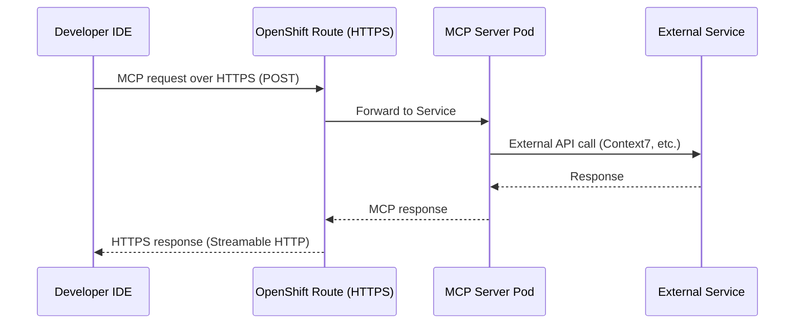
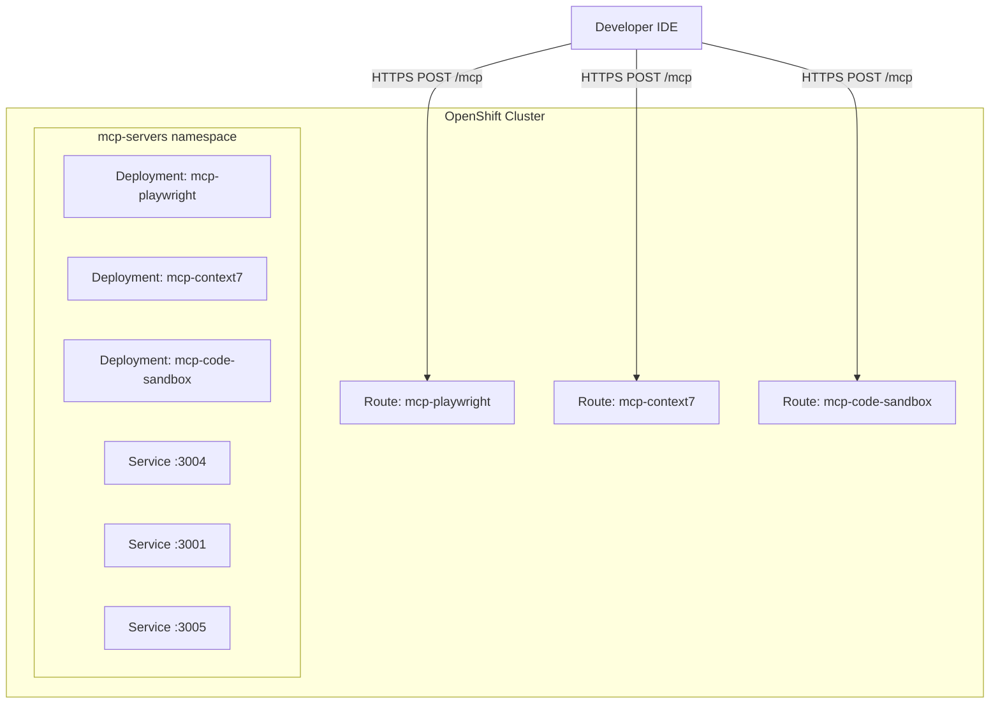

# MCP Servers — Overview

## What is MCP?

The **Model Context Protocol (MCP)** is an open standard that enables AI models to interact with external tools and data sources through a unified protocol. Think of it as a "USB port for AI" — any MCP-compatible tool can be plugged into any MCP-compatible IDE.

## When to Use MCP vs Skills/CLI

Not every tool needs MCP. We follow a pragmatic approach:

| Approach | Use When | Examples |
|----------|----------|---------|
| **MCP Server** | No CLI equivalent exists, or secure sandboxed execution needed | Context7, Code Sandbox, Playwright |
| **AI Skills** | CLI already exists, model knows the commands | `gh`, `oc`, `git`, `curl` |
| **Direct CLI** | Simple one-off commands | `oc get pods`, `gh issue list` |

> **Why we removed GitHub/gh-grep/Sequential Thinking MCP servers:**
> - `gh` CLI is already well-known to LLMs (training data from docs/StackOverflow)
> - Sequential thinking is built into modern agent modes (Cursor, Claude Code)
> - Each MCP server consumes context tokens for tool definitions — fewer servers = more room for actual work
> - See: [MCP is dead](https://www.quandri.io/engineering-blog/mcp-is-dead) for the full argument

## Protocol Architecture

## Transport: Streamable HTTP (2026 Standard)

| Transport | Protocol | Status |
|-----------|----------|--------|
| **Streamable HTTP** | HTTP POST (bidirectional) | ✅ Current standard |
| ~~HTTP SSE~~ | ~~Server-Sent Events~~ | ~~Deprecated — single-connection crash-loops~~ |
| **stdio** | stdin/stdout | Local only (not for team use) |

Streamable HTTP supports multiple concurrent connections natively, avoiding the crash-loop issues of the older SSE transport.

## MCP Servers in This Lab

| Server | Purpose | External Dependency | Transport |
|--------|---------|---------------------|-----------|
| **Context7** | Library documentation lookup | mcp.context7.com (HTTP) | supergateway → Streamable HTTP |
| **Code Sandbox** | Secure Python/Bash/Node execution | None (local) | Custom Python server |
| **Playwright** | Browser automation & testing | None (local Chromium) | supergateway → Streamable HTTP |

## Deployment Strategy on OpenShift

Each MCP server is deployed as:
- **Deployment** — Pod running the MCP server process
- **Service** — Internal cluster networking
- **Route** — External HTTPS endpoint (with TLS termination)

**Key insight:** stdio-based MCP servers (Playwright) are wrapped with `supergateway --outputTransport streamableHttp` inside the container to expose them as Streamable HTTP endpoints (`POST /mcp`).

## Next Steps

→ Continue to `2_deploy_mcp_servers.ipynb` for hands-on deployment on OpenShift.
