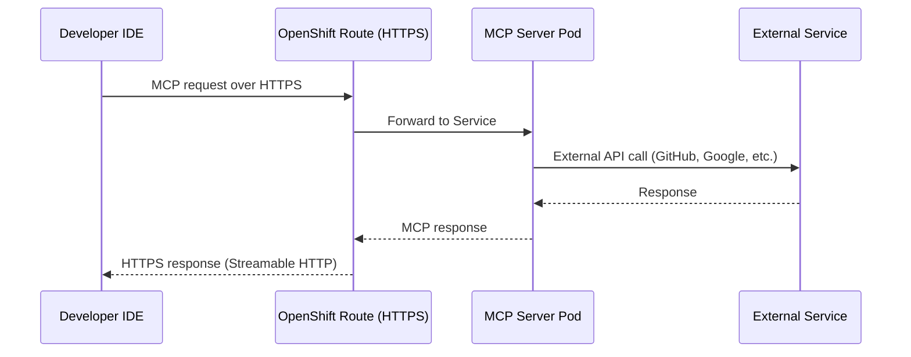
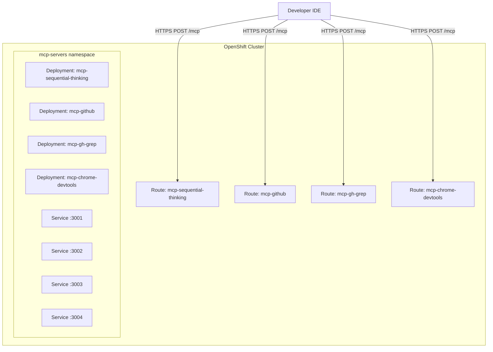

# MCP Servers — Overview

## What is MCP?

The **Model Context Protocol (MCP)** is an open standard that enables AI models to interact with external tools and data sources through a unified protocol. Think of it as a "USB port for AI" — any MCP-compatible tool can be plugged into any MCP-compatible IDE.

## Protocol Architecture

## Transport Types

| Transport | Protocol | Deployment |
|-----------|----------|------------|
| **stdio** | stdin/stdout | Local only (not for team use) |
| **Streamable HTTP** | HTTP POST (bidirectional) | OpenShift Service + Route |
| ~~HTTP SSE~~ | ~~HTTP + Server-Sent Events~~ | ~~Deprecated — single-connection only~~ |

For team deployments on OpenShift, we use **Streamable HTTP** transport (the 2026 MCP standard) exposed via Routes, so all developers share a single server instance. Streamable HTTP supports multiple concurrent connections natively, avoiding the crash-loop issues of the older SSE transport.

## MCP Servers in This Lab

| Server | Purpose | External Dependency | Transport |
|--------|---------|---------------------|-----------|
| Context7 | Library documentation lookup | mcp.context7.com (HTTP) | Already HTTP (no wrapping needed) |
| GitHub | Repository operations (issues, PRs, files) | api.github.com | stdio → HTTP via supergateway |
| gh-grep | Code search across GitHub | api.github.com | Custom HTTP server |
| Sequential Thinking | Structured problem solving | None (local logic) | stdio → HTTP via supergateway |
| Chrome DevTools | Browser automation | None (local Chromium) | stdio → HTTP via supergateway |

## Deployment Strategy on OpenShift

Each MCP server is deployed as:
- **Deployment** — Pod running the MCP server process
- **Service** — Internal cluster networking
- **Route** — External HTTPS endpoint (with TLS termination)
- **Secret** — API tokens (GitHub PAT)

**Key insight:** stdio-based MCP servers (GitHub, Sequential Thinking) are wrapped with `supergateway --outputTransport streamableHttp` inside the container to expose them as Streamable HTTP endpoints (`POST /mcp`).

## Next Steps

→ Continue to `2_deploy_mcp_servers.ipynb` for hands-on deployment on OpenShift.
