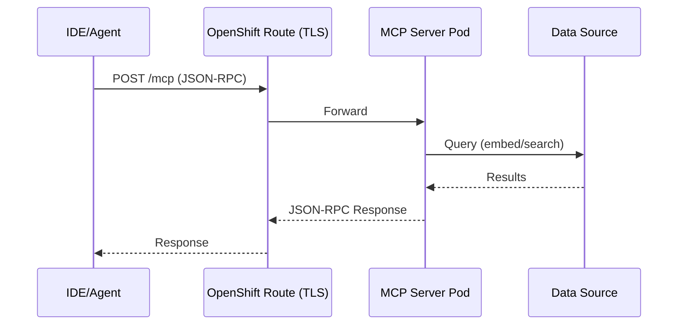
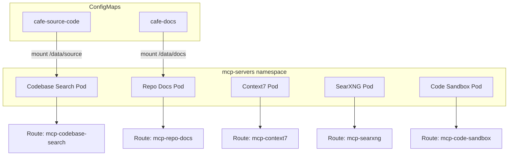

# MCP Servers — Overview

## What is MCP?

The **Model Context Protocol (MCP)** is an open standard that enables AI models to interact with external tools and data sources through a unified protocol. Think of it as a "USB port for AI" — any MCP-compatible tool can be plugged into any MCP-compatible IDE.

## When to Use MCP vs Skills/CLI

Not every tool needs MCP. We follow a pragmatic approach:

| Approach | Use When | Examples |
|----------|----------|---------|
| **MCP Server** | No CLI equivalent exists, or secure sandboxed execution needed | Context7, Code Sandbox, Codebase Search |
| **AI Skills** | CLI already exists, model knows the commands | `gh`, `oc`, `git`, `curl` |
| **Direct CLI** | Simple one-off commands | `oc get pods`, `gh issue list` |

> **Why we keep MCP servers minimal:**
> - Each MCP server consumes context tokens for tool definitions — fewer servers = more room for actual work
> - `gh` CLI is already well-known to LLMs (no GitHub MCP needed)
> - Sequential thinking is built into modern agent modes (Cursor, Claude Code, OpenCode)
> - We focus on tools that **cannot** be replicated via CLI

## Protocol Architecture



## Transport: Streamable HTTP (2026 Standard)

| Protocol | Status | Notes |
|----------|--------|-------|
| **Streamable HTTP** | Standard | All servers expose `POST /mcp` |
| SSE | Deprecated | Replaced by Streamable HTTP |
| stdio | Local only | Wrapped by `supergateway` for cluster deployment |

## MCP Servers in This Lab

| Server | Purpose | Air-gapped | External Dependency | Transport |
|--------|---------|:----------:|---------------------|-----------|
| **Context7** | Library documentation lookup | No | mcp.context7.com (HTTP) | supergateway → Streamable HTTP |
| **SearXNG** | Web search & content fetching | No | Self-hosted meta-engine | supergateway → Streamable HTTP |
| **Code Sandbox** | Secure Python/Bash/Node execution | Yes | None (local) | Native Streamable HTTP |
| **Codebase Search** | Semantic code search (internal) | Yes | None (local embeddings) | supergateway → Streamable HTTP |
| **Repo Docs** | Internal documentation Q&A | Yes | None (local embeddings) | supergateway → Streamable HTTP |

### Public vs Air-gapped Deployment

```
┌─────────────────────────────────────────────────────┐
│  PUBLIC                     │  AIR-GAPPED           │
├─────────────────────────────┼───────────────────────┤
│  Context7        ✅         │           ❌           │
│  SearXNG         ✅         │           ❌           │
│  Code Sandbox    ✅         │  Code Sandbox    ✅    │
│  Codebase Search ✅         │  Codebase Search ✅    │
│  Repo Docs       ✅         │  Repo Docs       ✅    │
├─────────────────────────────┼───────────────────────┤
│  5 servers                  │  3 servers             │
└─────────────────────────────┴───────────────────────┘
```

### Custom AI Servers (Codebase Search & Repo Docs)

These servers demonstrate **enterprise RAG** over internal codebases and documentation:

- **Embedding Model**: `all-MiniLM-L6-v2` (384-dim, ~80MB, runs on CPU)
- **Vector Store**: In-memory numpy (no external DB needed)
- **Indexing**: At pod startup — reads source/docs from mounted ConfigMap
- **Air-gapped**: Fully functional without internet (model baked into image)

## Deployment Strategy on OpenShift



Each MCP server is deployed as:
- **Deployment** — Pod running the MCP server process
- **Service** — Internal cluster networking
- **Route** — External HTTPS endpoint (with TLS termination)

Custom AI servers additionally use:
- **BuildConfig** — Build container image with pre-downloaded embedding model
- **ConfigMap** — Mount source code/documentation for indexing

## Next Steps

→ Continue to `2_deploy_mcp_servers.ipynb` for hands-on deployment on OpenShift.
