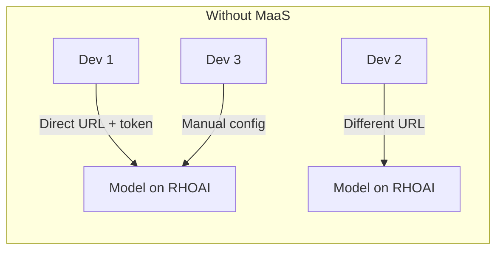
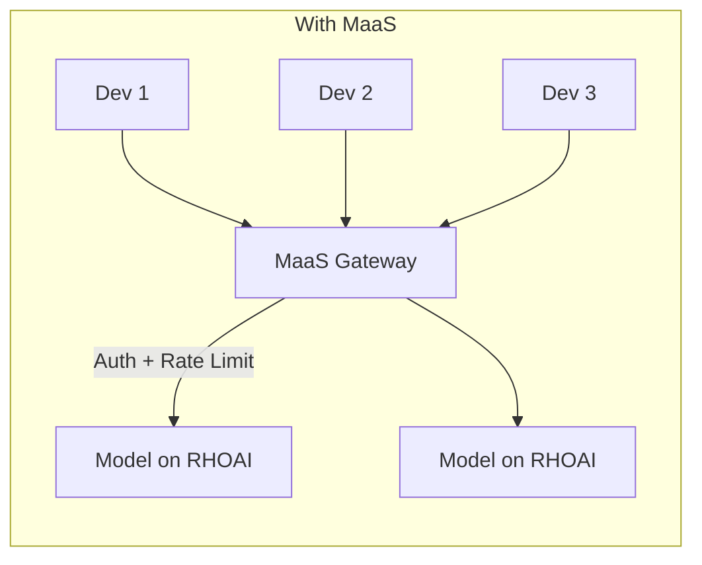
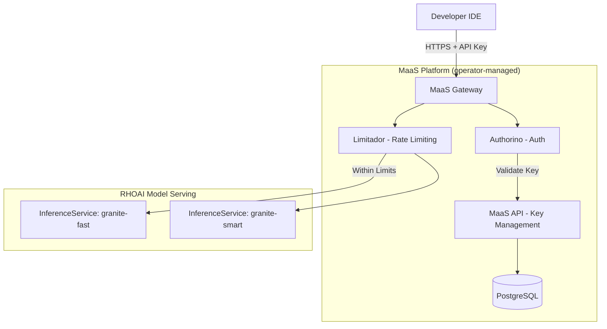

# Models as a Service (MaaS) — Overview

## What is MaaS?

[Models as a Service (MaaS)](https://opendatahub-io.github.io/models-as-a-service/latest/) is a platform-native feature of **Red Hat OpenShift AI** that provides a managed AI gateway with built-in authentication, rate limiting, and API key management. Unlike a standalone proxy, MaaS is deeply integrated into the RHOAI operator and uses Kubernetes-native components (Gateway API, Kuadrant, Authorino, Limitador).

## Why MaaS over a Manual Gateway?





| Feature | Direct to RHOAI | With MaaS |
|---------|----------------|-----------|
| Model discovery | Know each URL manually | `GET /v1/models` via single gateway |
| Authentication | Share SA tokens directly | Per-user API keys (`sk-oai-*`) |
| Rate limiting | None | Subscription-based token limits |
| API key management | None | Create, list, revoke via API or UI |
| Policy enforcement | None | AuthPolicy + RateLimitPolicy via Kuadrant |
| Observability | None | Prometheus metrics + Grafana dashboards |
| Deployment overhead | None | Zero — managed by RHOAI operator |

## Architecture on OpenShift



**Key insight:** MaaS is fully managed by the RHOAI/ODH operator. No manual deployment of proxies, databases, or config files — enable MaaS when deploying a model, and the platform handles the rest.

## How It Works

### 1. Deploy a Model with MaaS Enabled

When deploying a model through the RHOAI Dashboard, check the **MaaS checkbox** to enable MaaS gateway access.

### 2. Get Endpoint URL and API Key

Navigate to **AI assets → Endpoints → Models as a Service** in the RHOAI Dashboard to:
- View the MaaS endpoint URL
- Generate API keys for team members

### 3. Use the OpenAI-Compatible API

```bash
curl -sk "${MAAS_ENDPOINT}/v1/chat/completions" \
  -H "Authorization: Bearer ${API_KEY}" \
  -H "Content-Type: application/json" \
  -d '{"model": "MODEL_NAME", "messages": [{"role": "user", "content": "Hello"}], "max_tokens": 50}'
```

## Important Notes

> **Direct Access Caveat:** When MaaS is enabled for a model served using llm-d, the direct HTTPRoute to the model remains valid:
> - `https://maas.apps.<domain>/maas-api/v1/...` → Goes through MaaS Gateway (auth + rate limiting enforced)
> - `https://maas.apps.<domain>/<namespace>/<model-id>/v1/...` → Goes to the model directly, bypassing MaaS
>
> **Always check both the "MaaS" and "Require authentication" checkboxes** to prevent unauthorized direct access.

## Endpoint URL Format

| Path | Destination |
|------|-------------|
| `https://maas.apps.<domain>/maas-api/v1/models` | MaaS API — list available models |
| `https://maas.apps.<domain>/maas-api/v1/api-keys` | MaaS API — create API keys |
| `<model-url>/v1/chat/completions` | Model inference via MaaS |

## Next Steps

→ Continue to `2_enable_maas.ipynb` for hands-on setup.
