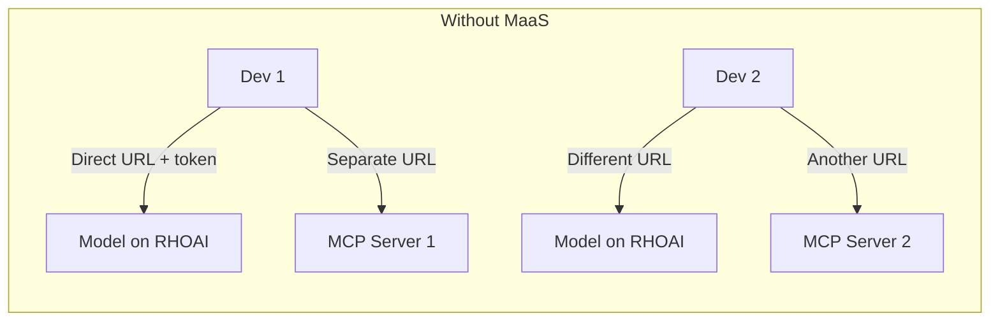
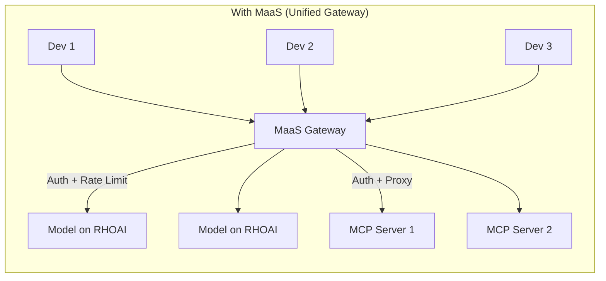
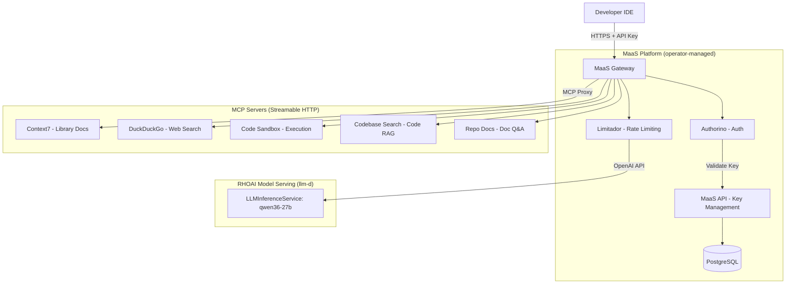

# Models as a Service (MaaS) — Overview

## What is MaaS?

[Models as a Service (MaaS)](https://opendatahub-io.github.io/models-as-a-service/latest/) is a platform-native feature of **Red Hat OpenShift AI** that provides a managed AI gateway with built-in authentication, rate limiting, and API key management. Unlike a standalone proxy, MaaS is deeply integrated into the RHOAI operator and uses Kubernetes-native components (Gateway API, Kuadrant, Authorino, Limitador).

In this lab, we extend MaaS as the **unified gateway** for both model inference and MCP tool access — giving developers a single endpoint with consistent auth and governance.

## Why MaaS as a Unified Gateway?





| Feature | Direct Access | With MaaS (Unified) |
|---------|-------------|---------------------|
| Model discovery | Know each URL manually | `GET /v1/models` via single gateway |
| MCP tools | Separate URLs per server | Proxied through same gateway |
| Authentication | Different tokens per service | Single API key for models + tools |
| Rate limiting | None | Subscription-based token limits |
| API key management | None | Create, list, revoke via API or UI |
| Policy enforcement | None | AuthPolicy + RateLimitPolicy via Kuadrant |
| Observability | None | Prometheus metrics + Grafana dashboards |
| Deployment overhead | None | Zero — managed by RHOAI operator |

## Architecture on OpenShift



**Key insight:** MaaS serves as the single entry point. Developers configure one gateway URL and one API key — the platform handles routing to models (OpenAI API) and MCP servers (Streamable HTTP) with consistent auth and rate limiting.

## How It Works

### 1. Deploy Models with LLMInferenceService (llm-d)

Models must be deployed using **LLMInferenceService** (llm-d) to be automatically registered with the MaaS Gateway. Standard `InferenceService` deployments are not visible to MaaS.

```yaml
apiVersion: serving.kserve.io/v1alpha1
kind: LLMInferenceService
metadata:
  name: qwen36-27b
  namespace: demo
spec:
  model:
    name: qwen36-27b
    uri: oci://quay.io/redhat-ai-services/modelcar-catalog:qwen36-27b
  replicas: 1
```

### 2. Register MCP Servers with the Gateway

MCP servers deployed on OpenShift are exposed through the MaaS gateway via HTTPRoute resources, applying the same auth policies as model endpoints.

### 3. Get Endpoint URL and API Key

Navigate to **AI assets → Endpoints → Models as a Service** in the RHOAI Dashboard to:
- View the MaaS endpoint URL
- Generate API keys for team members (works for both models and MCP tools)

### 4. Use the Unified API

```bash
# Model inference (OpenAI-compatible)
curl -sk "${MAAS_ENDPOINT}/v1/chat/completions" \
  -H "Authorization: Bearer ${API_KEY}" \
  -H "Content-Type: application/json" \
  -d '{"model": "MODEL_NAME", "messages": [{"role": "user", "content": "Hello"}], "max_tokens": 50}'

# MCP server access (Streamable HTTP — proxied through gateway)
curl -sk -X POST "${MAAS_ENDPOINT}/mcp/<server-name>/mcp" \
  -H "Authorization: Bearer ${API_KEY}" \
  -H "Content-Type: application/json" \
  -d '{"jsonrpc":"2.0","id":1,"method":"initialize","params":{"protocolVersion":"2025-03-26","capabilities":{},"clientInfo":{"name":"cli","version":"1.0"}}}'
```

## Important Notes

> **Direct Access Caveat:** When MaaS is enabled, both Gateway and direct routes exist:
> - `https://maas-api.apps.<domain>/<namespace>/<model>/v1/...` → MaaS Gateway (auth + rate limiting enforced)
> - Direct pod-level access → Bypasses MaaS entirely
>
> Use `security.opendatahub.io/enable-auth: "true"` annotation to enforce auth on direct access.

## Prerequisites (Platform-Level)

| Component | Version | Purpose | Install |
|-----------|---------|---------|---------|
| RHOAI Operator | 3.4+ | AI platform, model serving, MaaS controller | OLM (OperatorHub) |
| Red Hat Connectivity Link (RHCL) | 1.3+ | Gateway API + Authorino (Auth) + Limitador (Rate Limiting) | OLM (OperatorHub) |
| MetalLB Operator | — | External IP for Gateway LoadBalancer | OLM — **bare-metal only** |
| PostgreSQL | 14+ | API key storage for MaaS API | Deploy in `models-as-a-service` namespace |
| `modelsAsService: Managed` | — | Activates maas-controller + maas-api pods | DataScienceCluster patch |

> **Cloud environments** (AWS, Azure, GCP): MetalLB is NOT needed — cloud load balancers assign external IPs automatically.  
> **Bare-metal / on-prem**: MetalLB (or equivalent) is required, otherwise the MaaS Gateway will stay in `Pending` state with no EXTERNAL-IP.

## Key MaaS CRDs

| CRD | API Group | Namespace | Purpose |
|-----|-----------|-----------|---------|
| `MaaSModelRef` | `maas.opendatahub.io/v1alpha1` | Model namespace | Register model for MaaS catalog |
| `MaaSAuthPolicy` | `maas.opendatahub.io/v1alpha1` | `models-as-a-service` | Grant model access to groups/users |
| `MaaSSubscription` | `maas.opendatahub.io/v1alpha1` | `models-as-a-service` | Define token rate limits per group |
| `Tenant` | `maas.opendatahub.io/v1alpha1` | `models-as-a-service` | Platform config (gateway, telemetry) |
| `LLMInferenceService` | `serving.kserve.io/v1alpha1` | Model namespace | Deploy model with MaaS integration |

## Endpoint URL Format

| Path | Destination |
|------|-------------|
| `https://maas-api.apps.<domain>/<ns>/<model>/v1/models` | Model list via inference-gateway |
| `https://maas-api.apps.<domain>/<ns>/<model>/v1/chat/completions` | Model inference via gateway |
| `https://maas.apps.<domain>/maas-api/v1/api-keys` | MaaS API — manage API keys |
| `https://maas.apps.<domain>/maas-api/v1/models` | MaaS model catalog |
| `https://maas.apps.<domain>/mcp/<server-name>/mcp` | MCP server access (Streamable HTTP POST) |

## Next Steps

| Notebook | What You'll Do |
|----------|---------------|
| `2_enable_maas.ipynb` | Verify platform, register model (MaaSModelRef), create policies, generate API keys |
| `3_test_model_serving.ipynb` | Test inference, streaming, and auth enforcement through gateway |
| `4_test_mcp_servers.ipynb` | Test MCP server access with authentication via gateway |
| `../4_control/1_maas_advanced.ipynb` | Multi-tier subscriptions (Free vs Premium), observability |
| `../4_control/2_maas_policy_test.ipynb` | Trigger rate limit (429), verify recovery after window reset |
