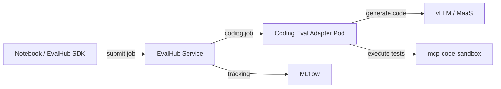

# Coding Evaluation Benchmarks — Overview

## Why Evaluate Coding Ability?

Self-hosted coding assistants sit on the critical path for developer productivity. Deploying a model is only the beginning — you need to verify that the model **actually writes correct code** before onboarding developers.

Coding evaluation answers two key questions:

| Question | What You Learn |
|----------|----------------|
| **Coding accuracy** | Does the model produce correct, functional code? (pass@1) |
| **Regression detection** | Did a model upgrade or config change hurt code quality? |



> **Lab scenario:** You deployed a coding model on RHOAI with vLLM. Before onboarding developers, evaluate its coding ability using HumanEval+ and MBPP+ benchmarks — all tracked in MLflow.

## Coding Evaluation

| Benchmark | Problems | Adapter | Metric |
|-----------|----------|---------|--------|
| HumanEval+ | 164 | Coding Eval | pass@1 (greedy) |
| MBPP+ | 399 | Coding Eval | pass@1 (greedy) |

Results are tracked in MLflow, enabling comparison across model upgrades or configuration changes.

## Coding Evaluation Benchmarks

### HumanEval+ (pass@1)

[HumanEval+](https://github.com/evalplus/evalplus) extends OpenAI's HumanEval with **80x more test cases** per problem. Each problem provides a Python function signature with docstring; the model must generate the function body.

- **164 problems** covering algorithms, data structures, string processing, math
- **Greedy pass@1**: single attempt at temperature=0, all test cases must pass
- **Test execution via mcp-code-sandbox**: air-gap safe, no `HF_ALLOW_CODE_EVAL` needed

### MBPP+ (pass@1)

[MBPP+](https://github.com/evalplus/evalplus) extends Google's Mostly Basic Python Problems with **35x more test cases**. Each problem provides a natural language description with examples; the model must write the complete function.

- **399 problems** (test split) covering basic programming tasks
- **Greedy pass@1**: same evaluation approach as HumanEval+
- **Test execution via mcp-code-sandbox**: identical sandboxed execution

### Code Execution via mcp-code-sandbox

The coding eval adapter does **not** execute generated code internally. Instead, it sends code + test assertions to the `mcp-code-sandbox` MCP server (already deployed in the cluster from Phase 1). This provides:

- **Security**: code runs in an isolated sandbox pod with resource limits
- **Air-gap safety**: no external network access needed at evaluation time
- **Consistency**: same execution environment for all test runs

## Key Metrics

| Metric | Definition | Impact |
|--------|------------|--------|
| **pass@1** | Fraction of problems solved correctly on the first attempt (greedy, temperature=0) | Primary measure of coding ability |
| **overall_score** | Normalized pass@1 (0.0–1.0) logged to MLflow | Cross-benchmark comparison |
| **duration_seconds** | Wall-clock time for the full evaluation run | Operational planning |

## Prerequisites

| Component | Purpose |
|-----------|---------|
| Phases 0–1 completed | Cluster access, model deployed, mcp-code-sandbox deployed |
| EvalHub deployed (`demo` ns) | Deploy via `0_setup/1_environment_setup.ipynb` Section 9 (TrustyAI + EvalHub CR) |
| mcp-code-sandbox deployed (`mcp-servers` ns) | Sandboxed code execution for coding benchmarks |
| EvalHub SA RBAC | `evalhub-service` SA needs configmaps/pods permissions in target namespace |
| API key or OCP token | Authenticate to EvalHub endpoints |
| GPU node with model running | vLLM serving Qwen or equivalent |

### EvalHub ServiceAccount RBAC

EvalHub creates ConfigMaps and Pods in the target namespace when running benchmarks. Working within the `demo` namespace requires no additional setup, but for other namespaces:

```bash
oc create rolebinding evalhub-manager -n <target-namespace> \
  --clusterrole=admin \
  --serviceaccount=demo:evalhub-service
```

### Verification Commands

```bash
CLUSTER_DOMAIN=$(oc get ingresses.config.openshift.io cluster -o jsonpath='{.spec.domain}')

# EvalHub health check
curl -sSk "https://evalhub-demo.${CLUSTER_DOMAIN}/api/v1/health" \
  -H "Authorization: Bearer $(oc whoami -t)"

# mcp-code-sandbox health check
oc get pod -n mcp-servers -l app=mcp-code-sandbox

# Model reachable
curl -sSk "https://maas-api.${CLUSTER_DOMAIN}/v1/models" \
  -H "Authorization: Bearer $(oc whoami -t)" | jq '.data[].id'
```

## Performance Benchmarks (Optional)

For performance testing (TTFT, ITL, throughput, capacity planning), see [rhoai-lmeval-builder-lab](https://github.com/hyogrin/rhoai-lmeval-builder-lab) which uses GuideLLM for load testing and capacity projections.

## Next Steps

→ Continue to `2_run_benchmarks.ipynb` to run the **coding evaluation** (HumanEval+ & MBPP+ pass@1) and view results in MLflow.

→ Then run `3_capacity_planning.ipynb` to translate benchmark numbers into team sizing and cost recommendations.
