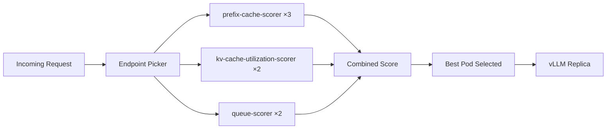
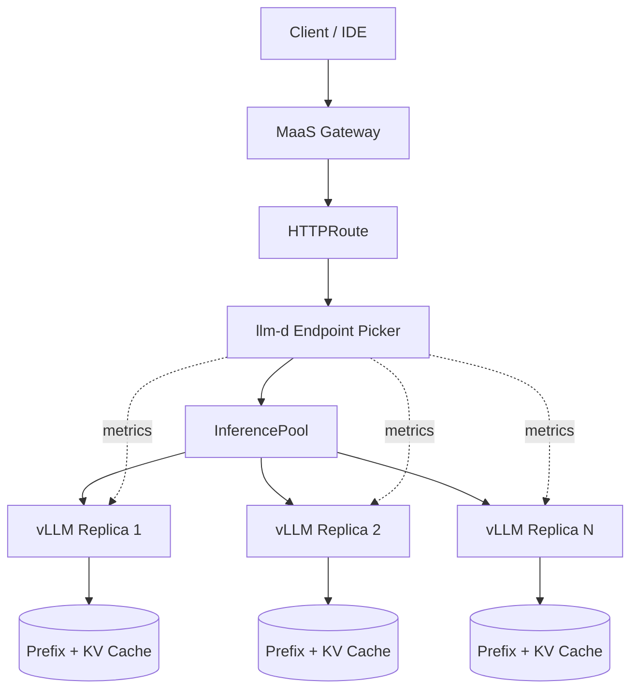

# llm-d Intelligent Routing — Overview

## What is llm-d?

**llm-d** is a Kubernetes-native intelligent routing layer for large language model (LLM) inference on OpenShift AI. Instead of sending every request to a random vLLM replica, llm-d uses an **Endpoint Picker (EPP)** — a scheduler that scores each available model-server pod and routes each request to the best candidate.

EPP runs as a sidecar alongside the inference gateway and maintains real-time awareness of:

- Which pods already hold matching **prefix cache** entries for the incoming prompt
- Current **KV-cache utilization** on each replica
- **Queue depth** (pending requests) per pod

## llm-d vs. Basic KServe Round-Robin

| Aspect | KServe Round-Robin | llm-d with EPP |
|--------|-------------------|----------------|
| Routing logic | Sequential rotation across replicas | Weighted scoring per request |
| Prefix cache awareness | None — same prompt may hit different pods | Routes to pods with cache hits |
| Load balancing | Request count only | Queue depth + KV utilization |
| Latency for repeated prompts | Full prefill every time (cache miss) | Faster TTFT when prefix is cached |
| Configuration | Built into KServe default | `EndpointPickerConfig` plugins + weights |
| CRD | `InferenceService` | `LLMInferenceService` |

**Key insight:** Round-robin treats all replicas as interchangeable. EPP treats them as *stateful* — a pod that already computed the system prompt's KV cache is strictly better for the next request sharing that prefix.

## EPP Scoring Algorithm

EPP combines multiple scorer plugins into a single scheduling profile. In this lab we use the **default** profile with three scorers:

| Plugin | Weight | What It Measures |
|--------|--------|------------------|
| **prefix-cache-scorer** | 3 | Likelihood of a prefix cache hit on each pod |
| **kv-cache-utilization-scorer** | 2 | Current KV-cache memory pressure per pod |
| **queue-scorer** | 2 | Number of in-flight / queued requests per pod |

Higher weight means stronger influence on the final score. Prefix cache gets the highest weight (3) because cache hits dramatically reduce time-to-first-token (TTFT).



## Benefits for Code Assistant Workloads

Coding assistants send a **large, fixed system prompt** on nearly every request — tool definitions, project rules, safety guidelines, and MCP tool schemas. With prefix caching enabled on vLLM:

| Workload Pattern | Without llm-d | With llm-d EPP |
|-----------------|---------------|----------------|
| Same system prompt across team | Each request prefills full system prompt | Routes to pod with cached prefix |
| Multi-turn agent sessions | Context re-processed on pod switch | Sticky routing to cached pod |
| Concurrent developers | Random pod assignment | Load-aware + cache-aware distribution |
| Tool-call heavy prompts | High TTFT on every request | TTFT drops after first request per pod |

> **Lab scenario:** When 10 developers share the same coding assistant, they all send identical system prompts. EPP ensures those requests converge on pods that already hold the prefix in KV cache — cutting prefill latency significantly.

## LLMInferenceService CRD

The `LLMInferenceService` CRD (API group: `serving.kserve.io/v1alpha1`) provisions the **full llm-d serving stack** in a single resource:

| Component | Purpose |
|-----------|---------|
| **vLLM pods** | Model inference with prefix caching, tool calling |
| **EPP scheduler** | Intelligent endpoint selection via `EndpointPickerConfig` |
| **InferencePool** | Registers vLLM replicas as inference endpoints |
| **HTTPRoute** | Exposes the model through the MaaS Gateway |

Compared to a standard `InferenceService`, you declare the router/scheduler inline — no separate Helm charts or manual EPP deployment.

```yaml
spec:
  model:
    name: Qwen/Qwen3-Coder-30B-A3B-Instruct-FP8
    uri: hf://Qwen/Qwen3-Coder-30B-A3B-Instruct-FP8
  replicas: 1
  router:
    gateway:
      refs:
      - name: maas-default-gateway
        namespace: openshift-ingress
    scheduler:
      template:
        containers:
        - name: main
          args:
          - --config-text
          - |
            kind: EndpointPickerConfig
            plugins:
            - type: prefix-cache-scorer
            schedulingProfiles:
            - name: default
              plugins:
              - pluginRef: prefix-cache-scorer
                weight: 3
```

## Architecture



**Request flow:**

1. Client sends a chat completion request to the MaaS Gateway endpoint
2. MaaS routes to the model's HTTPRoute (auth + rate limiting applied)
3. EPP receives the request, extracts the prompt prefix, and scores all pods
4. Request is forwarded to the highest-scoring vLLM replica
5. vLLM serves from prefix cache when available, returns the response

## Prerequisites

| Component | Version | Purpose |
|-----------|---------|---------|
| Red Hat OpenShift AI (RHOAI) | 3.3+ | LLMInferenceService CRD + llm-d operator |
| OpenShift Service Mesh | 3.x | mTLS, traffic management for inference pool |
| LeaderWorkerSet Operator | — | Multi-pod vLLM deployments at scale |
| cert-manager | — | TLS certificates for EPP ↔ vLLM mTLS |
| NVIDIA GPU nodes | L40S / H100 recommended | Qwen3-Coder-30B FP8 inference |
| MaaS Gateway | — | External access (Phase 2) |
| Hugging Face Token | — | Download Qwen3-Coder model weights |

```bash
# Quick prerequisite check
oc get csv -n redhat-ods-operator | grep rhods          # RHOAI 3.3+
oc get servicemeshcontrolplane -n istio-system           # Service Mesh 3
oc get crd leaderworkersets.leaderworkerset.x-k8s.io     # LeaderWorkerSet
oc get crd certificates.cert-manager.io                  # cert-manager
oc get crd llminferenceservices.serving.kserve.io      # LLMInferenceService CRD
```

## Model in This Lab

| Property | Value |
|----------|-------|
| Model | Qwen/Qwen3-Coder-30B-A3B-Instruct-FP8 |
| Parameters | 30B (MoE, 3B active) |
| Quantization | FP8 |
| Max context | 32,768 tokens |
| Features | Prefix caching, tool calling, reasoning |
| GPU | 1× NVIDIA GPU (24GB+ VRAM) |
| Storage | 100Gi gp3-csi PVC for model weights |

## Next Steps

→ Continue to `2_deploy_llmd.ipynb` to deploy the LLMInferenceService with EPP scoring.

→ Then run `3_verify_routing.ipynb` to observe prefix-cache-aware routing and benchmark latency improvements.
