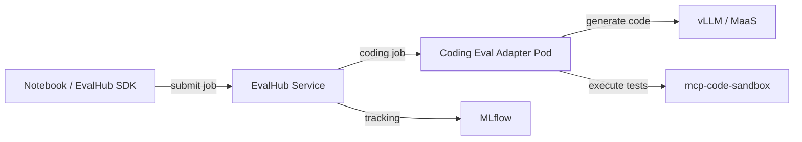
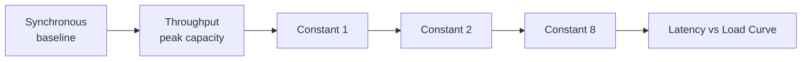

# Coding Evaluation Benchmarks — Overview

## Why Evaluate Coding Ability?

Self-hosted coding assistants sit on the critical path for developer productivity. Deploying a model is only the beginning — you need to verify that the model **actually writes correct code** before onboarding developers.

Coding evaluation answers two key questions:

| Question | What You Learn |
|----------|----------------|
| **Coding accuracy** | Does the model produce correct, functional code? (pass@1) |
| **Regression detection** | Did a model upgrade or config change hurt code quality? |



> **Lab scenario:** You deployed a coding model on RHOAI with vLLM. Before onboarding developers, evaluate its coding ability using HumanEval+ and MBPP+ benchmarks — all tracked in MLflow.

## Coding Evaluation

| Benchmark | Problems | Adapter | Metric |
|-----------|----------|---------|--------|
| HumanEval+ | 164 (50 sampled) | Coding Eval | pass@1 (greedy) |
| MBPP+ | 399 (30 sampled) | Coding Eval | pass@1 (greedy) |

Results are tracked in MLflow, enabling comparison across model upgrades or configuration changes.

## Coding Evaluation Benchmarks

### HumanEval+ (pass@1)

[HumanEval+](https://github.com/evalplus/evalplus) extends OpenAI's HumanEval with **80x more test cases** per problem. Each problem provides a Python function signature with docstring; the model must generate the function body.

- **164 problems** covering algorithms, data structures, string processing, math
- **Greedy pass@1**: single attempt at temperature=0, all test cases must pass
- **Test execution via mcp-code-sandbox**: air-gap safe, no `HF_ALLOW_CODE_EVAL` needed

### MBPP+ (pass@1)

[MBPP+](https://github.com/evalplus/evalplus) extends Google's Mostly Basic Python Problems with **35x more test cases**. Each problem provides a natural language description with examples; the model must write the complete function.

- **399 problems** (test split) covering basic programming tasks
- **Greedy pass@1**: same evaluation approach as HumanEval+
- **Test execution via mcp-code-sandbox**: identical sandboxed execution

### Code Execution via mcp-code-sandbox

The coding eval adapter does **not** execute generated code internally. Instead, it sends code + test assertions to the `mcp-code-sandbox` MCP server (already deployed in the cluster from Phase 1). This provides:

- **Security**: code runs in an isolated sandbox pod with resource limits
- **Air-gap safety**: no external network access needed at evaluation time
- **Consistency**: same execution environment for all test runs

## Key Metrics

GuideLLM (and vLLM generally) report metrics that map directly to developer experience:

| Metric | Definition | Developer Impact |
|--------|------------|------------------|
| **TTFT** (Time to First Token) | Latency from request sent to first output token | Perceived "thinking" delay — critical for chat and agent loops |
| **ITL** (Inter-Token Latency) | Average delay between consecutive output tokens | Streaming smoothness — high ITL feels "stuttery" |
| **Output tok/s** | Completion tokens per second (single stream) | Code generation speed for one active user |
| **Aggregate tok/s** | Total output tokens/sec across all concurrent streams | System-wide throughput ceiling |
| **Request throughput** | Requests completed per second (req/s) | Gateway capacity under sustained load |

**Single-user metrics** (TTFT, ITL, output tok/s) come from **synchronous** benchmarks — one request at a time. **Aggregate tok/s** comes from **throughput** or high-rate **constant** benchmarks where multiple streams compete for GPU time.

## GuideLLM Introduction

[**GuideLLM**](https://github.com/vllm-project/guidellm) is the vLLM project's official benchmarking tool. It generates realistic, configurable traffic against any **OpenAI-compatible** inference server — including vLLM behind MaaS.

| Capability | Details |
|------------|---------|
| Traffic profiles | Synchronous, throughput, concurrent, constant-rate, Poisson, sweep |
| Data sources | Synthetic token lengths, HuggingFace datasets, JSON files, trace replay |
| Metrics | TTFT, ITL, latency percentiles, token throughput, error rates |
| Output | Console summary, JSON, CSV, HTML reports |
| Auth | API key via `--backend-kwargs` for gated endpoints |

GuideLLM replaces ad-hoc curl loops and custom load scripts with reproducible, comparable benchmark suites — the same tool Red Hat uses to evaluate RHOAI model serving deployments.

## Benchmark Strategies

Different profiles answer different questions. Use all three in combination for a complete picture.

### 1. Synchronous (Single User)

Runs requests **one at a time** — no concurrency. Measures baseline latency and per-stream token speed.

```bash
guidellm benchmark \
  --target "$MODEL_URL/v1" \
  --profile synchronous \
  --data "kind=synthetic_text,prompt_tokens=512,output_tokens=256" \
  --max-seconds 60
```

**Use for:** TTFT, ITL, single-user output tok/s, SLO baselines.

### 2. Throughput (Max Concurrency)

Sends requests **in parallel** until the server saturates. Finds peak aggregate throughput.

```bash
guidellm benchmark \
  --target "$MODEL_URL/v1" \
  --profile throughput \
  --data "kind=synthetic_text,prompt_tokens=512,output_tokens=256" \
  --max-seconds 60
```

**Use for:** Peak aggregate tok/s, maximum req/s, capacity ceiling.

### 3. Constant-Rate (Realistic Load)

Sends requests at a **fixed rate** (e.g., 2 req/s) — simulates a team sharing the model without hammering it to saturation.

```bash
guidellm benchmark \
  --target "$MODEL_URL/v1" \
  --profile constant \
  --rate 2 \
  --data "kind=synthetic_text,prompt_tokens=512,output_tokens=256" \
  --max-seconds 120
```

**Use for:** Latency under realistic team load, finding the "knee" where TTFT degrades.

### Sweep (All Strategies Combined)

The **sweep** profile runs synchronous → throughput → 8 interpolated constant-rate steps (with `--rate 10`). This is the recommended starting point for capacity planning.



## Capacity Planning Methodology

Translate benchmark numbers into **developer headcount** using a conservative concurrency model:

1. **Measure** single-user output tok/s (synchronous) and peak aggregate tok/s (throughput).
2. **Estimate per-developer demand:**
   - Average prompt: ~512 tokens (system prompt + context)
   - Average output: ~256 tokens (code generation)
   - Active coding time: ~25% of an 8-hour day (2 hours of AI-assisted work)
3. **Apply the 30% concurrency assumption:** At any moment, ~30% of developers who are actively coding are waiting on the model simultaneously.

```
developer_capacity = peak_aggregate_tok_s / (single_user_tok_s × 0.30)
```

| Assumption | Value | Rationale |
|------------|-------|-----------|
| Concurrent fraction | 30% | Not all devs hit the model at the same instant; accounts for think-time, meetings, builds |
| Workload shape | 512 in / 256 out | Typical coding assistant turn with system prompt + tool context |
| SLO target | TTFT &lt; 500 ms at planned load | Interactive coding assistant responsiveness |

**Example:** L40S with Qwen3-Coder-30B FP8 — single-user ~93 tok/s, peak aggregate ~1,357 tok/s:

```
capacity = 1,357 / (93 × 0.30) ≈ 49 theoretical max
practical  = 10–15 devs  (with TTFT SLO headroom)
```

The gap between theoretical and practical capacity reflects TTFT degradation as load increases — constant-rate sweeps reveal where latency crosses your SLO threshold.

## Reference Performance Data

Benchmarks run with GuideLLM using synthetic data (512 prompt / 256 output tokens) against vLLM with prefix caching enabled:

| GPU | Model | Single-user tok/s | TTFT | ITL | Peak agg tok/s | Dev capacity |
|-----|-------|-------------------|------|-----|----------------|--------------|
| L40S (48GB) | Qwen3-Coder-30B FP8 | ~93 | 74ms | 10ms | ~1,357 | 10–15 devs |
| A100 (80GB) | Qwen3.6-35B FP8 | ~138 | 57ms | 6.8ms | ~2,781 | 20–30 devs |
| L10 (24GB) | Qwen2.5-Coder-14B FP8 | ~50–70 | ~100ms | ~15ms | ~400–600 | 5–8 devs |

> **Note:** Results vary with prompt length, prefix cache hit rate, and batch size. Always benchmark *your* deployment — these numbers are reference baselines, not guarantees.

## Cost Efficiency Comparison

Estimated cloud GPU pricing (on-demand, US regions, approximate) compared against developer capacity:

| GPU | Est. $/hr | Peak agg tok/s | $/1M output tokens | Dev capacity | $/dev/month (8hr/day) |
|-----|-----------|----------------|---------------------|--------------|------------------------|
| L10 (24GB) | ~$1.50 | ~500 | ~$0.83 | 5–8 | ~$60–96 |
| L40S (48GB) | ~$2.50 | ~1,357 | ~$0.51 | 10–15 | ~$40–60 |
| A100 (80GB) | ~$4.00 | ~2,781 | ~$0.40 | 20–30 | ~$27–40 |

**Cost per 1M output tokens** = `(GPU $/hr × 3,600) / peak_agg_tok_s / 1,000,000`

**Cost per developer per month** = `(GPU $/hr × 8 hr/day × 22 days) / dev_capacity`

| Insight | Detail |
|---------|--------|
| Larger GPUs cost more per hour | But serve more developers — lower cost per seat |
| L40S sweet spot | Best balance for 10–15 person teams running 30B-class models |
| L10 entry tier | Viable for small teams (≤8 devs) with 14B models |
| Multi-replica scaling | Linear throughput scaling until gateway or network becomes bottleneck |

## Prerequisites

| Component | Purpose |
|-----------|---------|
| Phases 0–3 completed | Cluster access, MaaS gateway, model deployed |
| EvalHub deployed (`demo` ns) | Orchestrates adapter jobs and tracks results in MLflow |
| GuideLLM provider registered | Performance benchmarking via EvalHub |
| mcp-code-sandbox deployed (`mcp-servers` ns) | Sandboxed code execution for coding benchmarks |
| EvalHub SA RBAC | `evalhub-service` SA needs configmaps/pods/jobs permissions in target namespace |
| MaaS `/health` pass-through | HTTPRoute for GuideLLM backend validation |
| API key or OCP token | Authenticate to MaaS and EvalHub endpoints |
| GPU node with model running | vLLM serving Qwen or equivalent |

### EvalHub ServiceAccount RBAC

EvalHub creates ConfigMaps and Pods in the target namespace when running benchmarks. Working within the `demo` namespace requires no additional setup, but for other namespaces:

```bash
oc create rolebinding evalhub-manager -n <target-namespace> \
  --clusterrole=admin \
  --serviceaccount=demo:evalhub-service
```

### Verification Commands

```bash
CLUSTER_DOMAIN=$(oc get ingresses.config.openshift.io cluster -o jsonpath='{.spec.domain}')

# Model reachable via MaaS
curl -sSk "https://maas-api.${CLUSTER_DOMAIN}/v1/models" \
  -H "Authorization: Bearer $(oc whoami -t)" | jq '.data[].id'

# EvalHub health check
curl -sSk "https://evalhub-demo.${CLUSTER_DOMAIN}/health"

# MaaS /health pass-through (GuideLLM validation)
curl -sSk "https://maas-api.${CLUSTER_DOMAIN}/health"

# mcp-code-sandbox health check
oc get pod -n mcp-servers -l app=mcp-code-sandbox
```

## Next Steps

→ Continue to `2_run_benchmarks.ipynb` to run the **unified evaluation** (coding accuracy + performance) and view results in MLflow.

→ Then run `3_capacity_planning.ipynb` to translate benchmark numbers into team sizing, multi-replica projections, and cost recommendations.
