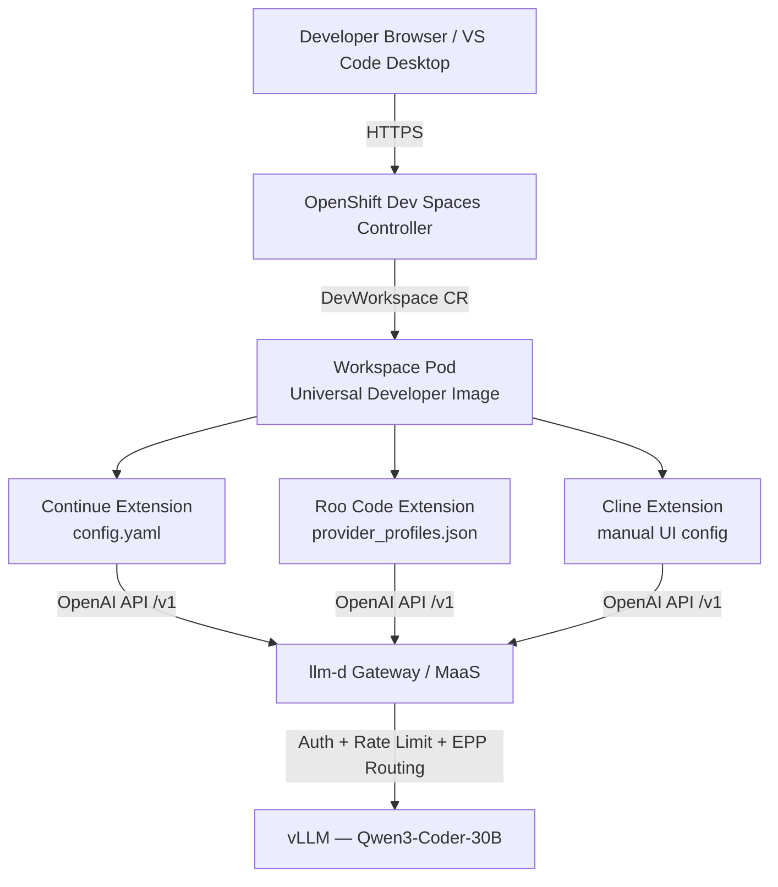

# OpenShift Dev Spaces — Developer Experience Overview

## What is OpenShift Dev Spaces?

**OpenShift Dev Spaces** (formerly Eclipse Che) provides **cloud development environments** on OpenShift — browser-based or desktop-connected workspaces where developers write, build, and test code without local toolchain setup. Each workspace runs as a Kubernetes pod with a pre-configured IDE (VS Code-based), language runtimes, and project sources mounted from Git.

In this lab, Dev Spaces becomes the **team onboarding layer**: every developer gets an identical workspace with AI coding extensions pre-configured to reach the MaaS / llm-d gateway — no manual IDE setup required.

## Why Team-Scale Developer Onboarding Matters

| Challenge (Local IDE) | Dev Spaces Solution |
|----------------------|---------------------|
| Each developer installs extensions, SDKs, and runtimes manually | Single DevWorkspace template — one click to start |
| AI extension config scattered across laptops | ConfigMaps mounted into every workspace automatically |
| API keys and endpoints differ per machine | Environment variables injected at workspace creation |
| New hires take days to reproduce the team setup | Factory URL gives instant, identical environments |
| Model endpoint changes require everyone to update config | Update ConfigMap once — all new workspaces pick it up |

**Key insight:** Dev Spaces shifts AI assistant configuration from *per-developer* to *platform-managed*. The platform team owns the gateway, model routing, and extension config; developers just open a URL and start coding.

## AI Extension Comparison

Three VS Code–compatible AI extensions are commonly deployed in Dev Spaces workspaces. Each has different strengths and configuration requirements when connecting to a self-hosted OpenAI-compatible gateway.

| Aspect | Continue | Cline | Roo Code |
|--------|----------|-------|----------|
| **Primary use** | Tab autocomplete + inline chat | Autonomous coding agent | Multi-mode agent (Code / Architect / Ask / Debug) |
| **Config file** | `config.yaml` | UI settings (manual) | `settings.json` / `provider_profiles.json` |
| **API compatibility** | OpenAI-compatible | OpenAI-compatible | OpenAI-compatible |
| **Tab autocomplete** | ✅ Built-in | ❌ Not supported | ❌ Not supported |
| **Autonomous agent** | Limited | ✅ Full agent loop | ✅ Multi-mode agent |
| **Browser automation** | ❌ | ✅ Built-in | ❌ |
| **Pre-config via ConfigMap** | ✅ Fully automated | ⚠️ Manual UI setup required | ✅ Via `provider_profiles.json` mount |
| **Tool calling** | Basic function calling | Native tool use loop | Requires native `tool_calls` in API response |
| **Streaming** | ✅ Supported | ✅ Supported | ⚠️ Disable streaming for vLLM compatibility |
| **Best for this lab** | Default — zero-touch onboarding | Power users who need browser automation | Agent workflows with mode switching |

### Continue — Recommended Default

Continue reads `~/.continue/config.yaml` at startup. Mount a ConfigMap with the DevWorkspace controller annotations and every workspace gets tab autocomplete and chat pointed at the MaaS endpoint automatically.

### Cline — Manual Setup Required

Cline operates as a fully autonomous agent with browser automation capabilities. It connects to OpenAI-compatible endpoints but requires **manual configuration through the VS Code UI** — settings cannot be fully pre-seeded via ConfigMap in all versions. Use Cline when developers need autonomous multi-step tasks with web browsing.

### Roo Code — Multi-Mode Agent

Roo Code (formerly Roo Cline) supports distinct modes — **Code**, **Architect**, **Ask**, **Debug**, and **Orchestrator** — each mapped to a provider profile. Configuration lives in `provider_profiles.json`. Roo Code expects **native OpenAI `tool_calls`** in non-streaming responses; streaming mode can cause tool-call parsing failures against vLLM.

## Tool Calling Configuration for vLLM

Agent extensions (Cline, Roo Code) depend on the model server returning structured `tool_calls` in the chat completion response. For **Qwen3-Coder** models served via vLLM, enable the Qwen3 tool-call and reasoning parsers:

```bash
--enable-auto-tool-choice \
--tool-call-parser qwen3_coder \
--reasoning-parser qwen3
```

These flags are set via `VLLM_ADDITIONAL_ARGS` on the `LLMInferenceService` in Phase 4:

```yaml
env:
  - name: VLLM_ADDITIONAL_ARGS
    value: "--enable-auto-tool-choice --tool-call-parser qwen3_coder --reasoning-parser qwen3 ..."
```

| Parser | Purpose |
|--------|---------|
| `--tool-call-parser qwen3_coder` | Parses Qwen3-Coder XML/JSON tool-call syntax into OpenAI `tool_calls` objects |
| `--reasoning-parser qwen3` | Separates `` reasoning blocks from the visible response |
| `--enable-auto-tool-choice` | Allows the model to decide when to invoke tools |

> **Roo Code note:** Set `"openAiStreamingEnabled": false` in `provider_profiles.json`. Streaming responses from vLLM may not include `tool_calls` in the expected format, causing agent loops to fail silently.

## DevWorkspace Architecture



**How it works:**

1. Developer opens a Dev Spaces URL (or Factory link) to create a workspace.
2. The DevWorkspace controller provisions a pod with the universal developer image.
3. ConfigMaps labeled `controller.devfile.io/mount-to-devworkspace: "true"` are mounted into extension config paths.
4. Environment variables (`MAAS_ENDPOINT`, `MAAS_API_KEY`, `MODEL_NAME`) are injected into the container.
5. Extensions call the MaaS / llm-d gateway using OpenAI-compatible APIs.
6. The gateway authenticates, rate-limits, and routes to the vLLM inference pool.

## Factory URL Pattern

Dev Spaces supports **Factory URLs** — self-service links that create a workspace from a Devfile or DevWorkspace template with one click. Share a Factory URL with your team to eliminate manual workspace creation.

```
https://devspaces.<CLUSTER_DOMAIN>/dashboard/#/<namespace>/createWorkspace/devfile/<encoded-devfile-url>
```

| Component | Example |
|-----------|---------|
| Dev Spaces dashboard | `https://devspaces.apps.cluster.example.com` |
| Namespace | `devspaces` |
| Devfile source | Git repo URL or inline Devfile encoded in the path |
| Workspace name | Auto-generated or specified via query parameter |

**Example Factory URL for this lab:**

```
https://devspaces.apps.<CLUSTER_DOMAIN>/dashboard/#/devspaces/createWorkspace/devfile?url=https://github.com/hyogrin/rhoai-code-assistant-lab
```

Developers click the link, authenticate with OpenShift, and receive a workspace with Continue and Roo Code pre-configured — connected to the team MaaS gateway.

## Important Notes

> **ConfigMap mounting:** Use the DevWorkspace controller annotations (`controller.devfile.io/mount-to-devworkspace`, `controller.devfile.io/mount-path`, `controller.devfile.io/mount-as: subpath`) so extension configs are injected without modifying the base image.

> **API key management:** Replace `REPLACE_WITH_MAAS_API_KEY` in manifests with a team API key from the MaaS Dashboard (`AI assets → Endpoints → Models as a Service → Generate Token`). For production, use an OpenShift Secret referenced by the DevWorkspace instead of plain-text values.

> **Cline caveat:** Cline cannot be fully pre-configured via ConfigMap. Document the manual setup steps for developers who choose Cline over Continue or Roo Code.

## Next Steps

→ Continue to `2_configure_devworkspace.ipynb` for hands-on DevWorkspace deployment with pre-configured AI extensions.
→ Then `3_test_extensions.ipynb` to verify gateway connectivity, tool calling, and streaming behavior from within the workspace.
