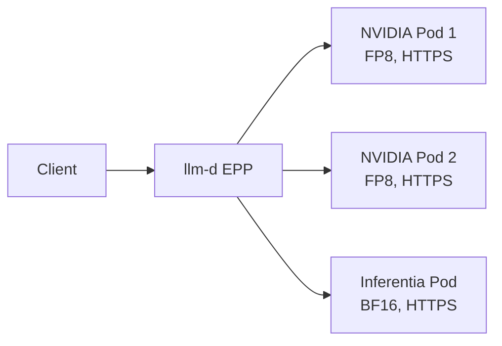
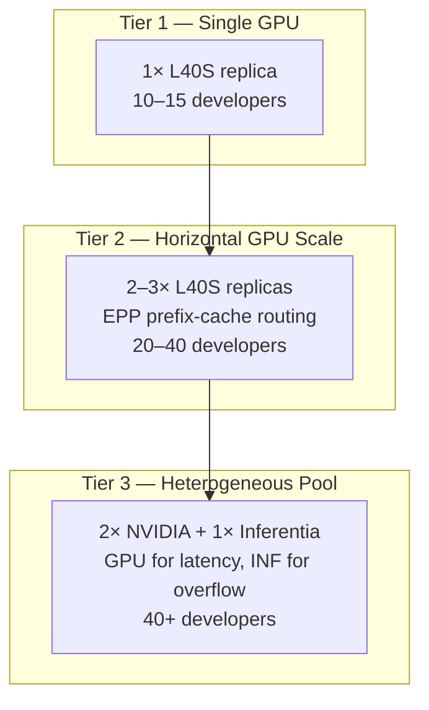

# Advanced Topics — Overview

## What This Module Covers

Phases 0–5 deploy a coding assistant with MaaS gateway access, benchmarking, and team-scale developer onboarding. **Phase 6** addresses production-grade concerns that emerge when you move beyond a single cluster and single accelerator type:

| Topic | Problem It Solves |
|-------|-------------------|
| **Multi-accelerator routing** | Mix NVIDIA GPUs and AWS Inferentia2 in one InferencePool for cost/latency trade-offs |
| **Multi-cloud deployment** | Run the same architecture on ROSA (AWS) or ARO (Azure) with platform-specific tuning |
| **Model caching** | Eliminate 4–45 minute cold starts on pod reschedule or scale-up |
| **KV cache optimization** | Reduce memory footprint with FP8 quantization for 2× compression |
| **Multi-replica scaling** | Scale throughput linearly while preserving prefix-cache benefits |

> **Documentation-only module:** Heterogeneous deployments require specific cloud hardware (Inferentia2 nodes, multi-GPU machine pools). This phase provides reference architecture and operational guidance — no hands-on notebooks.

## Heterogeneous Inference Architecture

The most advanced deployment pattern combines **NVIDIA GPUs** (low latency, FP8, prefix caching) with **Inferentia2** (overflow capacity, cost-effective batch inference) behind a single llm-d Endpoint Picker (EPP):

**Request flow:**

1. Client sends a chat completion request through the MaaS gateway (or llm-d gateway directly).
2. EPP scores all pods in the InferencePool using prefix-cache, KV-utilization, and queue scorers.
3. Requests with matching prefix cache route to NVIDIA pods (highest prefix-cache score).
4. Overflow traffic and cache-miss workloads spill to Inferentia2 when GPU pods are saturated.
5. All backends return responses over HTTPS with consistent TLS and the same `--served-model-name`.

## Multi-Cloud Deployment

The same coding-assistant stack runs on two managed OpenShift platforms:

| Platform | Cloud | GPU Option | AI Gateway |
|----------|-------|------------|------------|
| **ROSA HCP** | AWS | g6e.2xlarge (L40S 48GB) | MaaS |
| **ARO** | Azure | Standard_NC24ads_A100_v4 (A100 80GB) | llm-d GA |

Each platform differs in storage classes, GPU provisioning, vLLM versions, and max context windows. See `3_multi_cloud.md` for the full comparison and external reference deployment.

## Model Caching and Startup Optimization

Cold starts are the primary operational pain point at scale:

| Stage | Cold Start | Warm Start (cached) |
|-------|-----------|---------------------|
| Model download (GPU) | 4–15 min | ~10s (PVC hit) |
| NEFF compilation (Inferentia) | 30–45 min | ~10s (NEFF cache) |
| Pod scheduling + init | 1–3 min | 1–3 min |

Caching strategies — EBS PVCs, EBS snapshots, OCI model images, S3 mirrors — trade portability, cost, and warm-start speed. See `4_model_caching.md` for the strategy comparison and PVC manifest example.

## KV Cache Optimization

**FP8 quantization** compresses KV cache entries to half the memory of BF16, enabling:

- Longer effective context within the same VRAM budget
- More concurrent requests per GPU replica
- Better prefix-cache density on NVIDIA L40S / A100 nodes

Inferentia2 backends run **BF16 only** — no FP8 KV cache — which is one reason EPP naturally favors GPU pods for cache-heavy coding assistant workloads.

## Multi-Replica Scaling Strategies

Scaling deployments follows a tiered approach (llm-d EPP is recommended for Tier 2+):

| Strategy | When to Use | Trade-off |
|----------|-------------|-----------|
| **Single replica** | Pilot teams (≤15 devs) | Simplest ops; no routing overhead |
| **Multi-GPU replicas** | Production teams needing low TTFT | Linear throughput; prefix cache per pod |
| **Heterogeneous pool** | High concurrency with cost constraints | Complex node targeting; mixed quantization |
| **Multi-cloud failover** | DR / geo-distribution | GitOps sync; model cache per region |

> **Key insight:** Multi-replica scaling increases aggregate throughput but does *not* share prefix cache across pods. EPP's prefix-cache scorer is what makes multi-replica deployments efficient for coding assistants — identical system prompts converge on cached pods.

## Prerequisites

| Component | Purpose |
|-----------|---------|
| Phases 0–3 completed | Model deployed with InferenceService, MaaS gateway operational |
| Phase 5 benchmarks | Baseline TTFT / throughput for capacity decisions |
| Cloud GPU quota | Additional node types (Inferentia2, A100) if pursuing heterogeneous or multi-cloud |
| Persistent storage | gp3-csi (AWS) or managed-csi (Azure) for model cache PVCs |

## Module Contents

| Document | Focus |
|----------|-------|
| `1_advanced_overview.md` | This file — architecture and topic map |
| `2_multi_accelerator.md` | Heterogeneous routing with llm-d (NVIDIA + Inferentia2) |
| `3_multi_cloud.md` | ROSA vs ARO deployment reference |
| `4_model_caching.md` | Cold/warm start optimization strategies |

## Next Steps

→ Read `2_multi_accelerator.md` for heterogeneous InferencePool requirements and accelerator selection guidance.

→ Read `3_multi_cloud.md` for ROSA and ARO platform differences.

→ Read `4_model_caching.md` for PVC-based model caching and startup optimization.
