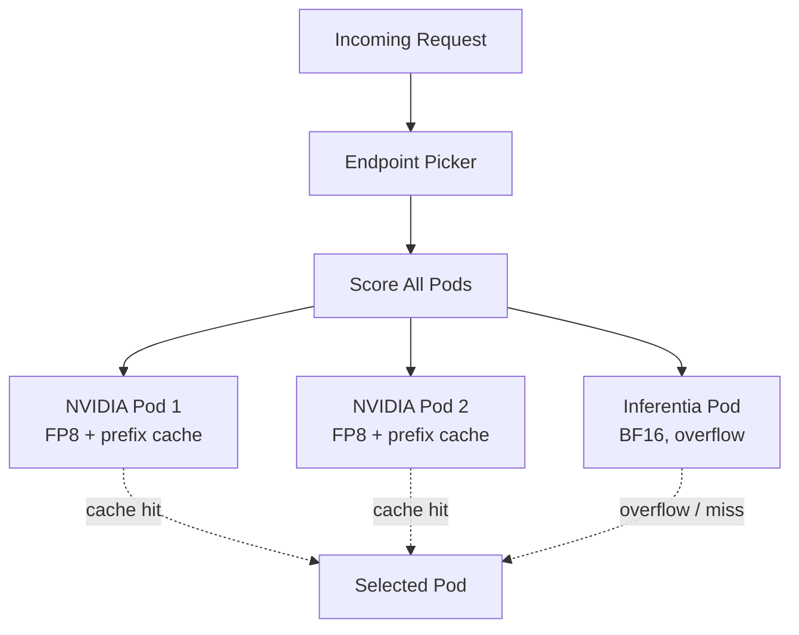
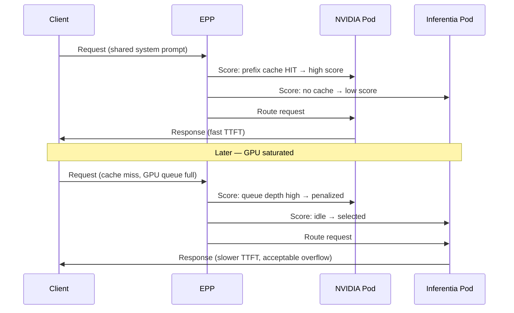

# Multi-Accelerator Heterogeneous Routing

## Overview

**Heterogeneous routing** lets a single llm-d InferencePool serve the same model from different accelerator types — NVIDIA GPUs and AWS Inferentia2 — behind one Endpoint Picker. EPP scores all backends uniformly and routes each request to the best candidate based on prefix-cache affinity, KV utilization, and queue depth.

This pattern suits teams that need **GPU-class latency** for interactive coding while offloading **burst traffic** to Inferentia2 overflow capacity.



## Requirements for Heterogeneous Routing

All backends must satisfy these constraints for EPP to treat them as members of the same InferencePool:

### Namespace Scope

InferencePool is **namespace-scoped**. Every model-server pod — NVIDIA and Inferentia — must run in the **same namespace**.

```bash
# All pods must share one namespace
oc get pods -n llm-d-serving -l llm-d.ai/inferencepool=<pool-name>
```

### HTTPS and TLS Consistency

All pods must serve **HTTPS on the same port** with **consistent TLS configuration**. EPP communicates with each backend over mTLS; mismatched certificates or HTTP-only endpoints break pool registration.

| Requirement | Detail |
|-------------|--------|
| Protocol | HTTPS (not plain HTTP) |
| Port | Same across all backends (typically 8000 or 8443) |
| TLS | cert-manager or platform-managed certs with matching SANs |
| Health checks | `/health` or vLLM `/v1/models` over HTTPS |

### Model Name Consistency

Every backend must expose the **same `--served-model-name`**. Clients and EPP reference a single model identifier regardless of which accelerator serves the request.

```yaml
env:
  - name: VLLM_ADDITIONAL_ARGS
    value: "--served-model-name Qwen/Qwen3-Coder-30B-A3B-Instruct-FP8 ..."
```

### InferencePool Labels

All pods must carry **matching InferencePool labels** so the llm-d operator registers them as pool members:

```yaml
metadata:
  labels:
    llm-d.ai/inferencepool: qwen-coder-pool
```

Verify registration:

```bash
oc get inferencepool -n llm-d-serving
oc describe inferencepool qwen-coder-pool -n llm-d-serving
```

### Hardware Targeting

Use **nodeSelector**, **taints**, and **tolerations** to pin pods to the correct hardware:

```yaml
# NVIDIA GPU pod
nodeSelector:
  nvidia.com/gpu.product: NVIDIA-L40S
tolerations:
  - key: nvidia.com/gpu
    operator: Exists
    effect: NoSchedule

# Inferentia2 pod
nodeSelector:
  node.kubernetes.io/instance-type: inf2.24xlarge
tolerations:
  - key: aws.amazon.com/neuron
    operator: Exists
    effect: NoSchedule
```

> **Important:** Without explicit node targeting, Kubernetes may schedule GPU pods on Inferentia nodes (or vice versa), causing pod failures or wasted capacity.

## NVIDIA vs Inferentia2 Comparison

Benchmarks use Qwen3-Coder-30B-class models with synthetic workloads (512 prompt / 256 output tokens):

| Factor | NVIDIA L40S (CUDA) | Inferentia2 (Neuron) |
|--------|-------------------|---------------------|
| Quantization | FP8 native | BF16 only |
| Prefix caching | Always available | Dense models only (not MoE) |
| Context window | 32,768 tokens | 8,192 tokens |
| Single-user ITL | ~10ms | ~56ms |
| Peak throughput | ~1,357 tok/s | ~137 tok/s |
| Cost/hr | $2.24 (g6e.2xlarge) | $6.49 (inf2.24xlarge) |

### When to Choose NVIDIA L40S

| Scenario | Rationale |
|----------|-----------|
| Interactive coding assistants | ~10ms ITL feels responsive; Inferentia at ~56ms feels sluggish |
| Prefix-cache-heavy workloads | System prompts cached across team; EPP routes to GPU pods |
| FP8 quantization | 2× KV cache compression; fits 30B MoE in 48GB VRAM |
| Long context (32K tokens) | Full Qwen3-Coder context window supported |
| Cost-efficient throughput | $2.24/hr with ~1,357 tok/s peak — best $/token for this model class |

### When to Choose Inferentia2

| Scenario | Rationale |
|----------|-----------|
| Batch / async inference | Latency less critical; throughput per dollar acceptable |
| Overflow capacity | Absorb burst traffic when GPU pods are saturated |
| AWS-native deployments | Already on ROSA with Inferentia node pools provisioned |
| Dense (non-MoE) models | Prefix caching available on dense architectures |

> **MoE caveat:** Qwen3-Coder-30B-A3B is a Mixture-of-Experts model. Inferentia2 **does not support prefix caching for MoE models**, eliminating one of EPP's primary routing advantages on that backend.

## EPP Behavior in Heterogeneous Pools

EPP applies the same scoring profile across all pool members. In practice, the scorers create a natural **GPU-first, Inferentia-overflow** pattern:

| Scorer | Weight | Heterogeneous Effect |
|--------|--------|---------------------|
| **prefix-cache-scorer** | 3 | Strongly favors NVIDIA pods (prefix caching enabled) |
| **kv-cache-utilization-scorer** | 2 | Routes away from GPU pods under memory pressure |
| **queue-scorer** | 2 | Spills to Inferentia when GPU queue depth is high |



**Operational implications:**

1. **NVIDIA pods handle the "hot path"** — interactive developers, cacheable system prompts, low-latency agent loops.
2. **Inferentia handles overflow** — burst traffic, cache misses, and non-latency-sensitive batch requests.
3. **Do not expect even load distribution** — EPP optimizes for latency and cache affinity, not round-robin fairness.
4. **Monitor per-backend queue depth** — sustained Inferentia routing may indicate under-provisioned GPU capacity.

## Deployment Checklist

| Step | Verification |
|------|-------------|
| 1. Provision GPU and Inferentia node pools | `oc get nodes -l node.kubernetes.io/instance-type` |
| 2. Create namespace and model cache PVC | PVC bound in same AZ as nodes |
| 3. Deploy NVIDIA vLLM pods with FP8 + prefix caching | Pod running, HTTPS health check passes |
| 4. Deploy Inferentia vLLM pod with BF16 | NEFF compiled, pod running |
| 5. Verify matching `--served-model-name` | Same model ID on all backends |
| 6. Apply InferencePool labels to all pods | `oc get inferencepool` shows all members |
| 7. Configure LLMInferenceService with EPP scorers | Prefix-cache weight = 3 |
| 8. Run Phase 5 benchmarks per backend | Confirm latency/throughput baselines |

## Next Steps

→ Read `3_multi_cloud.md` for ROSA and ARO platform-specific deployment patterns.

→ Read `4_model_caching.md` to minimize cold starts when scaling heterogeneous node pools.
