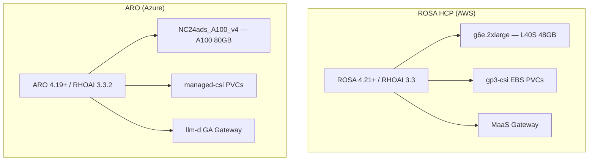
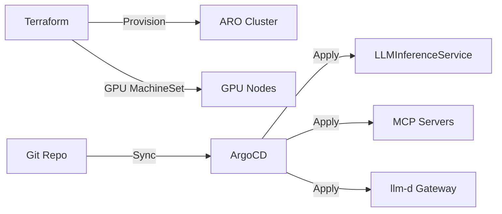

# Multi-Cloud Deployment Reference

## Overview

The coding assistant stack in this lab — vLLM model serving, MaaS gateway, and MCP tool servers — deploys on any OpenShift cluster with RHOAI 2.x+. For production multi-replica scenarios, llm-d routing can be added. Production teams commonly choose between two managed platforms:

| Platform | Full Name | Cloud Provider |
|----------|-----------|----------------|
| **ROSA** | Red Hat OpenShift Service on AWS | Amazon Web Services |
| **ARO** | Azure Red Hat OpenShift | Microsoft Azure |

Both platforms support GPU-accelerated model serving, but differ in hardware options, storage classes, provisioning workflows, and gateway integration.



## ROSA (AWS) Deployment

### Platform Stack

| Component | Version / Detail |
|-----------|-----------------|
| OpenShift | ROSA HCP 4.21+ |
| RHOAI | 3.3 |
| GPU instance | g6e.2xlarge (NVIDIA L40S 48GB) |
| GPU cost | ~$2.24/hr (on-demand, US regions) |
| Model serving | llm-d via `LLMInferenceService` CRD |
| AI Gateway | MaaS (Models as a Service) |
| Storage | gp3-csi EBS PVCs |

### GPU Provisioning

ROSA uses **machine pools** to add GPU worker nodes:

```bash
# Example: create a GPU machine pool
rosa create machinepool --cluster <cluster-name> \
  --name gpu-pool \
  --instance-type g6e.2xlarge \
  --replicas 1 \
  --taints nvidia.com/gpu=true:NoSchedule
```

NVIDIA GPU Operator and RHOAI model serving operator install via the cluster's operator hub. vLLM pods request GPU resources with standard `nvidia.com/gpu: "1"` limits.

### Storage

Model weights and cache files persist on **gp3-csi** EBS volumes:

| Property | Value |
|----------|-------|
| StorageClass | `gp3-csi` (default on ROSA) |
| Access mode | ReadWriteOnce |
| Typical size | 100Gi for 30B-class models |
| Snapshot support | EBS snapshots for instant warm-start PVCs |
| AZ binding | PVC bound to a single availability zone |

### llm-d Deployment

Deploy via `LLMInferenceService` CRD (requires RHOAI 3.3+). ROSA clusters with RHOAI 3.3 include the llm-d operator and CRD out of the box.

## ARO (Azure) Deployment

### Platform Stack

| Component | Version / Detail |
|-----------|-----------------|
| OpenShift | ARO 4.19+ |
| RHOAI | 3.3.2 |
| GPU instance | Standard_NC24ads_A100_v4 (NVIDIA A100 80GB) |
| GPU cost | ~$3.67/hr (on-demand) |
| Model serving | llm-d via `LLMInferenceService` CRD |
| AI Gateway | llm-d GA (direct gateway, not MaaS) |
| Storage | managed-csi PVCs |
| GitOps | Terraform + ArgoCD |

### GPU Provisioning

ARO adds GPU nodes via **MachineSet** scripts rather than ROSA machine pools:

```bash
# GPU MachineSet applied to the cluster
oc apply -f gpu-machineset.yaml
```

The A100 80GB SKU provides more VRAM than the L40S, supporting larger context windows and higher batch concurrency.

### Storage

Azure Disk **managed-csi** storage class backs model cache PVCs:

| Property | Value |
|----------|-------|
| StorageClass | `managed-csi` (default on ARO) |
| Access mode | ReadWriteOnce |
| Typical size | 100–200Gi for 30B–35B models |
| Snapshot support | Azure Disk snapshots |
| Zone binding | Bound to an Azure availability zone |

### GitOps Workflow

ARO deployments commonly use **Terraform** for cluster infrastructure and **ArgoCD** for application sync:



This separates infrastructure lifecycle (Terraform) from application lifecycle (ArgoCD), enabling repeatable multi-environment deployments.

### vLLM Version

ARO deployments may pin an **upstream vLLM version** (e.g., 0.17.1) rather than the RHOAI-bundled default (0.13+). Verify compatibility with your model and tool-call parser configuration before upgrading.

## Key Differences

| Aspect | ROSA (AWS) | ARO (Azure) |
|--------|-----------|-------------|
| GPU VM | g6e.2xlarge (L40S 48GB) | NC24ads_A100_v4 (A100 80GB) |
| Provisioning | ROSA machine pool | MachineSet script |
| Storage | gp3-csi | managed-csi |
| Max context | 32,768 tokens | 65,536 tokens |
| vLLM version | RHOAI default (0.13+) | 0.17.1 (upstream) |
| AI Gateway | MaaS | llm-d GA |
| Heterogeneous routing | NVIDIA + Inferentia2 | NVIDIA only (no Inferentia on Azure) |
| Est. GPU cost | $2.24/hr | $3.67/hr |
| Peak throughput | ~1,357 tok/s (L40S) | ~2,781 tok/s (A100) |

### Platform Selection Guidance

| Choose ROSA when… | Choose ARO when… |
|-------------------|------------------|
| AWS is your primary cloud | Azure is your primary cloud |
| Cost efficiency matters ($2.24/hr L40S) | Maximum context (65K tokens) is required |
| Inferentia2 heterogeneous routing is planned | A100 throughput (~2,781 tok/s) is needed |
| MaaS unified gateway (models + MCP) is preferred | GitOps (Terraform + ArgoCD) is standard |
| Team size ≤15 devs per L40S replica | Team size ≤30 devs per A100 replica |

## External Reference Deployment

A complete multi-cloud reference implementation — including ROSA and ARO Terraform modules, ArgoCD application manifests, GPU MachineSets, and llm-d configurations — is maintained separately:

**[Private AI Coding Assistant](https://github.com/manujoy7/Private_AI_Coding_Assistant)**

| Resource | Contents |
|----------|----------|
| Terraform modules | ROSA HCP and ARO cluster provisioning |
| ArgoCD apps | LLMInferenceService, MCP servers, gateway configs |
| Benchmark data | L40S, A100, and Inferentia2 performance baselines |
| Model caching | PVC, snapshot, and OCI image strategies |

Use this repository as a starting point for production deployments beyond what this lab covers in Phases 0–6.

## Cross-Cloud Considerations

When operating across both platforms:

| Concern | Recommendation |
|---------|---------------|
| **Model cache portability** | OCI model images or S3 mirrors — PVCs are AZ/region-bound |
| **Gateway endpoint** | Different URLs per cloud; Dev Spaces ConfigMaps need per-environment values |
| **API key management** | MaaS keys (ROSA) vs llm-d gateway tokens (ARO) — separate auth flows |
| **Benchmark baselines** | Re-run Phase 5 benchmarks per platform; do not extrapolate across GPUs |
| **vLLM config drift** | Pin `--tool-call-parser` and `--reasoning-parser` flags consistently |

## Next Steps

→ Read `4_model_caching.md` for storage strategies that work across ROSA and ARO.

→ Return to Phase 5 benchmarks to establish per-platform capacity baselines before scaling.
