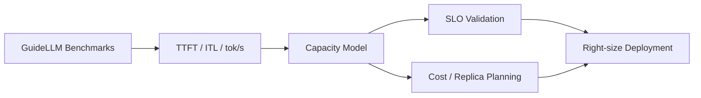
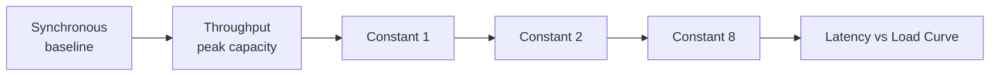

# Performance Benchmarks — Overview

## Why Benchmark Your AI Infrastructure?

Self-hosted coding assistants sit on the critical path for developer productivity. Without measured performance data, teams either **over-provision** expensive GPU capacity or **under-provision** and hit latency spikes during peak usage.

Benchmarking answers three operational questions:

| Question | What You Learn |
|----------|----------------|
| **Capacity planning** | How many developers can one GPU replica support? |
| **SLO validation** | Does TTFT stay under your target (e.g., &lt; 500 ms) at expected load? |
| **Regression detection** | Did a model upgrade, routing change, or config tweak hurt throughput? |



> **Lab scenario:** You deployed Qwen3-Coder-30B with llm-d routing in Phase 4. Before onboarding 20 developers, run benchmarks to confirm the cluster can sustain interactive coding assistant workloads — not just a single curl test.

## Key Metrics

GuideLLM (and vLLM generally) report metrics that map directly to developer experience:

| Metric | Definition | Developer Impact |
|--------|------------|------------------|
| **TTFT** (Time to First Token) | Latency from request sent to first output token | Perceived "thinking" delay — critical for chat and agent loops |
| **ITL** (Inter-Token Latency) | Average delay between consecutive output tokens | Streaming smoothness — high ITL feels "stuttery" |
| **Output tok/s** | Completion tokens per second (single stream) | Code generation speed for one active user |
| **Aggregate tok/s** | Total output tokens/sec across all concurrent streams | System-wide throughput ceiling |
| **Request throughput** | Requests completed per second (req/s) | Gateway capacity under sustained load |

**Single-user metrics** (TTFT, ITL, output tok/s) come from **synchronous** benchmarks — one request at a time. **Aggregate tok/s** comes from **throughput** or high-rate **constant** benchmarks where multiple streams compete for GPU time.

## GuideLLM Introduction

[**GuideLLM**](https://github.com/vllm-project/guidellm) is the vLLM project's official benchmarking tool. It generates realistic, configurable traffic against any **OpenAI-compatible** inference server — including vLLM behind MaaS or llm-d.

| Capability | Details |
|------------|---------|
| Traffic profiles | Synchronous, throughput, concurrent, constant-rate, Poisson, sweep |
| Data sources | Synthetic token lengths, HuggingFace datasets, JSON files, trace replay |
| Metrics | TTFT, ITL, latency percentiles, token throughput, error rates |
| Output | Console summary, JSON, CSV, HTML reports |
| Auth | API key via `--backend-kwargs` for gated endpoints |

GuideLLM replaces ad-hoc curl loops and custom load scripts with reproducible, comparable benchmark suites — the same tool Red Hat uses to evaluate RHOAI model serving deployments.

## Benchmark Strategies

Different profiles answer different questions. Use all three in combination for a complete picture.

### 1. Synchronous (Single User)

Runs requests **one at a time** — no concurrency. Measures baseline latency and per-stream token speed.

```bash
guidellm benchmark \
  --target "$MODEL_URL/v1" \
  --profile synchronous \
  --data "kind=synthetic_text,prompt_tokens=512,output_tokens=256" \
  --max-seconds 60
```

**Use for:** TTFT, ITL, single-user output tok/s, SLO baselines.

### 2. Throughput (Max Concurrency)

Sends requests **in parallel** until the server saturates. Finds peak aggregate throughput.

```bash
guidellm benchmark \
  --target "$MODEL_URL/v1" \
  --profile throughput \
  --data "kind=synthetic_text,prompt_tokens=512,output_tokens=256" \
  --max-seconds 60
```

**Use for:** Peak aggregate tok/s, maximum req/s, capacity ceiling.

### 3. Constant-Rate (Realistic Load)

Sends requests at a **fixed rate** (e.g., 2 req/s) — simulates a team sharing the model without hammering it to saturation.

```bash
guidellm benchmark \
  --target "$MODEL_URL/v1" \
  --profile constant \
  --rate 2 \
  --data "kind=synthetic_text,prompt_tokens=512,output_tokens=256" \
  --max-seconds 120
```

**Use for:** Latency under realistic team load, finding the "knee" where TTFT degrades.

### Sweep (All Strategies Combined)

The **sweep** profile runs synchronous → throughput → 8 interpolated constant-rate steps (with `--rate 10`). This is the recommended starting point for capacity planning.



## Capacity Planning Methodology

Translate benchmark numbers into **developer headcount** using a conservative concurrency model:

1. **Measure** single-user output tok/s (synchronous) and peak aggregate tok/s (throughput).
2. **Estimate per-developer demand:**
   - Average prompt: ~512 tokens (system prompt + context)
   - Average output: ~256 tokens (code generation)
   - Active coding time: ~25% of an 8-hour day (2 hours of AI-assisted work)
3. **Apply the 30% concurrency assumption:** At any moment, ~30% of developers who are actively coding are waiting on the model simultaneously.

```
developer_capacity = peak_aggregate_tok_s / (single_user_tok_s × 0.30)
```

| Assumption | Value | Rationale |
|------------|-------|-----------|
| Concurrent fraction | 30% | Not all devs hit the model at the same instant; accounts for think-time, meetings, builds |
| Workload shape | 512 in / 256 out | Typical coding assistant turn with system prompt + tool context |
| SLO target | TTFT &lt; 500 ms at planned load | Interactive coding assistant responsiveness |

**Example:** L40S with Qwen3-Coder-30B FP8 — single-user ~93 tok/s, peak aggregate ~1,357 tok/s:

```
capacity = 1,357 / (93 × 0.30) ≈ 49 theoretical max
practical  = 10–15 devs  (with TTFT SLO headroom)
```

The gap between theoretical and practical capacity reflects TTFT degradation as load increases — constant-rate sweeps reveal where latency crosses your SLO threshold.

## Reference Performance Data

Benchmarks run with GuideLLM using synthetic data (512 prompt / 256 output tokens) against vLLM with prefix caching enabled:

| GPU | Model | Single-user tok/s | TTFT | ITL | Peak agg tok/s | Dev capacity |
|-----|-------|-------------------|------|-----|----------------|--------------|
| L40S (48GB) | Qwen3-Coder-30B FP8 | ~93 | 74ms | 10ms | ~1,357 | 10–15 devs |
| A100 (80GB) | Qwen3.6-35B FP8 | ~138 | 57ms | 6.8ms | ~2,781 | 20–30 devs |
| L10 (24GB) | Qwen2.5-Coder-14B FP8 | ~50–70 | ~100ms | ~15ms | ~400–600 | 5–8 devs |

> **Note:** Results vary with prompt length, prefix cache hit rate, batch size, and llm-d routing. Always benchmark *your* deployment — these numbers are reference baselines, not guarantees.

## Cost Efficiency Comparison

Estimated cloud GPU pricing (on-demand, US regions, approximate) compared against developer capacity:

| GPU | Est. $/hr | Peak agg tok/s | $/1M output tokens | Dev capacity | $/dev/month (8hr/day) |
|-----|-----------|----------------|---------------------|--------------|------------------------|
| L10 (24GB) | ~$1.50 | ~500 | ~$0.83 | 5–8 | ~$60–96 |
| L40S (48GB) | ~$2.50 | ~1,357 | ~$0.51 | 10–15 | ~$40–60 |
| A100 (80GB) | ~$4.00 | ~2,781 | ~$0.40 | 20–30 | ~$27–40 |

**Cost per 1M output tokens** = `(GPU $/hr × 3,600) / peak_agg_tok_s / 1,000,000`

**Cost per developer per month** = `(GPU $/hr × 8 hr/day × 22 days) / dev_capacity`

| Insight | Detail |
|---------|--------|
| Larger GPUs cost more per hour | But serve more developers — lower cost per seat |
| L40S sweet spot | Best balance for 10–15 person teams running 30B-class models |
| L10 entry tier | Viable for small teams (≤8 devs) with 14B models |
| Multi-replica scaling | Linear throughput scaling until gateway or network becomes bottleneck |

## Prerequisites

| Component | Purpose |
|-----------|---------|
| Phases 0–4 completed | Cluster access, MaaS gateway, model deployed (preferably llm-d) |
| GuideLLM installed | `pip install guidellm` (notebook handles this) |
| API key or OCP token | Authenticate to MaaS / llm-d endpoint |
| GPU node with model running | vLLM serving Qwen or equivalent |

```bash
# Quick check — model reachable via MaaS
CLUSTER_DOMAIN=$(oc get ingresses.config.openshift.io cluster -o jsonpath='{.spec.domain}')
curl -sSk "https://maas.${CLUSTER_DOMAIN}/maas-api/v1/models" \
  -H "Authorization: Bearer $(oc whoami -t)" | jq '.data[].id'
```

## Next Steps

→ Continue to `2_run_benchmarks.ipynb` to install GuideLLM, benchmark your llm-d endpoint, and parse TTFT / ITL / throughput results.

→ Then run `3_capacity_planning.ipynb` to translate benchmark numbers into team sizing, multi-replica projections, and cost recommendations.
