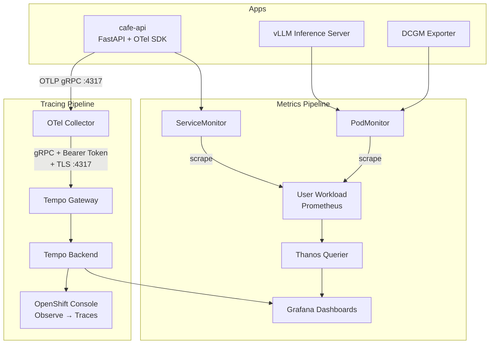

# Observability Stack — Overview

## What This Module Deploys

A unified observability stack for OpenShift AI coding assistant workloads covering **metrics**, **dashboards**, and **distributed tracing**.



| Component | Namespace | Manifest | Purpose |
|-----------|-----------|----------|---------|
| ServiceMonitor | `cafe-system` | `01-servicemonitor-cafe.yaml` | Scrape cafe-api `/metrics` |
| PodMonitor | `demo` | `02-podmonitor-vllm.yaml` | Scrape vLLM metrics (HTTPS) |
| TempoMonolithic | `monitoring` | `04-tempo.yaml` | Trace storage with gateway |
| RBAC | cluster-wide | `04b-tempo-rbac.yaml` | Trace read/write permissions |
| OTel Collector | `monitoring` | `03-otel-collector.yaml` | Receive & forward OTLP traces |
| UIPlugin | cluster-wide | `04a-uiplugin-tracing.yaml` | Enable Console Traces UI |
| Grafana | `monitoring` | `05-grafana.yaml`, `06-*` | Metric dashboards |

---

## Prerequisites (Operators)

Three operators must be installed **before** running the monitoring notebook.
The setup notebook (`0_setup/1_environment_setup.ipynb` Section 7) installs them automatically.

| Operator | Namespace | Why |
|----------|-----------|-----|
| **Tempo Operator** | `openshift-tempo-operator` | Manages TempoMonolithic CR and gateway lifecycle |
| **Red Hat build of OpenTelemetry** | `openshift-opentelemetry-operator` | Manages OpenTelemetryCollector CR |
| **Cluster Observability Operator** | `openshift-operators` | Provides UIPlugin CRD for Console Traces |

---

## Distributed Tracing — How It Works

### The Gateway Is the Key

OpenShift Console's **Observe → Traces** page only works with Tempo instances that have a **gateway** running. The gateway handles authentication (OpenShift OAuth) and multi-tenancy.

```
                                    ┌─────────────────────────────┐
                                    │  tempo-lab-0 (StatefulSet)  │
                                    │                             │
  OTel Collector ──gRPC+TLS+Token──▶│  tempo-gateway (:8090)      │
                                    │       │                     │
                                    │       ▼                     │
                                    │  tempo-gateway-opa          │
                                    │       │ (authz check)       │
                                    │       ▼                     │
                                    │  tempo (:3200, :4317)       │
                                    └─────────────────────────────┘
                                              ▲
                                              │ query via Console
                                    ┌─────────┴──────────┐
                                    │  Console Plugin     │
                                    │  (distributed-      │
                                    │   tracing)          │
                                    └────────────────────-┘
```

### What Creates the Gateway?

The Tempo Operator creates the gateway **only when tenants are configured**.
This is the single most important detail in the entire setup:

```yaml
# 04-tempo.yaml
spec:
  multitenancy:
    enabled: true
    mode: openshift
    authentication:          # ← THIS ARRAY IS REQUIRED
      - tenantName: dev      #   Without it, no gateway is created
        tenantId: dev         #   and Console shows "No Tempo instances"
```

> **Common mistake:** Setting `enabled: true` and `mode: openshift` without
> the `authentication` array. The operator accepts this without error,
> reports `Ready: True`, but silently skips gateway creation.

### Connection Chain (OTel → Gateway → Tempo)

The OTel Collector cannot send traces directly to Tempo when multi-tenancy is enabled.
It must go through the gateway with three requirements:

| Requirement | Config | Why |
|-------------|--------|-----|
| **Bearer token** | `bearertokenauth` extension | Gateway uses OpenShift OAuth to verify the caller |
| **TLS** | `tls.ca_file: service-ca.crt` | Gateway's serving cert is signed by OpenShift service-CA |
| **Tenant header** | `X-Scope-OrgID: dev` | Identifies which tenant the traces belong to |

```yaml
# 03-otel-collector.yaml (key parts)
extensions:
  bearertokenauth:
    filename: "/var/run/secrets/kubernetes.io/serviceaccount/token"

exporters:
  otlp/tempo:
    endpoint: tempo-lab-gateway.monitoring.svc.cluster.local:4317
    tls:
      insecure: false
      ca_file: "/var/run/secrets/kubernetes.io/serviceaccount/service-ca.crt"
    auth:
      authenticator: bearertokenauth
    headers:
      X-Scope-OrgID: dev

service:
  extensions: [bearertokenauth]    # ← must be listed here too
```

### RBAC for Trace Read/Write

The gateway enforces RBAC via custom Tempo resources.
Without these ClusterRoles, the Console shows no traces and the OTel Collector gets 403 errors.

```yaml
# 04b-tempo-rbac.yaml

# Console users can READ traces
- apiGroups: [tempo.grafana.com]
  resources: [dev]              # ← matches tenantName
  resourceNames: [traces]
  verbs: [get]

# OTel Collector SA can WRITE traces
- apiGroups: [tempo.grafana.com]
  resources: [dev]
  resourceNames: [traces]
  verbs: [create]
```

### Console Integration (UIPlugin)

The Cluster Observability Operator provides the UIPlugin CRD.
A single UIPlugin enables the **Observe → Traces** page in the OpenShift Console:

```yaml
# 04a-uiplugin-tracing.yaml
apiVersion: observability.openshift.io/v1alpha1
kind: UIPlugin
metadata:
  name: distributed-tracing
spec:
  type: DistributedTracing
```

---

## Troubleshooting

### "No Tempo instances yet" in Console

| Check | Command | Expected |
|-------|---------|----------|
| Tenant configured? | `oc get tempomonolithic lab -n monitoring -o jsonpath='{.spec.multitenancy.authentication}'` | Should list at least one tenant |
| Gateway pod running? | `oc get pod tempo-lab-0 -n monitoring -o jsonpath='{.spec.containers[*].name}'` | Should include `tempo-gateway` |
| Console plugin sees it? | `oc exec deploy/distributed-tracing -n openshift-operators -- curl -sk https://localhost:9443/api/v1/list-tempo-resources` | Should list the instance with tenants |
| UIPlugin active? | `oc get uiplugin distributed-tracing -o jsonpath='{.status.conditions[?(@.type=="Available")].status}'` | `True` |

**Root cause is almost always:** `authentication` array missing from TempoMonolithic spec.

### OTel Collector export failures

| Symptom | Cause | Fix |
|---------|-------|-----|
| `connection refused` on :8090 | Using container port instead of service port | Change endpoint to `:4317` |
| `transport: authentication handshake failed` | Missing TLS config | Set `tls.insecure: false` + `ca_file` |
| `i/o timeout` on gateway port | Port not exposed by service, or TLS mismatch | Verify `oc get svc tempo-lab-gateway` ports |
| `rpc error: code = PermissionDenied` | Missing RBAC for trace write | Apply `04b-tempo-rbac.yaml` |
| No bearer token in requests | `bearertokenauth` extension not in `service.extensions` | Add it to both `extensions:` and `service.extensions:` |

### Port Reference

TempoMonolithic with gateway exposes these service ports:

| Service | Port | Target | Protocol | Used By |
|---------|------|--------|----------|---------|
| `tempo-lab-gateway` | 8080 | public (HTTP) | HTTPS | Console plugin queries |
| `tempo-lab-gateway` | 8081 | internal | HTTP | Health/metrics |
| `tempo-lab-gateway` | 3200 | http (Tempo API) | HTTPS | Grafana datasource |
| `tempo-lab-gateway` | 4317 | grpc-public (:8090) | gRPC+TLS | **OTel Collector** |
| `tempo-lab` | 3200 | http | HTTP | Direct Tempo API (no auth) |
| `tempo-lab` | 4317 | otlp-grpc | gRPC | Direct ingest (no auth) |

> When gateway is active, always route through `tempo-lab-gateway` for authenticated access.

---

## Deployment Order

The monitoring notebook (`1_observability_setup.ipynb`) follows this sequence:

```
1. Verify operators are installed (Tempo, OTel, COO)
2. Create monitoring namespace
3. Deploy metrics collection (ServiceMonitor, PodMonitor)
4. Deploy cafe-api with /metrics endpoint
5. Deploy tracing stack:
   a. TempoMonolithic (with tenant → creates gateway)
   b. RBAC (trace read/write ClusterRoles)
   c. OTel Collector (bearer token + TLS → gateway)
   d. UIPlugin (enables Console Traces page)
6. Configure cafe-api to export traces to OTel Collector
7. Deploy Grafana with dashboards
8. Verify end-to-end: send request → see trace in Console
```

---

## Adding More Tenants

To add a `prod` tenant alongside `dev`:

1. Add to `04-tempo.yaml`:
   ```yaml
   authentication:
     - tenantName: dev
       tenantId: dev
     - tenantName: prod
       tenantId: prod
   ```

2. Add RBAC rules for `prod` in `04b-tempo-rbac.yaml` (duplicate the `dev` rules, replacing `resources: [dev]` with `resources: [prod]`).

3. Create a separate OTel Collector (or pipeline) with `X-Scope-OrgID: prod` for production workloads.

---

## Reference: Gateways in OpenShift AI

The word "gateway" appears in multiple places across the OpenShift AI stack.
This section clarifies which gateway does what and how they relate to the tracing pipeline above.

```
Developer Request
    │
    ▼
┌──────────────────────────────┐
│  MaaS Gateway (API layer)    │  ← Auth + Rate Limiting for model & MCP access
│  Gateway API + Authorino     │     Module: 3_maas/, 4_control/
│  + Limitador                 │
└──────────┬───────────────────┘
           │  routes to
           ▼
┌──────────────────────────────┐
│  KServe Ingress Gateway      │  ← L7 routing from external traffic to model pods
│  (Istio-based)               │     Managed by: RHOAI Operator + Service Mesh
└──────────┬───────────────────┘
           │  forwards to
           ▼
      Model Pod (vLLM)
           │
           │  app emits OTLP traces
           ▼
┌──────────────────────────────┐
│  OTel Collector              │
└──────────┬───────────────────┘
           │  gRPC + TLS + Bearer Token
           ▼
┌──────────────────────────────┐
│  Tempo Gateway (Observability│  ← Auth + Multi-tenancy for trace storage
│  layer inside Tempo pod)     │     Module: 6_monitoring/ (this module)
└──────────┬───────────────────┘
           │
           ▼
      Tempo Backend
```

### Gateway Summary

| Gateway | Layer | What It Does | Who Manages It |
|---------|-------|-------------|----------------|
| **MaaS Gateway** | Application API | Single entry point for model inference and MCP tools. Enforces API key auth and rate limiting. | RHOAI + RHCL Operators |
| **KServe Ingress Gateway** | Network (L7) | Routes external HTTPS traffic to the correct model serving pod inside the cluster. | RHOAI Operator + Service Mesh |
| **Kubernetes Gateway API** | Infrastructure | The standard API that MaaS Gateway is built on. Defines routing rules as Kubernetes resources (`Gateway`, `HTTPRoute`). | RHCL Operator (implementation) |
| **Tempo Gateway** | Observability | Authenticates trace writes (from OTel Collector) and reads (from Console/Grafana) using OpenShift OAuth. Enforces tenant isolation. | Tempo Operator |

### Key Differences

- **MaaS Gateway** handles *user-facing API traffic* — developers interact with it directly.
- **KServe Ingress Gateway** handles *network routing* — invisible to developers, managed by the platform.
- **Tempo Gateway** handles *observability traffic* — only OTel Collector and Console talk to it.
- **Kubernetes Gateway API** is not a running component but a *specification* that MaaS builds on.

> **Tip:** When someone says "the gateway" in an OpenShift AI context, they almost always
> mean the **MaaS Gateway**. The Tempo Gateway only comes up when configuring tracing,
> and the KServe/Istio gateway is rarely discussed directly because the operator manages it.
