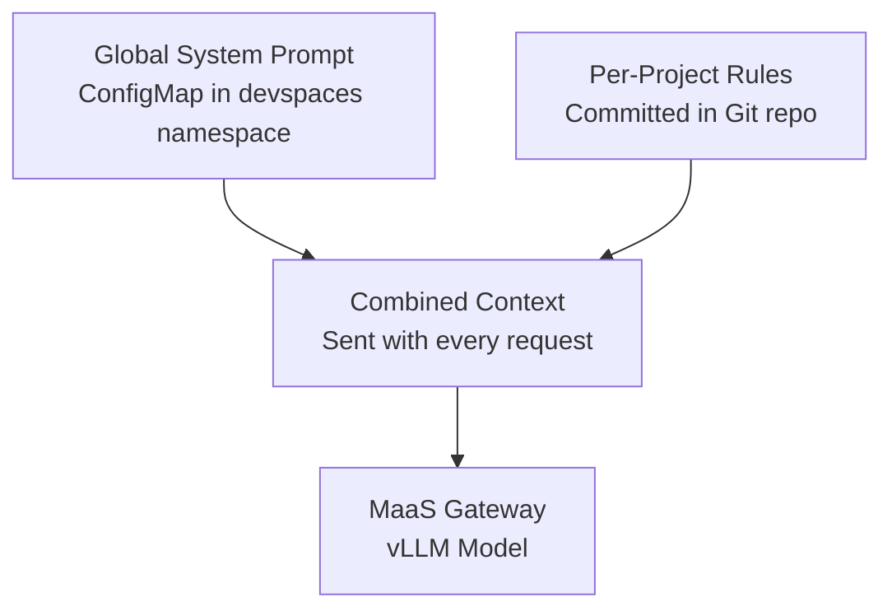
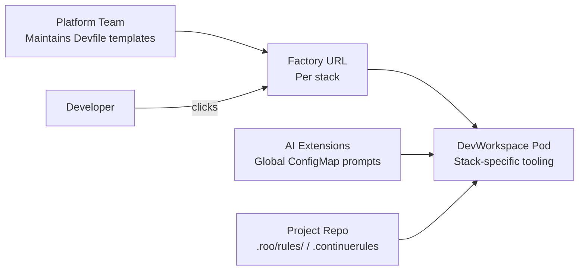

# System Prompts and Context Engineering

## Overview

**Context engineering** is the practice of shaping what the model knows before it generates code. In a Dev Spaces deployment, context comes from two sources:

1. **Global system prompts** — platform-managed defaults injected via extension ConfigMaps (every workspace, every repo).
2. **Per-project rules** — repository-local files that append team- or service-specific instructions (one repo at a time).

Together they convert a general-purpose coding model into one that understands your stack, conventions, and architectural boundaries.



## Global System Prompt Customization

Global prompts are distributed through **extension ConfigMaps** mounted into every DevWorkspace — the same pattern established in Phase 4.

### Continue — `systemMessage` in `config.yaml`

```yaml
# Fragment of continue-config ConfigMap (Phase 4 pattern)
data:
  config.yaml: |
    models:
      - name: Qwen3-Coder-30B
        provider: openai
        model: Qwen/Qwen3-Coder-30B-A3B-Instruct-FP8
        apiBase: https://maas.CLUSTER_DOMAIN/v1
        apiKey: REPLACE_WITH_MAAS_API_KEY
        systemMessage: |
          You are a senior engineer at Acme Corp.

          ## Technology Standards
          - Primary languages: Java 21, Python 3.12, TypeScript (Node 22)
          - Java: Spring Boot 3.x, Maven, JUnit 5, Testcontainers
          - Python: FastAPI, uv for dependency management, pytest + ruff
          - TypeScript: NestJS, pnpm, ESLint with @acme/eslint-config

          ## Architecture
          - Microservices communicate via REST (OpenAPI 3.1) or async events (Kafka)
          - Never call another service's database directly
          - Use acme-auth-lib for authentication — do not roll custom JWT handling

          ## Conventions
          - Package naming: com.acme.<service>.<layer>
          - REST paths: /api/v1/<resource> (kebab-case, plural nouns)
          - All public APIs require OpenAPI spec in docs/openapi.yaml

          ## Testing
          - Minimum 80% line coverage on new code
          - Integration tests use Testcontainers (Java) or pytest fixtures (Python)
          - No @Disabled or skip without linked Jira ticket
```

### Roo Code — Custom Instructions per Mode

Roo Code supports mode-specific behavior. Place global instructions in `.roo/rules/` (see below) or configure default instructions in the DevWorkspace base image. For platform-wide defaults, many teams bake a starter `.roo/rules/` tree into the DevWorkspace template Git repo referenced by the Factory URL.

### ConfigMap Distribution Pattern

Use the DevWorkspace controller annotations from Phase 4 so updates propagate without image rebuilds:

```yaml
metadata:
  labels:
    controller.devfile.io/mount-to-devworkspace: "true"
    controller.devfile.io/watch-configmap: "true"
  annotations:
    controller.devfile.io/mount-as: subpath
    controller.devfile.io/mount-path: /home/user/.continue
```

> **Tip:** Version global prompts in Git (this repo or a dedicated `platform-config` repo) and apply via `oc apply -f`. Track changes in pull requests — a bad prompt affects every developer immediately.

## Typical Global Customizations

| Category | What to Include | Example |
|----------|-----------------|---------|
| **Language and framework context** | Approved runtimes and major versions | "Java 21 with Spring Boot 3.3+, not javax.* imports" |
| **Internal library preferences** | Approved SDKs over generic alternatives | "Use acme-observability-lib for metrics, not raw Micrometer boilerplate" |
| **Architectural patterns** | Service boundaries, communication styles | "CQRS for write-heavy domains; no shared database tables across services" |
| **Naming conventions and style** | Package, class, API, and file naming | "Controllers named `<Entity>Controller`, DTOs suffixed `Request`/`Response`" |
| **Test framework standards** | Required test libraries and patterns | "JUnit 5 + AssertJ + Mockito; Given-When-Then structure in test names" |

## Per-Project Context via Rules Files

Repository-local rules override or extend global prompts for a specific codebase. Commit these files to Git so they travel with the project and are visible in code review.

| Extension | Rules File | Scope |
|-----------|-----------|-------|
| **Continue** | `.continuerules` | Per-repo system prompt append |
| **Cline** | `.clinerules` | Per-repo instruction file |
| **Roo Code** | `.roo/rules/`, `.roo/rules-{mode}/` | Per-mode rules (Code, Architect, Ask, Debug) |

### Continue — `.continuerules`

Plain-text file appended to the system prompt when working in that repository:

```text
# .continuerules — payment-service

This is the Payment Service (com.acme.payment).

- Uses hexagonal architecture: domain/ ports, infrastructure/ adapters
- Database: PostgreSQL via Flyway migrations in src/main/resources/db/migration/
- Idempotency keys required on all POST endpoints (header: Idempotency-Key)
- Do not import from com.acme.billing directly — use the billing-events Kafka topic
- Feature flags: acme-feature-flags SDK, never hardcode environment checks
```

### Cline — `.clinerules`

Same concept, consumed by Cline's autonomous agent loop:

```text
# .clinerules — payment-service

Before making changes:
1. Read docs/adr/ for architectural decisions
2. Run `mvn test` before proposing commits
3. All new REST endpoints must update docs/openapi.yaml
```

### Roo Code — `.roo/rules/` Structure

Roo Code loads rules from `.roo/rules/` globally and `.roo/rules-{mode}/` for mode-specific overrides. Example layout for a **polyglot organization** (Java payment service with shared platform rules):

```text
payment-service/
├── .roo/
│   ├── rules/
│   │   ├── 00-company-standards.md      # Inherited patterns (or symlink to template)
│   │   ├── 10-java-spring.md              # Spring Boot conventions
│   │   ├── 20-payment-domain.md           # Domain-specific invariants
│   │   └── 30-security-sonar.md           # SonarQube rules (see Phase 7 doc 3)
│   ├── rules-architect/
│   │   └── adr-process.md                 # Architect mode: ADR format, diagram tools
│   ├── rules-code/
│   │   └── implementation-checklist.md    # Code mode: TDD steps, commit format
│   └── rules-debug/
│       └── observability.md               # Debug mode: log correlation IDs, trace queries
├── src/
└── docs/
    └── adr/
```

**Example — `10-java-spring.md`:**

```markdown
# Java / Spring Boot Rules — payment-service

## Dependencies
- Spring Boot 3.3.x BOM — do not override managed versions without ADR
- Prefer Spring Data JPA repositories; no EntityManager in service layer

## Error Handling
- Use @ControllerAdvice with ProblemDetail (RFC 7807)
- Never expose stack traces in API responses

## Logging
- Structured JSON logging via acme-logging-lib
- Include correlationId, tenantId, paymentId in MDC
```

**Example — `rules-architect/adr-process.md`:**

```markdown
# Architect Mode — ADR Process

When proposing architectural changes:
1. Check docs/adr/ for existing decisions
2. New ADRs follow docs/adr/template.md (Status, Context, Decision, Consequences)
3. Include a Mermaid sequence diagram for cross-service flows
4. Reference internal Confluence space PAYMENTS for integration contracts
```

## DevWorkspace Templates per Technology Stack

Different squads need different toolchains pre-installed. Replace the generic Universal Developer Image with **stack-specific DevWorkspace templates** — one Factory URL per team.

| Team/Stack | Image | Pre-installed Tooling |
|------------|-------|----------------------|
| **Java/Spring** | UBI 9 + JDK 21 | mvn, java, oc, git |
| **Python/FastAPI** | UBI 9 + Python 3.12 | uv, ruff, pytest, oc |
| **Node.js/NestJS** | UBI 9 + Node 22 | npm, pnpm, eslint, oc |
| **Go** | UBI 9 + Go 1.22 | go, golangci-lint, oc |

### Devfile Fragment — Java/Spring Template

```yaml
schemaVersion: 2.2.0
metadata:
  name: java-spring-dev
  annotations:
    che.theia-ide.org/external-endpoint-url: https://devspaces.CLUSTER_DOMAIN
components:
  - name: tools
    container:
      image: registry.example.com/devspaces/ubi9-jdk21:latest
      memoryLimit: 4Gi
      env:
        - name: MAAS_ENDPOINT
          value: https://maas.CLUSTER_DOMAIN/v1
        - name: MODEL_NAME
          value: Qwen/Qwen3-Coder-30B-A3B-Instruct-FP8
        - name: JAVA_HOME
          value: /usr/lib/jvm/java-21
      volumeMounts:
        - name: m2-cache
          path: /home/user/.m2
  - name: m2-cache
    volume:
      size: 10Gi
commands:
  - id: verify-toolchain
    exec:
      component: tools
      commandLine: "java -version && mvn -version && oc version --client"
```

### Template Design Guidelines

| Guideline | Rationale |
|-----------|-----------|
| **Pin image digests in production** | Reproducible builds; controlled rollout of toolchain updates |
| **Mount Maven/npm/go module caches as PVCs** | Faster dependency resolution across workspace restarts |
| **Inject MaaS env vars at template level** | Extensions read the same endpoint regardless of stack |
| **Include oc and git in every template** | Consistent deploy-and-commit workflow from the workspace |
| **One Factory URL per template** | Self-service onboarding — share link in team wiki |



## Layering Strategy

Apply customizations in order of **widest to narrowest** scope:

1. **Global system prompt** — company-wide standards (ConfigMap)
2. **DevWorkspace template** — stack toolchain and env vars (Devfile)
3. **Per-project rules** — service-specific architecture (Git)
4. **Mode-specific rules** — architect vs. code vs. debug behavior (`.roo/rules-{mode}/`)
5. **Live MCP context** — ADRs, Jira tickets, SonarQube findings (runtime)

> **Avoid duplication:** Put company-wide Java conventions in the global prompt once. Per-repo files should only contain what differs for that service — not a copy of the entire style guide.

## Important Notes

> **Prompt length vs. prefix cache:** Shared global prompts increase prefix-cache hit rates on vLLM. Keep global prompts stable and identical across developers; put volatile or repo-specific content in per-project rules.

> **Review rules in PRs:** Treat `.continuerules`, `.clinerules`, and `.roo/rules/` like code — they directly influence generated output and security posture.

> **Cline caveat:** Cline reads `.clinerules` but global config still requires manual UI setup (Phase 4). Document the expected `.clinerules` location in team onboarding docs.

## Next Steps

→ Read `3_sonarqube_integration.md` to embed SonarQube quality rules into system prompts and connect live findings.

→ Read `4_mcp_internal_systems.md` to give the AI access to internal ADRs, OpenAPI catalogs, and Jira acceptance criteria via MCP.
