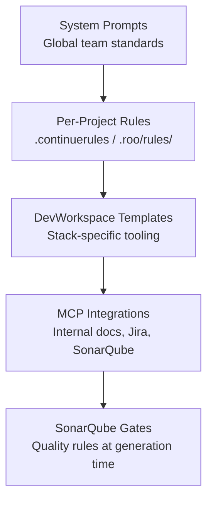
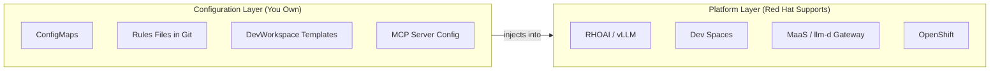

# Enterprise Customization — Overview

## What This Module Covers

Phases 0–7 deploy a production-ready coding assistant: MCP tool servers, MaaS / llm-d gateway, Dev Spaces onboarding, benchmarks, and advanced scaling patterns. **Phase 8** addresses the gap between a *working* platform and one that produces **team-specific, high-quality output** at enterprise scale.

Enterprise customization operates on two parallel tracks:

| Track | Goal | Primary Mechanisms |
|-------|------|-------------------|
| **Team Practice Alignment** | AI output matches your language, architecture, libraries, and conventions | System prompts, per-project rules, DevWorkspace templates |
| **Quality Gate Integration** | AI-generated code passes SonarQube and security gates on first commit | SonarQube rules in prompts, live findings via MCP, pre-commit hooks |

> **Documentation-only module:** This phase provides reference architecture and best practices for platform teams rolling out coding assistants across multiple squads. No hands-on notebooks — apply these patterns to your existing Phase 5 Dev Spaces and Phase 1 MCP deployments.

## Why Customization Matters

Out-of-the-box AI coding assistants optimize for **generic, broadly applicable code**. Enterprise teams need the opposite: output that looks like it was written by a senior engineer on *your* team.

| Generic AI Output | Customized AI Output |
|-------------------|----------------------|
| Uses whatever library the model remembers | Prefers your internal SDKs and approved frameworks |
| Ignores naming conventions and package structure | Follows team style guides and repo layout |
| May introduce security anti-patterns | Embeds SonarQube rules at generation time |
| Each developer configures extensions differently | Platform-managed config via ConfigMaps |
| Onboarding takes days to reproduce setup | Factory URL + stack-specific DevWorkspace template |

**Key insight:** Customization transforms the platform from *"an AI that writes code"* into *"an AI that writes **your** code"* — without forking the underlying RHOAI stack.

## Customization Layers

Customizations stack from global platform defaults down to per-repo rules and live quality feedback:

| Layer | Scope | Managed By | Update Frequency |
|-------|-------|------------|------------------|
| **System Prompts** | All developers, all repos | Platform team (ConfigMap) | Quarterly or on major framework changes |
| **Per-Project Rules** | Single repository | Squad / tech lead (Git) | Per sprint or when architecture changes |
| **DevWorkspace Templates** | Team or technology stack | Platform team (Devfile) | When base image or toolchain versions change |
| **MCP Integrations** | All developers with MCP access | Platform team (OpenShift Deployment) | As internal APIs evolve |
| **SonarQube Gates** | Language / quality profile | Security / quality engineering | Monthly profile sync |

Each layer **narrows context** without replacing the layers above. A Java squad inherits the global system prompt, adds `.roo/rules/` for Spring conventions, opens a Java DevWorkspace with JDK 21 pre-installed, queries Confluence ADRs via MCP, and generates code that already satisfies SonarQube security hotspots.

## Configuration, Not Code Changes

Every customization in this module is **configuration** — ConfigMaps, Devfiles, rules files, MCP server settings, and prompt text. The underlying platform remains:

- **Supported** by Red Hat (RHOAI, OpenShift, Dev Spaces operators)
- **Upgradeable** without merge conflicts in forked controller code
- **Auditable** through GitOps (rules files in repos, ConfigMaps in cluster config repos)

> **Anti-pattern:** Forking vLLM, patching the Dev Spaces controller, or embedding custom logic in the gateway proxy. These create upgrade debt and void support boundaries. Prefer prompt engineering, MCP tools, and ConfigMap distribution instead.

## Relationship to Earlier Phases

| Phase | What Phase 8 Builds On |
|-------|------------------------|
| **Phase 1 — MCP Servers** | Extend deployment pattern to internal systems (Confluence, Jira, SonarQube) |
| **Phase 2 — MaaS Gateway** | System prompts reference the same model endpoint; no gateway changes required |
| **Phase 5 — Dev Spaces** | ConfigMap mounting for global prompts; DevWorkspace templates per stack |
| **Phase 6 — Benchmarks** | Baseline quality metrics before/after SonarQube prompt customization |
| **Phase 7 — Advanced** | Multi-replica scaling unchanged; prefix-cache benefits increase with shared system prompts |

## Module Contents

| Document | Focus |
|----------|-------|
| `1_enterprise_overview.md` | This file — tracks, layers, and design principles |
| `2_system_prompts.md` | Global prompts, per-project rules, DevWorkspace templates |
| `3_sonarqube_integration.md` | Quality gates, live findings, pre-commit hooks, improvement loop |
| `4_mcp_internal_systems.md` | MCP servers for internal docs, APIs, issue trackers, SonarQube |

## Prerequisites

| Component | Purpose |
|-----------|---------|
| Phases 0–5 completed | Cluster, MaaS gateway, Dev Spaces with AI extensions |
| Phase 1 MCP pattern understood | Deployment model for internal MCP servers |
| SonarQube instance (optional) | Quality gate integration in `3_sonarqube_integration.md` |
| Internal API access | Confluence, Jira, or GitLab tokens for MCP servers in `4_mcp_internal_systems.md` |

## Next Steps

→ Read `2_system_prompts.md` for global system prompt customization, per-project rules files, and stack-specific DevWorkspace templates.

→ Read `3_sonarqube_integration.md` to embed quality rules in prompts and connect live SonarQube findings via MCP.

→ Read `4_mcp_internal_systems.md` to extend MCP beyond GitHub to your internal documentation and service catalogs.
