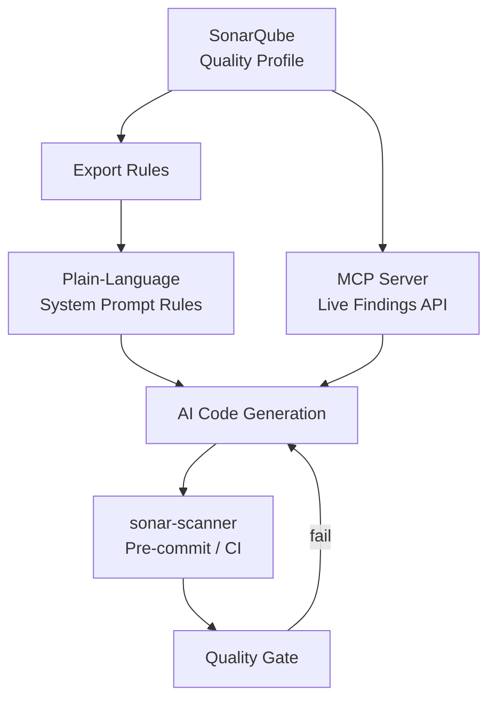
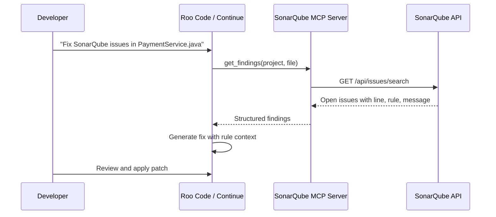
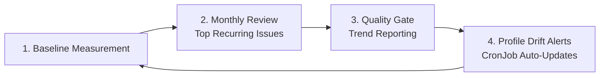

# SonarQube-Aware Code Generation

## The Problem

AI-generated code often **passes functional review** but **fails quality gates** on first SonarQube scan:

| Finding Type | Example | Why AI Produces It |
|--------------|---------|-------------------|
| **Security hotspots** | SQL injection via string concatenation | Model defaults to simplest working query pattern |
| **Code smells** | Cognitive complexity > 15, duplicated blocks | Model optimizes for readability, not Sonar metrics |
| **Bug patterns** | Resource leaks, ignored return values | Training data includes legacy patterns |
| **Coverage gaps** | Untested branches in generated helpers | Model may skip tests unless explicitly prompted |

Developers then spend review cycles fixing preventable issues — eroding trust in the coding assistant.

## The Solution

Embed **SonarQube rules as plain-language instructions** in system prompts at generation time, and optionally feed **live findings** back to the AI via MCP so it fixes existing violations instead of introducing new ones.



**Two complementary approaches:**

1. **Preventive** — Rules in system prompt stop violations before they are written.
2. **Corrective** — MCP server returns open findings so the AI remediates existing issues in context.

## Implementation Approach

### Step 1 — Export Quality Profile from SonarQube

Export the active quality profile for each language your teams use:

```bash
# SonarQube Web API — export profile (requires admin token)
curl -u "${SONAR_TOKEN}:" \
  "https://sonarqube.example.com/api/qualityprofiles/export?language=java&qualityProfile=Acme%20Java%20Way"
```

Alternatively, use **SonarQube Quality Profiles → Backup** in the UI to download a JSON or XML export.

Focus on rules that are **activated** and **non-trivial** — security hotspots, reliability bugs, and maintainability blockers. Skip stylistic rules already covered by formatters (Checkstyle, Prettier).

### Step 2 — Convert Rules to Plain-Language Instructions

Transform SonarQube rule metadata into imperative instructions the model can follow during generation. Group by category for prompt clarity.

**Mapping template:**

| SonarQube Rule | Rule Key (example) | Plain-Language Instruction |
|----------------|-------------------|---------------------------|
| SQL injection | `java:S3649` | Always use parameterized queries or JPA named parameters — never concatenate user input into SQL |
| Resource leak | `java:S2095` | Use try-with-resources for all AutoCloseable objects (Connection, Stream, Reader) |
| Cognitive complexity | `java:S3776` | Keep methods under complexity 15 — extract helpers when logic branches exceed three levels |
| Hardcoded credentials | `python:S2068` | Never hardcode secrets — use os.environ or the acme-secrets SDK |
| eval usage | `javascript:S1523` | Do not use eval(), Function constructor, or dynamic code execution |

### Step 3 — AI Applies Rules During Code Generation

Add the converted rules to:

- **Global system prompt** (ConfigMap) for language-wide standards
- **Per-project rules** (`.roo/rules/30-security-sonar.md`) for service-specific profiles
- **Mode-specific rules** (`.roo/rules-code/`) for implementation-focused checks

## Example — Java Security Rules in System Prompt Format

```markdown
# SonarQube Quality Rules — Java (Acme Java Way profile)

Apply these rules to ALL generated Java code. Code that violates these rules
will fail the SonarQube quality gate and cannot be merged.

## Security (Blocker / Critical)

- **S3649 — SQL Injection:** Use PreparedStatement or JPA @Query with named
  parameters. NEVER build SQL with string concatenation or String.format().
  ```java
  // WRONG
  stmt.executeQuery("SELECT * FROM users WHERE id = '" + userId + "'");
  // RIGHT
  stmt.executeQuery("SELECT * FROM users WHERE id = ?", userId);
  ```

- **S5131 — XSS:** Encode all user-supplied data before rendering in HTML.
  Use OWASP Java Encoder or Spring's HtmlUtils.htmlEscape().

- **S2077 — LDAP Injection:** Sanitize input used in LDAP queries via
  LdapEncoder.filterEncode().

## Reliability (Major)

- **S2095 — Resource Leaks:** Wrap AutoCloseable in try-with-resources.
- **S1166 — Exception Handling:** Log or rethrow exceptions — never empty catch blocks.
- **S2259 — Null Dereference:** Use Optional or explicit null checks on external API responses.

## Maintainability

- **S3776 — Cognitive Complexity:** Refactor methods exceeding complexity 15.
- **S1192 — String Literals:** Extract duplicated string literals to constants.
- **S106 — System.out:** Use SLF4J logger (acme-logging-lib) — never System.out.println.

## Testing

- **S2699 — Assertions:** Every test method must contain at least one assertion.
- New code must maintain ≥ 80% line coverage on changed files.
```

> **Keep prompts maintainable:** Reference SonarQube rule keys (e.g., `S3649`) so platform teams can diff prompt changes against profile updates during monthly reviews.

## SonarQube Findings as Live AI Context

Static prompt rules prevent *new* violations. An **MCP server** querying the SonarQube Web API provides *existing* findings as runtime context — enabling fix workflows like *"resolve all BLOCKER issues in this file."*



**Suggested MCP tools:**

| Tool | Purpose |
|------|---------|
| `get_project_findings` | List open issues filtered by severity, type, file |
| `get_rule_description` | Fetch full rule description and remediation guidance |
| `get_quality_gate_status` | Return pass/fail and failed conditions for a project |
| `get_hotspots` | Security hotspots requiring review |

Deploy the MCP server using the Phase 1 pattern (Deployment + Service + Route). Store the SonarQube token in an OpenShift Secret.

## Language-Specific Customization Matrix

| Language | Common Rules Addressed | AI Customization |
|----------|------------------------|------------------|
| **Java** | SQL injection, resource leaks, complexity | Parameterized queries, try-with-resources, extract method refactoring |
| **Python** | Hardcoded creds, broad except, SQL injection | `secrets` / env vars, specific exception types, SQLAlchemy parameterized queries |
| **JavaScript** | Prototype pollution, XSS, eval() | Strict equality (`===`), sanitize DOM output, ban `eval()` and `new Function()` |
| **Go** | Error return ignored, race conditions | Always handle errors (`if err != nil`), use sync primitives and context cancellation |

### Python Example — Prompt Fragment

```markdown
## Python SonarQube Rules

- Never use bare `except:` — catch specific exceptions (Sonar S5754)
- Use `secrets.compare_digest()` for token comparison, not `==`
- Database queries via SQLAlchemy `text()` with bound parameters only
- No `# noqa` without linked Sonar issue ID in comment
```

### Go Example — Prompt Fragment

```markdown
## Go SonarQube Rules

- Every error return must be checked — use `if err != nil { return fmt.Errorf("...: %w", err) }`
- Protect shared state with sync.Mutex or channels — no unsynchronized map writes
- Pass context.Context as first parameter to all I/O functions
- golangci-lint must pass with zero issues before commit
```

## Pre-Commit Hook Integration

Catch violations **before** code reaches the remote repository by running `sonar-scanner` in a Git pre-commit hook inside the DevWorkspace.

```bash
#!/bin/bash
# .git/hooks/pre-commit (or managed via pre-commit framework)

set -euo pipefail

# Run fast local analysis (sonar-scanner or sonarlint-cli)
sonar-scanner \
  -Dsonar.projectKey="${SONAR_PROJECT_KEY}" \
  -Dsonar.host.url="${SONAR_HOST_URL}" \
  -Dsonar.token="${SONAR_TOKEN}" \
  -Dsonar.sources=src \
  -Dsonar.inclusions="$(git diff --cached --name-only --diff-filter=ACM | tr '\n' ',')"

# Optional: fail on quality gate (requires webhook or polling)
# curl -sf "${SONAR_HOST_URL}/api/qualitygates/project_status?projectKey=${SONAR_PROJECT_KEY}"
```

| Approach | Speed | Coverage | Best For |
|----------|-------|----------|----------|
| **SonarLint (IDE)** | Instant | Open files | Developer feedback while typing |
| **sonar-scanner pre-commit** | 30–90s | Changed files | Gate before push |
| **CI pipeline scan** | Minutes | Full branch | Authoritative quality gate |

> **Developer experience:** Pre-commit hooks should scan **changed files only** to keep the feedback loop under two minutes. Full branch analysis remains in CI.

### DevWorkspace Integration

Add a `pre-commit` setup command to stack-specific Devfiles:

```yaml
commands:
  - id: setup-pre-commit
    exec:
      component: tools
      commandLine: |
        pip install pre-commit  # or: npm install -g @acme/pre-commit-hooks
        pre-commit install
```

## Continuous Improvement Loop

SonarQube integration is not a one-time prompt write. Operate a feedback loop between quality engineering and platform teams:



### 1. Baseline Measurement

Before customizing prompts, capture current state:

| Metric | Source |
|--------|--------|
| Issues per 1,000 LOC | SonarQube portfolio dashboard |
| Quality gate pass rate | CI pipeline metrics |
| Top 10 rules by frequency | SonarQube Issues search, grouped by rule |
| Time from PR open to quality gate pass | Git + CI timestamps |

Compare again after 30 days of prompt customization to quantify improvement.

### 2. Monthly Review of Top Recurring Issues

Quality engineering exports the top recurring rule violations across repos. Platform team updates system prompts and `.roo/rules/30-security-sonar.md` templates accordingly.

```bash
# Top rules across portfolio (last 30 days)
curl -u "${SONAR_TOKEN}:" \
  "https://sonarqube.example.com/api/issues/search?ps=1&facets=rules&createdAfter=$(date -d '30 days ago' +%Y-%m-%d)"
```

### 3. Quality Gate Trend Reporting

Track quality gate pass rate over time in your observability stack (Grafana, OpenShift monitoring). Correlate dips with model upgrades or prompt changes.

| Dashboard Panel | Query |
|-----------------|-------|
| Gate pass rate (weekly) | CI metric: `sonarqube_quality_gate_status` |
| New issues per PR | SonarQube webhook → event stream |
| AI-assisted PR vs. manual PR issue density | Tag PRs with `ai-assisted=true` label |

### 4. Profile Drift Alerts (CronJob Auto-Updates)

SonarQube quality profiles evolve as new rules are released. A **CronJob** detects profile changes and notifies the platform team (or auto-regenerates prompt fragments):

```yaml
apiVersion: batch/v1
kind: CronJob
metadata:
  name: sonar-profile-sync
  namespace: devspaces
spec:
  schedule: "0 6 1 * *"   # First day of each month, 06:00 UTC
  jobTemplate:
    spec:
      template:
        spec:
          containers:
            - name: sync
              image: registry.example.com/platform/sonar-prompt-sync:latest
              env:
                - name: SONAR_HOST_URL
                  value: https://sonarqube.example.com
                - name: SONAR_TOKEN
                  valueFrom:
                    secretKeyRef:
                      name: sonarqube-token
                      key: token
              command:
                - /bin/sh
                - -c
                - |
                  # Export profile, diff against last month, open PR if changed
                  /scripts/export-and-diff-profiles.sh
                  /scripts/notify-slack.sh "#platform-ai" "SonarQube profile drift detected"
          restartPolicy: OnFailure
```

The sync script should:

1. Export current quality profiles for Java, Python, JS, Go.
2. Diff against the Git-stored prompt fragments in the platform config repo.
3. Open a pull request with updated rule instructions (human review required).
4. Alert if new **Blocker** or **Critical** rules were activated.

## Important Notes

> **Prompt rules are advisory; CI is authoritative.** System prompts reduce violations but cannot guarantee compliance. Always enforce the quality gate in CI.

> **Do not paste entire SonarQube rule catalogs.** Focus on the 20–40 rules that cause 80% of gate failures in your organization. Overlong prompts degrade model attention and prefix-cache efficiency.

> **Coordinate with security team** on hotspot rules — some require human review in SonarQube even after AI remediation.

## Next Steps

→ Read `4_mcp_internal_systems.md` to deploy the SonarQube MCP server alongside Confluence, Jira, and internal API catalog integrations.

→ Apply SonarQube prompt fragments to your Phase 5 Continue ConfigMap and per-repo `.roo/rules/` templates.
