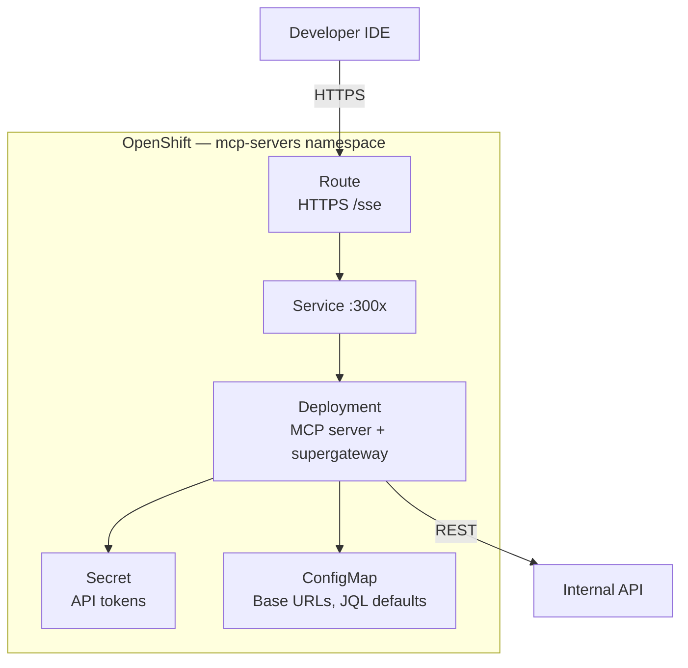

# MCP Integration with Internal Systems

## Overview

Phase 1 deploys MCP servers for **external** services — GitHub, library documentation, browser automation. Enterprise teams need the same pattern for **internal** systems: architecture decision records, runbooks, service catalogs, issue trackers, and code search across private repositories.

MCP turns these systems into **tools the AI can invoke** during coding sessions — fetching an ADR before refactoring, reading Jira acceptance criteria before implementing a feature, or querying open SonarQube findings before opening a PR.

```mermaid
flowchart TB
    IDE[Developer IDE<br/>Continue / Roo Code / Cline]
    MaaS[MaaS Gateway<br/>Optional MCP Proxy]
    subgraph Internal MCP["Internal MCP Servers (OpenShift)"]
        CONF[Confluence / Notion<br/>ADRs, Runbooks]
        API[OpenAPI Catalog<br/>Service Discovery]
        JIRA[Jira / Issue Tracker<br/>AC, DoD]
        GIT[Internal GitLab / GitHub<br/>Cross-Repo Search]
        SONAR[SonarQube<br/>Live Findings]
    end

    IDE -->|HTTPS /sse| MaaS
    IDE -->|HTTPS /sse| Internal MCP
    MaaS --> Internal MCP
    CONF --> CONF_API[Confluence REST API]
    API --> CATALOG[Internal API Gateway]
    JIRA --> JIRA_API[Jira REST API]
    GIT --> GIT_API[GitLab / GitHub Enterprise API]
    SONAR --> SQ_API[SonarQube Web API]
```

## Extending MCP Beyond GitHub

| Internal System | MCP Use Cases | Typical Tools |
|-----------------|---------------|---------------|
| **Confluence / Notion** | ADRs, runbooks, design docs, onboarding guides | `search_docs`, `get_page`, `list_adrs` |
| **OpenAPI catalogs** | Internal service discovery, contract lookup | `list_services`, `get_openapi_spec`, `find_endpoint` |
| **Jira / issue tracker** | Acceptance criteria, Definition of Done, sprint context | `get_issue`, `get_linked_issues`, `search_jql` |
| **Internal GitLab / GitHub** | Code search across repos, reference implementations | `search_code`, `get_file`, `list_repos` |
| **SonarQube** | Live findings as context for remediation | `get_findings`, `get_quality_gate`, `get_hotspots` |

**Key insight:** Each integration follows the same Phase 1 deployment pattern. The difference is the **adapter layer** inside the MCP server pod that translates MCP tool calls into your internal REST APIs.

## MCP Server Deployment Pattern on OpenShift

Internal MCP servers use the **identical architecture** from Phase 1:



Each server consists of:

| Resource | Purpose |
|----------|---------|
| **Deployment** | Container running MCP server (stdio wrapped with `supergateway` or native HTTP SSE) |
| **Service** | Cluster-internal networking on a fixed port |
| **Route** | External HTTPS endpoint with TLS termination |
| **Secret** | API tokens (Confluence PAT, Jira token, SonarQube token, GitLab deploy token) |
| **ConfigMap** | Non-secret config (base URLs, default project keys, allowed spaces) |

### Example Deployment — SonarQube MCP Server

```yaml
apiVersion: apps/v1
kind: Deployment
metadata:
  name: mcp-sonarqube
  namespace: mcp-servers
  labels:
    app.kubernetes.io/part-of: code-assistant-lab
spec:
  replicas: 1
  selector:
    matchLabels:
      app: mcp-sonarqube
  template:
    metadata:
      labels:
        app: mcp-sonarqube
    spec:
      serviceAccountName: mcp-sonarqube
      containers:
        - name: mcp-server
          image: registry.example.com/mcp/sonarqube-server:latest
          ports:
            - containerPort: 3006
          env:
            - name: SONAR_HOST_URL
              valueFrom:
                configMapKeyRef:
                  name: mcp-sonarqube-config
                  key: hostUrl
            - name: SONAR_TOKEN
              valueFrom:
                secretKeyRef:
                  name: mcp-sonarqube-token
                  key: token
          resources:
            requests:
              memory: 256Mi
              cpu: 100m
            limits:
              memory: 512Mi
              cpu: 500m
```

Register the server with MaaS (Phase 2) so developers access it through the unified gateway, or connect directly via Route URL in extension MCP config.

## Configuration Distribution via ConfigMaps

Centralize non-secret MCP configuration in ConfigMaps managed by the platform team — the same GitOps workflow as Continue and Roo Code configs in Phase 5.

```yaml
apiVersion: v1
kind: ConfigMap
metadata:
  name: mcp-internal-config
  namespace: mcp-servers
  labels:
    app.kubernetes.io/part-of: code-assistant-lab
data:
  confluence-base-url: "https://confluence.example.com"
  confluence-default-spaces: "ENG,ARCH,RUNBOOKS"
  jira-base-url: "https://jira.example.com"
  jira-default-project: "PAY"
  openapi-catalog-url: "https://api-catalog.example.com/v1"
  gitlab-base-url: "https://gitlab.example.com"
  sonar-host-url: "https://sonarqube.example.com"
```

| Config Key | Purpose |
|------------|---------|
| `*-base-url` | Internal service endpoint (no trailing slash) |
| `*-default-spaces` / `*-default-project` | Scope MCP searches to approved areas |
| `allowed-repos` | GitLab/GitHub org or group allowlist |
| `rate-limit-rpm` | Per-server request throttle to protect internal APIs |

> **Single source of truth:** Store ConfigMaps in a `platform-config` Git repo. CI applies to the cluster on merge — same pattern as Dev Spaces extension ConfigMaps.

### IDE Connection — Continue MCP Config

```yaml
# Fragment added to continue-config ConfigMap
mcpServers:
  - name: confluence
    serverUrl: https://maas.CLUSTER_DOMAIN/mcp/confluence/sse
  - name: jira
    serverUrl: https://maas.CLUSTER_DOMAIN/mcp/jira/sse
  - name: sonarqube
    serverUrl: https://maas.CLUSTER_DOMAIN/mcp/sonarqube/sse
  - name: openapi-catalog
    serverUrl: https://maas.CLUSTER_DOMAIN/mcp/openapi-catalog/sse
```

## Security Considerations

Internal MCP servers bridge the AI assistant to sensitive corporate systems. Apply defense-in-depth:

### Service Accounts and RBAC

| Principle | Implementation |
|-----------|----------------|
| **Dedicated ServiceAccount per MCP server** | `mcp-confluence`, `mcp-jira`, etc. — no shared identity |
| **Minimal OpenShift RBAC** | ServiceAccount can read its Secret and ConfigMap only |
| **Minimal API token scope** | Confluence: read-only space access; Jira: read issues; GitLab: read_repository |
| **Token rotation** | Rotate Secrets quarterly; use External Secrets Operator for vault-backed tokens |

```yaml
apiVersion: v1
kind: ServiceAccount
metadata:
  name: mcp-confluence
  namespace: mcp-servers
---
apiVersion: rbac.authorization.k8s.io/v1
kind: Role
metadata:
  name: mcp-confluence
  namespace: mcp-servers
rules:
  - apiGroups: [""]
    resources: ["secrets", "configmaps"]
    resourceNames: ["mcp-confluence-token", "mcp-internal-config"]
    verbs: ["get"]
```

### Network Policies

Restrict MCP pods to egress only to approved internal endpoints:

```yaml
apiVersion: networking.k8s.io/v1
kind: NetworkPolicy
metadata:
  name: mcp-servers-egress
  namespace: mcp-servers
spec:
  podSelector:
    matchLabels:
      app.kubernetes.io/part-of: code-assistant-lab
  policyTypes:
    - Egress
  egress:
    - to:
        - namespaceSelector: {}
      ports:
        - protocol: TCP
          port: 443    # Internal HTTPS APIs
    - to:
        - namespaceSelector:
            matchLabels:
              kubernetes.io/metadata.name: openshift-dns
      ports:
        - protocol: UDP
          port: 53
```

### Data Handling

| Risk | Mitigation |
|------|------------|
| AI exfiltrates confidential docs | Scope MCP tools to approved spaces/projects; no "list all" tools |
| Prompt injection via Jira ticket body | Sanitize HTML; truncate long fields; label untrusted content in tool response |
| Token leakage in logs | Disable request body logging; redact tokens in MCP server stdout |
| Over-broad code search | Restrict GitLab search to org/group allowlist in ConfigMap |

## Example — Custom MCP Server for Internal Docs

The following example shows a minimal **Confluence MCP server** that exposes ADR search and page retrieval. Adapt the pattern for Notion, SharePoint, or an internal Markdown docs repo.

### Tool Definitions

| Tool | Input | Output |
|------|-------|--------|
| `search_docs` | `query: string`, `space?: string` | List of matching pages (title, id, excerpt) |
| `get_page` | `pageId: string` | Full page content (Markdown-converted) |
| `list_adrs` | `space: string` | ADR index pages sorted by date |

### Server Implementation Sketch (Python + FastMCP)

```python
"""Minimal Confluence MCP server — deploy behind supergateway or native HTTP SSE."""
import os
import httpx
from mcp.server.fastmcp import FastMCP

mcp = FastMCP("confluence")
BASE = os.environ["CONFLUENCE_BASE_URL"]
AUTH = (os.environ["CONFLUENCE_USER"], os.environ["CONFLUENCE_TOKEN"])
SPACES = os.environ.get("CONFLUENCE_DEFAULT_SPACES", "ARCH").split(",")


@mcp.tool()
async def search_docs(query: str, space: str | None = None) -> list[dict]:
    """Search Confluence for ADRs, runbooks, and design docs."""
    cql = f'text ~ "{query}"'
    if space:
        cql += f' AND space = "{space}"'
    else:
        cql += f' AND space in ({",".join(SPACES)})'
    async with httpx.AsyncClient() as client:
        resp = await client.get(
            f"{BASE}/rest/api/content/search",
            params={"cql": cql, "limit": 10, "expand": "body.view"},
            auth=AUTH,
            timeout=30.0,
        )
        resp.raise_for_status()
    return [
        {"id": r["id"], "title": r["title"], "space": r.get("space", {}).get("key")}
        for r in resp.json().get("results", [])
    ]


@mcp.tool()
async def get_page(page_id: str) -> str:
    """Retrieve a Confluence page as plain text for AI context."""
    async with httpx.AsyncClient() as client:
        resp = await client.get(
            f"{BASE}/rest/api/content/{page_id}",
            params={"expand": "body.storage"},
            auth=AUTH,
            timeout=30.0,
        )
        resp.raise_for_status()
    # Production: convert storage format XHTML to Markdown
    return resp.json()["body"]["storage"]["value"]


if __name__ == "__main__":
    mcp.run(transport="sse", host="0.0.0.0", port=3007)
```

### Container and supergateway Wrapper

For stdio-based MCP SDK servers, wrap with `supergateway` as in Phase 1:

```dockerfile
FROM node:22-slim
RUN npm install -g supergateway
COPY confluence_mcp.py /app/
RUN pip install httpx mcp
EXPOSE 3007
CMD ["supergateway", "--stdio", "python /app/confluence_mcp.py", "--port", "3007", "--ssePath", "/sse"]
```

### Dockerfile vs. Native SSE

| Approach | When to Use |
|----------|-------------|
| **supergateway + stdio** | Reuse existing stdio MCP servers from the community |
| **Native HTTP SSE** | Custom servers (like above) — simpler ops, one process |

## OpenAPI Catalog MCP Server

Internal microservice catalogs (Backstage, custom portal, or S3-hosted specs) enable the AI to generate correct client code and understand service boundaries.

**Example tools:**

```python
@mcp.tool()
async def find_endpoint(service: str, operation: str) -> dict:
    """Find an API endpoint by service name and operation (e.g., 'payment', 'createPayment')."""
    spec = await fetch_openapi_spec(service)
    # Search paths and operations for matching operationId or path
    ...

@mcp.tool()
async def list_services() -> list[str]:
    """List all registered internal services in the API catalog."""
    ...
```

Connect this to the **architect mode** rules in `.roo/rules-architect/` so the AI validates designs against published contracts before suggesting implementation.

## Jira Integration for Acceptance Criteria

```python
@mcp.tool()
async def get_issue(issue_key: str) -> dict:
    """Fetch Jira issue with description, acceptance criteria, and linked epics."""
    ...

@mcp.tool()
async def get_definition_of_done(project: str) -> str:
    """Return the project's Definition of Done checklist from Confluence link."""
    ...
```

Developers invoke: *"Implement PAY-1234 per acceptance criteria"* — the agent pulls the Jira issue via MCP before writing code.

## Operational Checklist

| Task | Frequency | Owner |
|------|-----------|-------|
| Rotate API tokens in Secrets | Quarterly | Platform team |
| Review MCP tool audit logs | Monthly | Security |
| Validate internal API rate limits | After onboarding new squad | Platform team |
| Test MCP connectivity from DevWorkspace | On ConfigMap change | CI smoke test |
| Update allowlists (spaces, repos, projects) | On org restructuring | Platform + squad leads |

## Important Notes

> **Start with read-only tools.** Internal MCP servers should not create Jira tickets, modify Confluence pages, or push code until read workflows are stable and security-reviewed.

> **MaaS gateway proxy:** When MCP servers are registered with MaaS (Phase 2), auth and rate limiting apply uniformly — one API key for models and internal tools.

> **Latency budget:** Internal API calls add to agent loop time. Cache frequently accessed pages (ADR index, DoD checklist) in the MCP server with a short TTL (5–15 minutes).

## Next Steps

→ Deploy internal MCP servers using manifests in `1_mcp_servers/manifests/` as a template — swap GitHub adapter for Confluence, Jira, or SonarQube.

→ Register servers with MaaS (Phase 2) and add MCP endpoints to the Phase 5 Continue ConfigMap.

→ Combine with `2_system_prompts.md` (per-project rules) and `3_sonarqube_integration.md` (live findings) for a complete enterprise customization stack.
