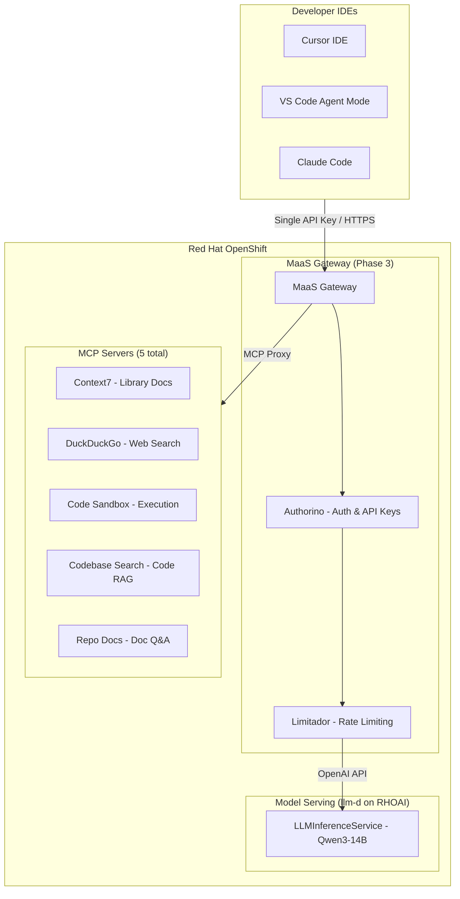

# RHOAI Code Assistant Lab

A hands-on workshop for building a **centralized coding assistant infrastructure** on **Red Hat OpenShift AI (RHOAI)**. Deploy shared MCP tool servers, enable **Models as a Service (MaaS)** for managed model access, and validate end-to-end with benchmarks — no external LLM API keys required.

## Architecture



## Lab Flow

| Phase | Folder | Focus | Key Outcome |
|-------|--------|-------|-------------|
| **0** | `0_setup/` | Environment & models | Models deployed, demo app ready |
| **1** | `1_mcp_servers/` | MCP tool servers | 5 MCP servers accessible via Routes |
| **2** | `2_basic_run/` | Run coding assistant | Public vs air-gapped comparison |
| **3** | `3_maas/` | MaaS gateway | Unified auth & API key management |
| **4** | `4_control/` | Centralized control | Rate limiting & policy enforcement |
| **5** | `5_benchmarks/` | Performance validation | Capacity planning with real metrics |

> Together: models provide the **"brain"** (inference), MCP tools provide the **"hands"** (actions), MaaS provides **"governance"** (auth, rate limiting, API keys), and AI Skills provide **"knowledge"** (domain-specific instructions).

## Model Serving Strategy

| Model | Use Case | GPU | MaaS | Deployment |
|-------|----------|-----|:----:|------------|
| Qwen3-14B (FP8) | Coding, reasoning, tool calling | 1x A100/L40S | Yes | LLMInferenceService (OCI modelcar) |
| Qwen3-4B | Lightweight coding tasks | 1x L4/A10G | Yes | LLMInferenceService (OCI modelcar) |

> Models are deployed via `LLMInferenceService` (llm-d) using OCI modelcar images from `quay.io/redhat-ai-services/modelcar-catalog`.

## MCP Servers

| Server | Type | Air-gapped | Key Tools |
|--------|------|:----------:|-----------|
| Context7 | External API | No | `resolve-library-id`, `get-library-docs` |
| DuckDuckGo | External API | No | `duckduckgo_search`, `duckduckgo_fetch_content` |
| Code Sandbox | Local | Yes | `execute_code`, `read_file`, `write_file` |
| Codebase Search | Local AI | Yes | `search_code`, `get_file`, `list_files` |
| Repo Docs | Local AI | Yes | `search_docs`, `list_docs` |

## What's Included

### Phase 0 — Setup

* `0_setup/0_prerequisites.md` — Required access, tools, environment preparation
* `0_setup/1_environment_setup.ipynb` — Verify cluster, deploy models on RHOAI
* `0_setup/2_app_setup.ipynb` — Deploy the `cafe-order-system` demo app (target for MCP servers)

### Phase 1 — MCP Servers

* `1_mcp_servers/1_mcp_overview.md` — MCP protocol, server types, deployment strategy
* `1_mcp_servers/2_deploy_mcp_servers.ipynb` — Deploy 5 MCP servers (Context7, DuckDuckGo, Code Sandbox, Codebase Search, Repo Docs)
* `1_mcp_servers/3_integrate_mcp_catalog.ipynb` — Register with MCP Gateway & RHOAI Catalog (MCPServerRegistration, tool aggregation)
* `1_mcp_servers/4_connect_ide_clients.ipynb` — Configure IDEs to connect via Routes

### Phase 2 — Run the Coding Assistant

* `2_basic_run/1_ide_configuration.ipynb` — Configure IDEs with MCP server Routes
* `2_basic_run/2_run_public_coding_assistant.ipynb` — **Public network**: all 5 MCP tools active (Context7 + DuckDuckGo + local tools)
* `2_basic_run/3_run_closed_coding_assistant.ipynb` — **Air-gapped**: 3 local tools only (Codebase Search + Repo Docs + Code Sandbox)

### Phase 3 — MaaS Gateway

* `3_maas/1_maas_overview.md` — MaaS architecture, prerequisites (RHCL, MetalLB), CRD reference
* `3_maas/2_enable_maas.ipynb` — Verify platform, register model (MaaSModelRef), create policies + API keys, register MCP servers
* `3_maas/3_test_model_serving.ipynb` — Inference, streaming, auth enforcement (401/403 verification)
* `3_maas/4_test_mcp_servers.ipynb` — MCP protocol tests through gateway, direct vs gateway comparison

### Phase 4 — Centralized Control

* `4_control/1_maas_advanced.ipynb` — Multi-tier demo (Free 500 tok/min vs Premium 50K tok/min), API key lifecycle, Prometheus observability
* `4_control/2_maas_policy_test.ipynb` — Rate limit trigger (429), recovery after window reset, policy enforcement

### Phase 5 — Benchmarks

* `5_benchmarks/1_benchmarks_overview.md` — GuideLLM methodology, key metrics (TTFT, ITL, tok/s)
* `5_benchmarks/2_run_benchmarks.ipynb` — Run benchmarks via EvalHub SDK
* `5_benchmarks/3_capacity_planning.ipynb` — Translate results into team capacity projections

## Prerequisites

| Component | Version | Purpose |
|-----------|---------|---------|
| Red Hat OpenShift | 4.14+ (4.19+ for llm-d) | Container platform |
| OpenShift AI (RHOAI) | 3.4+ | Model serving with vLLM + MaaS |
| Red Hat Connectivity Link (RHCL) | 1.3+ | Gateway API + Authorino (auth) + Limitador (rate limiting) |
| MaaS (Models as a Service) | — | Managed model gateway (`modelsAsService: Managed` in DSC) |
| PostgreSQL | 14+ | Required by MaaS for API key management |
| MetalLB Operator | — | External IP for Gateway — **bare-metal only** |
| NVIDIA GPU Operator | — | GPU support for model inference |
| `oc` CLI | 4.14+ | Cluster management |
| Python | 3.11+ | Jupyter notebooks |

## Quick Start

1. Clone this repo:
```bash
git clone https://github.com/hyogrin/rhoai-code-assistant-lab.git
cd rhoai-code-assistant-lab
```

2. Configure environment:
```bash
cp sample.env .env
# Edit .env with your tokens and cluster info
```

3. Install AI skills (optional):
```bash
lola mod add https://github.com/hyogrin/hyo-rhoai-skills.git
lola install hyo-rhoai-skills -a cursor
```

4. Follow phases 0-5 in order.

## AI Skills (Cursor / Claude Code)

This lab uses AI skills from **[hyo-rhoai-skills](https://github.com/hyogrin/hyo-rhoai-skills)** — production-ready skills for RHOAI model deployment and operations.

| Skill | Description |
|-------|-------------|
| `/model-deploy` | Deploy AI/ML models with vLLM, NIM, or Caikit runtimes |
| `/hf-model-deploy` | Stable model weight acquisition (OCI ModelCar, S3, PVC) |
| `/debug-inference` | Troubleshoot failed InferenceService deployments |

## Related Projects

* [Private AI Coding Assistant](https://github.com/manujoy7/Private_AI_Coding_Assistant) — Production reference architecture for private AI code assistants on ROSA HCP and ARO.

## About

This workshop demonstrates how to build a fully self-contained, enterprise-grade coding assistant infrastructure on Red Hat OpenShift AI — from model serving through tool integration to performance validation — without dependency on external AI API providers.
