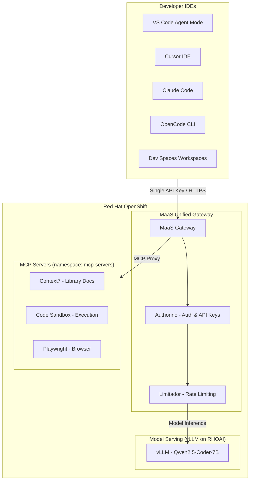
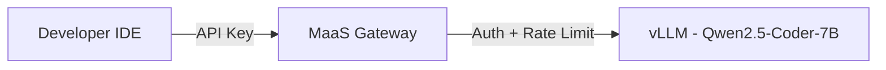

# RHOAI Code Assistant Lab

A hands-on workshop for building a **centralized coding assistant infrastructure** on **Red Hat OpenShift AI (RHOAI)**. This lab guides you through deploying shared MCP tool servers, enabling **Models as a Service (MaaS)** for managed model access, and **Dev Spaces** for team-scale developer onboarding — no external LLM API keys required.

## Architecture



## How It Works

| Phase | Focus | Key Outcome |
|-------|-------|-------------|
| **0 — Setup** | Prerequisites & environment | Models deployed on RHOAI |
| **1 — MCP Servers** | Deploy shared tool servers | MCP tools accessible via Routes |
| **2 — MaaS Gateway** | Unified gateway with auth | Single API key for models + MCP tools |
| **3 — Run & Control** | IDE integration & operations | End-to-end coding assistant |
| **4 — Developer Experience** | Dev Spaces & extensions | Team-scale onboarding with pre-configured IDEs |
| **5 — Benchmarks** | Performance validation | Capacity planning with real metrics |
| **6 — IDE Integration Test** | Agent mode verification | Screenshots of working coding assistant |

> Together: models provide the **"brain"** (inference), MCP tools provide the **"hands"** (actions), and MaaS provides **"governance"** (auth, rate limiting, API keys) — all accessed via a single API key.

## Model Serving Strategy



| Model | Use Case | GPU | Deployment |
|-------|----------|-----|------------|
| Qwen2.5-Coder-7B-Instruct | Coding, autocomplete, tool calling | 1x L4/L10 (24GB) | InferenceService via OCI ModelCar |

> **Note:** Model choices are configurable. Any model deployable on vLLM works. Models from [RedHatAI on Hugging Face](https://huggingface.co/RedHatAI) are pre-quantized for optimal vLLM performance.

### Upgrade Options (Larger Models)

For teams with A100/H100 GPUs, pre-built vLLM container images with optimized serving configs are available:

| Model | Architecture | Weights | GPU | Concurrent 128K Seqs |
|-------|-------------|---------|-----|---------------------|
| [Qwen3.6-27B-FP8](https://github.com/eggboy/vllm-container-image/tree/main/qwen36-27b) | Dense (27B active) | FP8 (~28GB) | A100 80GB | 12 |
| [Qwen3.6-35B-A3B](https://github.com/eggboy/vllm-container-image/tree/main/qwen36-35b-a3b) | MoE (35B total, 3B active) | GPTQ-Int4 (~18GB) | A100 80GB / L40S | 8 |

**Key differences:**
- **27B Dense** — Maximum quality, all 27B parameters active per token. Best for complex code generation.
- **35B-A3B MoE** — 35B knowledge with only 3B compute cost per token. Faster responses, ideal for team-shared coding assistants.

Both include: chunked-prefill, GDN hybrid attention optimization, native tool calling (`--tool-call-parser qwen3_coder`), and reasoning mode (`--reasoning-parser qwen3`).

```bash
# Build and push to your registry (example: Quay.io)
git clone https://github.com/eggboy/vllm-container-image.git
cd vllm-container-image/qwen36-35b-a3b
podman build -t quay.io/<namespace>/vllm-qwen36-35b-a3b:latest -f Dockerfile.vllm.a100 .
podman push quay.io/<namespace>/vllm-qwen36-35b-a3b:latest
```

> **Tip:** On OpenShift, use a `BuildConfig` to avoid downloading ~18-28GB model weights locally.

## What's Included

### 0. Setup

* **0_setup/0_prerequisites.md**: Required access, tools, and environment preparation.
* **0_setup/1_environment_setup.ipynb**: Verify cluster access, deploy models on RHOAI, and test InferenceService endpoints.

### 1. MCP Servers (Phase 1)

* **1_mcp_servers/1_mcp_overview.md**: Introduction to MCP protocol, server types, and deployment strategies on OpenShift.
* **1_mcp_servers/2_deploy_mcp_servers.ipynb**: Deploy 3 MCP servers to OpenShift (Context7, Code Sandbox, Playwright). GitHub/Sequential Thinking are replaced by AI Skills + `gh` CLI.
* **1_mcp_servers/3_connect_ide_clients.ipynb**: Configure IDEs to connect to MCP servers via OpenShift Routes.

### 2. Models as a Service — Unified Gateway (Phase 2)

* **2_ai_gateway/1_maas_overview.md**: MaaS architecture — unified gateway for models and MCP tools with managed auth, rate limiting, and API key management.
* **2_ai_gateway/2_enable_maas.ipynb**: Enable MaaS on RHOAI, register MCP servers with the gateway, and create API keys.
* **2_ai_gateway/3_test_model_serving.ipynb**: Test inference, streaming, rate limiting, and concurrent access.
* **2_ai_gateway/4_test_mcp_servers.ipynb**: Test MCP server access through the MaaS gateway with auth enforcement.

### 3. Run the Coding Assistant & Centralized Control (Phase 3)

* **3_run_and_control/1_ide_configuration.ipynb**: Configure IDEs (Cursor, VS Code, Claude Code, OpenCode) to use MaaS endpoints for both model calls and MCP tools.
* **3_run_and_control/2_run_coding_assistant.ipynb**: Run the coding assistant end-to-end with Cursor IDE — code generation, MCP tool invocation, and inline editing.
* **3_run_and_control/3_maas_advanced.ipynb**: Centralized control — subscription rate limits, API key lifecycle management, and observability.

### 4. Developer Experience — Dev Spaces (Phase 4)

* **4_developer_experience/1_devspaces_overview.md**: Dev Spaces integration — AI extension comparison (Continue vs Cline vs Roo Code), tool calling configuration, and DevWorkspace architecture.
* **4_developer_experience/2_configure_devworkspace.ipynb**: Deploy DevWorkspace with pre-configured AI extensions connected to MaaS gateway.
* **4_developer_experience/3_test_extensions.ipynb**: Test tool calling, streaming behavior, and troubleshoot common extension issues.

### 5. Performance Benchmarks (Phase 5)

* **5_benchmarks/1_benchmarks_overview.md**: Benchmarking methodology — GuideLLM, key metrics (TTFT, ITL, tok/s), capacity planning, and reference GPU performance data.
* **5_benchmarks/2_run_benchmarks.ipynb**: Run GuideLLM benchmarks via EvalHub SDK — single-user latency, sweep, and throughput tests with automatic MLflow tracking.
* **5_benchmarks/3_capacity_planning.ipynb**: Translate benchmark results into team capacity — multi-replica projections and cost analysis.

> **Requires:** EvalHub service + GuideLLM provider registered in `demo` namespace. EvalHub SA (`demo:evalhub-service`) must have RBAC to create ConfigMaps/Pods in the target namespace. See `1_benchmarks_overview.md` for details.

### 6. IDE Integration Test (Phase 6)

* **6_ide_integration_test/1_cursor_agent_mode.ipynb**: Cursor IDE Agent mode — discover endpoints, verify connectivity, configure, and test multi-step agent workflows.
* **6_ide_integration_test/2_vscode_continue.ipynb**: VS Code + Continue extension — auto-generate config, test chat, inline edit, and MCP tool calling.
* **6_ide_integration_test/3_claude_code_cli.ipynb**: Claude Code CLI — environment setup, MCP configuration, and terminal-based agent testing.

## Prerequisites

| Component | Version | Purpose |
|-----------|---------|---------|
| Red Hat OpenShift | 4.14+ | Container platform |
| OpenShift AI (RHOAI) | 2.x+ | Model serving with vLLM + MaaS |
| MaaS (Models as a Service) | — | Managed model gateway with auth & rate limiting |
| NVIDIA GPU Operator | — | GPU support for model inference |
| OpenShift Dev Spaces | 3.27+ | Cloud development environments (Phase 4) |
| `oc` CLI | 4.14+ | Cluster management |
| Python | 3.11+ | Jupyter notebooks |

## Quick Start

1. Clone this repo into your OpenShift AI Workbench:
```bash
git clone https://github.com/hyogrin/rhoai-code-assistant-lab.git
cd rhoai-code-assistant-lab
```

2. Configure environment:
```bash
cp sample.env .env
# Edit .env with your tokens and cluster info
```

3. Install AI skills (optional, for Cursor/Claude Code users):
```bash
# Install lola CLI, then add RHOAI skills
lola mod add https://github.com/hyogrin/hyo-rhoai-skills.git
lola install hyo-rhoai-skills -a cursor
```

4. Follow the phased approach:
   - **Phases 0–3**: Core setup (models, MCP servers, MaaS gateway, IDE integration)
   - **Phase 4**: Enable Dev Spaces for team onboarding
   - **Phase 5**: Benchmark and validate capacity
   - **Phase 6**: IDE integration test — verify Agent mode with screenshots

## AI Skills (Cursor / Claude Code)

This lab uses AI skills from **[hyo-rhoai-skills](https://github.com/hyogrin/hyo-rhoai-skills)** — production-ready skills for Red Hat OpenShift AI model deployment and operations. Install via `lola` (see Quick Start step 3).

Key skills included:

| Skill | Description |
|-------|-------------|
| `/hf-model-deploy` | Stable model weight acquisition (OCI ModelCar, S3, PVC) |
| `/model-deploy` | Deploy AI/ML models with vLLM, NIM, or Caikit runtimes |
| `/debug-inference` | Troubleshoot failed InferenceService deployments |
| `/ai-observability` | Analyze model performance and GPU utilization |
| `/ds-project-setup` | Create and configure Data Science Projects |

> **See:** [hyo-rhoai-skills README](https://github.com/hyogrin/hyo-rhoai-skills) for the full list of available skills and MCP server configurations.

> **Note:** All components run within OpenShift. No external LLM API subscriptions required — models are self-hosted on RHOAI with vLLM, accessed through MaaS.

## Related Projects

* [Private AI Coding Assistant](https://github.com/manujoy7/Private_AI_Coding_Assistant) — Production reference architecture for private AI code assistants on ROSA HCP and ARO, with multi-accelerator benchmarks and GitOps deployment.
* [vLLM Container Images](https://github.com/eggboy/vllm-container-image) — Pre-built vLLM Dockerfiles with optimized serving configs for Qwen3.6 models on A100/H100 GPUs (FP8, GPTQ-Int4, chunked-prefill, GDN hybrid attention).

## About

This workshop demonstrates how to build a fully self-contained, enterprise-grade coding assistant infrastructure on Red Hat OpenShift AI — from model serving through tool integration and developer onboarding, to performance validation and enterprise customization — without dependency on external AI API providers.
