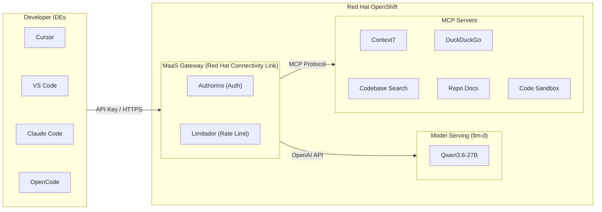
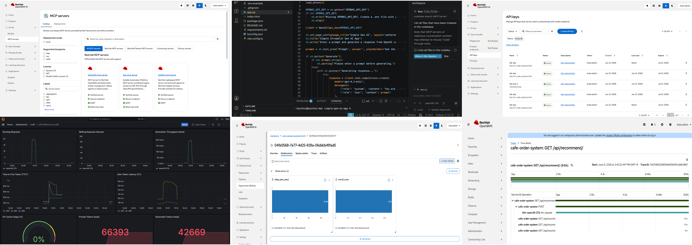

# RHOAI Code Assistant Lab

A hands-on workshop for building a **centralized coding assistant infrastructure** on **Red Hat OpenShift AI (RHOAI)**. Deploy shared MCP tool servers, enable **Models as a Service (MaaS)** for managed model access, and validate end-to-end with benchmarks — no external LLM API keys required. This workshop demonstrates how to build a fully self-contained, enterprise-grade coding assistant infrastructure on Red Hat OpenShift AI — from model serving through tool integration to performance validation — without dependency on external AI API providers.

## Architecture



## Scope & Security Notes

This lab is designed for **hands-on learning**, not production deployment. Several security simplifications are made intentionally:

| Area | Lab Approach | Production Recommendation |
|------|-------------|--------------------------|
| Ingress TLS | OpenShift default self-signed cert (`NODE_TLS_REJECT_UNAUTHORIZED=0` on clients) | Let's Encrypt or enterprise CA via cert-manager |
| Internal DB connection | `sslmode=disable` (plaintext within cluster network) | TLS with custom PKI (e.g., CNPG + cert-manager) |
| Internal service auth | OpenShift service-serving CA (auto-trusted) | Custom CA with `user-ca-bundle` in Proxy for end-to-end encryption |
| API key storage | `.env` file (local only, gitignored) | Vault, Sealed Secrets, or external secret management |
| Distributed serving | Not installed (single-GPU models only) | Leader Worker Set (LWS) for multi-node tensor-parallel |
| MaaS Gateway | Operator-managed defaults (auto-created by DSC `modelsAsService: Managed`) | Manual override (`opendatahub.io/managed: 'false'`) for custom TLS, hostname, Envoy resource tuning, and GitOps compatibility |

> For a production-grade reference with trusted TLS, custom PKI, end-to-end encryption, and manual Gateway control, see [maas-from-scratch](https://github.com/jharmison-redhat/maas-from-scratch).

## Lab Flow

| Phase | Folder | Focus | Key Outcome |
|-------|--------|-------|-------------|
| **0** | `0_setup/` | Environment & models | Models deployed, demo app ready |
| **1** | `1_mcp_servers/` | MCP tool servers | 5 MCP servers accessible via Routes |
| **2** | `2_maas/` | MaaS gateway | Unified auth & API key management |
| **3** | `3_basic_run/` | Run coding assistant | Public vs air-gapped comparison |
| **4** | `4_control/` | Centralized control | Rate limiting & policy enforcement |
| **5** | `5_benchmarks/` | Coding evaluation | HumanEval+ & MBPP+ pass@1 via EvalHub |
| **6** | `6_monitoring/` | Observability | Metrics, dashboards & distributed tracing |

> Together: models provide the **"brain"** (inference), MCP tools provide the **"hands"** (actions), MaaS provides **"governance"** (auth, rate limiting, API keys), and AI Skills provide **"knowledge"** (domain-specific instructions).




## What's Included

### Phase 0 — Setup

* `0_setup/0_prerequisites.md` — Required access, tools, environment preparation
* `0_setup/1_environment_setup.ipynb` — Verify cluster, deploy models on RHOAI
* `0_setup/2_app_setup.ipynb` — Deploy the `cafe-order-system` demo app (target for MCP servers)

### Phase 1 — MCP Servers

* `1_mcp_servers/1_mcp_overview.md` — MCP protocol, server types, deployment strategy
* `1_mcp_servers/2_deploy_mcp_servers.ipynb` — Deploy 5 MCP servers (Context7, DuckDuckGo, Code Sandbox, Codebase Search, Repo Docs)
* `1_mcp_servers/3_integrate_mcp_catalog.ipynb` — Register with MCP Gateway & RHOAI Catalog (MCPServerRegistration, tool aggregation)
* `1_mcp_servers/4_connect_ide_clients.ipynb` — Configure IDEs to connect via Routes

### Phase 2 — MaaS Gateway

* `2_maas/1_maas_overview.md` — MaaS architecture, prerequisites (RHCL, MetalLB), CRD reference
* `2_maas/2_enable_maas.ipynb` — Verify platform, register model (MaaSModelRef), create policies + API keys, register MCP servers
* `2_maas/3_test_model_serving.ipynb` — Inference, streaming, auth enforcement (401/403 verification)
* `2_maas/4_test_mcp_servers.ipynb` — MCP protocol tests through gateway, direct vs gateway comparison

### Phase 3 — Run the Coding Assistant

* `3_basic_run/1_ide_model_config.ipynb` — Configure IDE model endpoints (self-hosted + MaaS Gateway)
* `3_basic_run/2_run_public_coding_assistant.ipynb` — **Public network**: all 5 MCP tools active (Context7 + DuckDuckGo + local tools)
* `3_basic_run/3_run_closed_coding_assistant.ipynb` — **Air-gapped**: 3 local tools only (Codebase Search + Repo Docs + Code Sandbox)

### Phase 4 — Centralized Control

* `4_control/1_maas_advanced.ipynb` — Multi-tier demo (Free 500 tok/min vs Premium 50K tok/min), API key lifecycle, Prometheus observability
* `4_control/2_maas_policy_test.ipynb` — Rate limit trigger (429), recovery after window reset

### Phase 5 — Coding Evaluation

* `5_benchmarks/1_benchmarks_overview.md` — Coding evaluation methodology (HumanEval+, MBPP+ pass@1)
* `5_benchmarks/2_run_benchmarks.ipynb` — Run coding benchmarks via EvalHub SDK, track in MLflow
* `5_benchmarks/3_capacity_planning.ipynb` — Translate results into team capacity projections

### Phase 6 — Observability

* `6_monitoring/1_monitoring_overview.md` — Observability stack architecture (metrics, tracing, dashboards)
* `6_monitoring/1_observability_setup.ipynb` — Deploy ServiceMonitor, PodMonitor, Tempo, OTel Collector, Grafana

## Prerequisites

| Component | Version | Purpose |
|-----------|---------|---------|
| Red Hat OpenShift | 4.14+ (4.19+ for llm-d) | Container platform |
| OpenShift AI (RHOAI) | 3.4+ | Model serving with vLLM + MaaS |
| Red Hat Connectivity Link (RHCL) | 1.3+ | Gateway API + Authorino (auth) + Limitador (rate limiting) |
| MaaS (Models as a Service) | — | Managed model gateway (`modelsAsService: Managed` in DSC) |
| PostgreSQL | 14+ | Required by MaaS for API key management |
| MetalLB Operator | — | External IP for Gateway — **bare-metal only** |
| NVIDIA GPU Operator | — | GPU support for model inference |
| `oc` CLI | 4.14+ | Cluster management |
| Python | 3.11+ | Jupyter notebooks |
| `uv` | 0.4+ | Python package manager (`uv sync` to install dependencies) |

## Quick Start

1. Clone this repo:
```bash
git clone https://github.com/hyogrin/rhoai-code-assistant-lab.git
cd rhoai-code-assistant-lab
```

2. Configure environment:
```bash
cp sample.env .env
# Edit .env with your tokens and cluster info
```

3. Install Python dependencies:
```bash
uv sync
```

4. Install AI skills (optional):
```bash
lola mod add https://github.com/hyogrin/hyo-rhoai-skills.git
lola install hyo-rhoai-skills -a cursor    # or: -a opencode
```

5. Follow phases 0-6 in order.

## AI Skills (Cursor / Claude Code / OpenCode)

This lab uses AI skills from **[hyo-rhoai-skills](https://github.com/hyogrin/hyo-rhoai-skills)** — production-ready skills for RHOAI model deployment and operations.

| Skill | Description |
|-------|-------------|
| `/model-deploy` | Deploy AI/ML models with vLLM, NIM, or Caikit runtimes |
| `/hf-model-deploy` | Stable model weight acquisition (OCI ModelCar, S3, PVC) |
| `/debug-inference` | Troubleshoot failed InferenceService deployments |

## Model Serving Examples

The lab default is `qwen36-27b`. Other models can be selected via `DEPLOY_MODEL` in `.env`.

| Model | VRAM | Notes |
|-------|------|-------|
| `qwen36-27b` | ~27 GB | **Default.** Qwen3.6-27B FP8, reasoning + tool-calling |
| `qwen3-14b` | ~14 GB | Qwen3-14B FP8, smaller alternative |
| `qwen-coder-7b` | ~8 GB | Code-focused (Qwen2.5-Coder) |
| `qwen-coder-14b` | ~16 GB | Better code quality (Qwen2.5-Coder) |

### Deployment Types

| | llm-d (`LLMInferenceService`) | KServe (`InferenceService`) |
|---|---|---|
| MaaS Gateway | Yes — API keys, rate limiting, auth | No — direct Route access only |
| Model Source | OCI modelcar or HuggingFace | S3, PVC, OCI |
| Used in this lab | Phases 0-6 (default) | Optional for non-MaaS models |

**llm-d** models are registered with `MaaSModelRef` and accessed through the MaaS gateway,
giving you centralized API key management, token-based rate limiting, and auth policies.
**InferenceService** models are accessed directly via their own Route — no gateway governance.

### Model Sources

| Source | How it works | Trade-off |
|--------|-------------|-----------|
| OCI modelcar | Pre-packaged weights in a container image | Fast startup, no download; needs a pre-built image |
| HuggingFace | Downloads weights at pod startup | Any model available; slow, needs `HF_TOKEN`, can hang |

## MCP Servers

| Server | Type | Air-gapped | Key Tools |
|--------|------|:----------:|-----------|
| Context7 | External API | No | `resolve-library-id`, `get-library-docs` |
| DuckDuckGo | External API | No | `search` |
| Code Sandbox | Local | Yes | `execute_code`, `read_file`, `write_file` |
| Codebase Search | Local AI | Yes | `search_code`, `get_file`, `list_files` |
| Repo Docs | Local AI | Yes | `search_docs`, `list_docs` |

## Related Projects

* [Private AI Coding Assistant](https://github.com/manujoy7/Private_AI_Coding_Assistant) — Production reference architecture for private AI code assistants on ROSA HCP and ARO.
