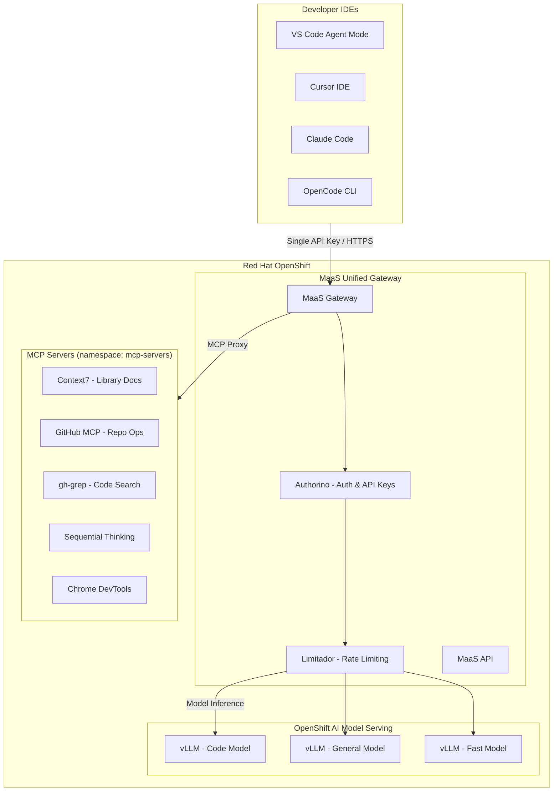
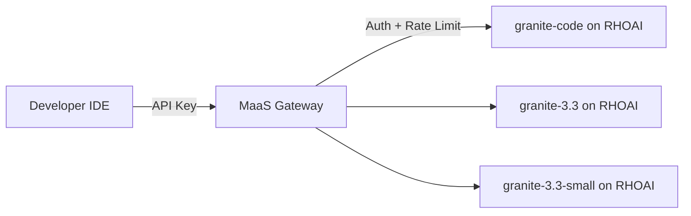

# RHOAI Code Assistant Lab

A hands-on workshop for building a **centralized coding assistant infrastructure** on **Red Hat OpenShift AI (RHOAI)**. This lab guides you through deploying shared MCP tool servers and enabling **Models as a Service (MaaS)** for managed model access with built-in authentication and rate limiting — no external LLM API keys required.

## Architecture



## How It Works

* **Phase 1 (MCP Servers):** Deploy MCP servers as OpenShift Services with Routes. Servers are containerized and accessible within the cluster.
* **Phase 2 (MaaS — Unified Gateway):** Enable Models as a Service on RHOAI as a **unified gateway** for both model inference and MCP tool access. MaaS provides built-in API key authentication, subscription-based rate limiting, model discovery, and MCP server proxying — all operator-managed with zero manual proxy deployment. Developers get a single endpoint and API key for everything.

> Together: models provide the **"brain"** (inference) and MCP tools provide the **"hands"** (actions) — all accessed via a single API key through the MaaS gateway.

## Model Serving Strategy

This lab uses **models deployed on OpenShift AI** with **MaaS enabled** for managed access:



| RHOAI Model | Use Case |
|-------------|----------|
| IBM Granite 3.3 2B | Autocomplete, simple tasks |
| IBM Granite 3.3 8B | General coding, planning |
| IBM Granite Code 34B | Complex reasoning, architecture |

> **Note:** Model choices are configurable. Any model deployable on vLLM (Llama, Mistral, Qwen, etc.) works.

## What's Included

### 0. Setup

* **0_setup/0_prerequisites.md**: Required access, tools, and environment preparation.
* **0_setup/1_environment_setup.ipynb**: Verify cluster access, deploy models on RHOAI, and test InferenceService endpoints.

### 1. MCP Servers (Phase 1)

* **1_mcp_servers/1_mcp_overview.md**: Introduction to MCP protocol, server types, and deployment strategies on OpenShift.
* **1_mcp_servers/2_deploy_mcp_servers.ipynb**: Deploy 5 MCP servers to OpenShift (Context7, GitHub, gh-grep, Sequential Thinking, Chrome DevTools).
* **1_mcp_servers/3_connect_ide_clients.ipynb**: Configure IDEs to connect to MCP servers via OpenShift Routes.

### 2. Models as a Service — Unified Gateway (Phase 2)

* **2_ai_gateway/1_maas_overview.md**: MaaS architecture — unified gateway for models and MCP tools with managed auth, rate limiting, and API key management.
* **2_ai_gateway/2_enable_maas.ipynb**: Enable MaaS on RHOAI, register MCP servers with the gateway, and create API keys.
* **2_ai_gateway/3_test_model_serving.ipynb**: Test inference, streaming, rate limiting, and concurrent access.
* **2_ai_gateway/4_test_mcp_servers.ipynb**: Test MCP server access through the MaaS gateway with auth enforcement.

### 3. Run & Control (Phase 3)

* **3_run_and_control/1_ide_configuration.ipynb**: Configure IDEs to use MaaS endpoints for both model calls and MCP tools.
* **3_run_and_control/2_run_coding_assistant.ipynb**: Test the coding assistant with Cursor IDE — code generation, MCP tools, and inline editing.
* **3_run_and_control/3_maas_advanced.ipynb**: Advanced MaaS features — subscription rate limits, API key management, and monitoring.

## Phase Comparison

| Aspect | Phase 1: MCP Servers | Phase 2: MaaS (Unified Gateway) |
|--------|---------------------|----------------------------------|
| **What it centralizes** | Tools & capabilities | Model access + MCP tools + governance |
| **Protocol** | MCP (JSON-RPC over HTTP SSE) | OpenAI API + MCP SSE (unified) |
| **Developer setup** | Deploy MCP servers to cluster | Set single MaaS endpoint + API key in IDE |
| **Key benefit** | Shared tools without local install | Single gateway for models + tools with auth |
| **Manages** | External services (GitHub, docs, search) | RHOAI models + MCP server routing |
| **Scaling** | HPA per MCP server | Operator-managed gateway + model replicas |
| **Auth** | None (or manual OAuth proxy) | Built-in API key auth for all services |

## Prerequisites

* Red Hat OpenShift cluster with OpenShift AI and MaaS support
* GPU nodes for model serving (NVIDIA GPU recommended for vLLM)
* `oc` CLI with cluster-admin or appropriate RBAC
* Python 3.11+ (for Jupyter notebooks)
* GitHub Personal Access Token (for GitHub MCP server)
* An IDE with MCP support (VS Code, Cursor, Claude Code, or OpenCode)

## Quick Start

1. Clone this repo into your OpenShift AI Workbench:
```bash
git clone https://github.com/hyogrin/rhoai-code-assistant-lab.git
cd rhoai-code-assistant-lab
```

2. Configure environment:
```bash
cp sample.env .env
# Edit .env with your tokens and cluster info
```

3. Deploy models on RHOAI with MaaS enabled (via Dashboard or CLI)

4. Deploy MCP servers:
```bash
oc apply -f 1_mcp_servers/manifests/
```

5. Get the unified MaaS endpoint:
```bash
# MaaS gateway (serves both models and MCP tools)
CLUSTER_DOMAIN=$(kubectl get ingresses.config.openshift.io cluster -o jsonpath='{.spec.domain}')
echo "https://maas.${CLUSTER_DOMAIN}"

# MCP servers are accessed via: https://maas.<domain>/mcp/<server-name>/sse
# Models are accessed via: <model-url>/v1/chat/completions
```

6. Follow notebooks for detailed walkthroughs.

> **Note:** All components run within OpenShift. No external LLM API subscriptions required — models are self-hosted on RHOAI with vLLM, accessed through MaaS.

## About

This workshop demonstrates how to build a fully self-contained, enterprise-grade coding assistant infrastructure on Red Hat OpenShift AI — from model serving to tool integration to IDE connectivity — without dependency on external AI API providers.
