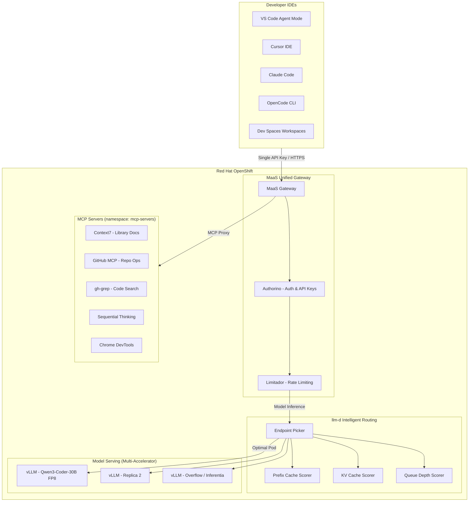
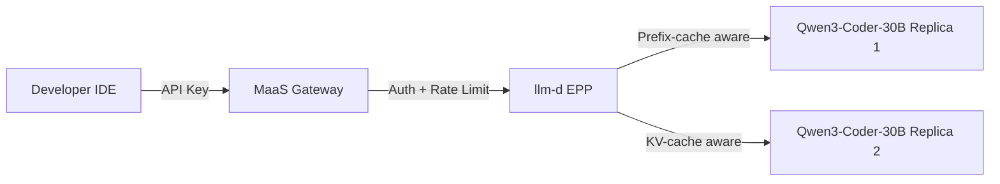

# RHOAI Code Assistant Lab

A hands-on workshop for building a **centralized coding assistant infrastructure** on **Red Hat OpenShift AI (RHOAI)**. This lab guides you through deploying shared MCP tool servers, enabling **Models as a Service (MaaS)** for managed model access, **llm-d intelligent routing** for production-grade inference, and **Dev Spaces** for team-scale developer onboarding — no external LLM API keys required.

## Architecture



## How It Works

| Phase | Focus | Key Outcome |
|-------|-------|-------------|
| **0 — Setup** | Prerequisites & environment | Models deployed on RHOAI |
| **1 — MCP Servers** | Deploy shared tool servers | MCP tools accessible via Routes |
| **2 — MaaS Gateway** | Unified gateway with auth | Single API key for models + MCP tools |
| **3 — Run & Control** | IDE integration & operations | End-to-end coding assistant |
| **4 — llm-d Routing** | Intelligent inference routing | Prefix-cache-aware, KV-optimized routing |
| **5 — Developer Experience** | Dev Spaces & extensions | Team-scale onboarding with pre-configured IDEs |
| **6 — Benchmarks** | Performance validation | Capacity planning with real metrics |
| **7 — Advanced** | Multi-accelerator & multi-cloud | Heterogeneous routing, ARO deployment |
| **8 — Enterprise** | Production customization | SonarQube integration, system prompts, rules |

> Together: models provide the **"brain"** (inference), MCP tools provide the **"hands"** (actions), llm-d provides **"intelligence"** (optimal routing), and MaaS provides **"governance"** (auth, rate limiting, API keys) — all accessed via a single API key.

## Model Serving Strategy

This lab supports two deployment paths that can be used independently or layered together:



| Model | Use Case | GPU | Deployment |
|-------|----------|-----|------------|
| Qwen2.5-Coder-7B-Instruct (FP8) | Autocomplete, fast tasks | 1x L10 (24GB) | InferenceService (Phase 0) |
| Qwen2.5-Coder-14B-Instruct (FP8) | Coding, planning | 1x L10 (24GB) | InferenceService (Phase 0) |
| Qwen3-Coder-30B-A3B-Instruct (FP8) | Agent mode, tool calling | 1x L40S (48GB) | LLMInferenceService + llm-d (Phase 4) |

> **Note:** Model choices are configurable. Any model deployable on vLLM works. Models from [RedHatAI on Hugging Face](https://huggingface.co/RedHatAI) are pre-quantized for optimal vLLM performance.

## What's Included

### 0. Setup

* **0_setup/0_prerequisites.md**: Required access, tools, and environment preparation.
* **0_setup/1_environment_setup.ipynb**: Verify cluster access, deploy models on RHOAI, and test InferenceService endpoints.

### 1. MCP Servers (Phase 1)

* **1_mcp_servers/1_mcp_overview.md**: Introduction to MCP protocol, server types, and deployment strategies on OpenShift.
* **1_mcp_servers/2_deploy_mcp_servers.ipynb**: Deploy 5 MCP servers to OpenShift (Context7, GitHub, gh-grep, Sequential Thinking, Chrome DevTools).
* **1_mcp_servers/3_connect_ide_clients.ipynb**: Configure IDEs to connect to MCP servers via OpenShift Routes.

### 2. Models as a Service — Unified Gateway (Phase 2)

* **2_ai_gateway/1_maas_overview.md**: MaaS architecture — unified gateway for models and MCP tools with managed auth, rate limiting, and API key management.
* **2_ai_gateway/2_enable_maas.ipynb**: Enable MaaS on RHOAI, register MCP servers with the gateway, and create API keys.
* **2_ai_gateway/3_test_model_serving.ipynb**: Test inference, streaming, rate limiting, and concurrent access.
* **2_ai_gateway/4_test_mcp_servers.ipynb**: Test MCP server access through the MaaS gateway with auth enforcement.

### 3. Run the Coding Assistant & Centralized Control (Phase 3)

* **3_run_and_control/1_ide_configuration.ipynb**: Configure IDEs (Cursor, VS Code, Claude Code, OpenCode) to use MaaS endpoints for both model calls and MCP tools.
* **3_run_and_control/2_run_coding_assistant.ipynb**: Run the coding assistant end-to-end with Cursor IDE — code generation, MCP tool invocation, and inline editing.
* **3_run_and_control/3_maas_advanced.ipynb**: Centralized control — subscription rate limits, API key lifecycle management, and observability.

### 4. llm-d Intelligent Routing (Phase 4)

* **4_llm_d_routing/1_llmd_overview.md**: llm-d architecture — EPP scoring (prefix-cache, KV-cache, queue-depth), LLMInferenceService CRD, and benefits for code assistant workloads.
* **4_llm_d_routing/2_deploy_llmd.ipynb**: Deploy LLMInferenceService with Qwen3-Coder-30B, verify EPP discovery, and test prefix-cache behavior.
* **4_llm_d_routing/3_verify_routing.ipynb**: Verify intelligent routing — concurrent request distribution, prefix-cache-aware pod selection, and latency comparison.

### 5. Developer Experience — Dev Spaces (Phase 5)

* **5_developer_experience/1_devspaces_overview.md**: Dev Spaces integration — AI extension comparison (Continue vs Cline vs Roo Code), tool calling configuration, and DevWorkspace architecture.
* **5_developer_experience/2_configure_devworkspace.ipynb**: Deploy DevWorkspace with pre-configured AI extensions connected to MaaS gateway.
* **5_developer_experience/3_test_extensions.ipynb**: Test tool calling, streaming behavior, and troubleshoot common extension issues.

### 6. Performance Benchmarks (Phase 6)

* **6_benchmarks/1_benchmarks_overview.md**: Benchmarking methodology — GuideLLM, key metrics (TTFT, ITL, tok/s), capacity planning, and reference GPU performance data.
* **6_benchmarks/2_run_benchmarks.ipynb**: Run GuideLLM sweep benchmarks — single-user latency, throughput, and constant-rate tests.
* **6_benchmarks/3_capacity_planning.ipynb**: Translate benchmark results into team capacity — multi-replica projections and cost analysis.

### 7. Advanced Topics (Phase 7)

* **7_advanced/1_advanced_overview.md**: Advanced deployment patterns — multi-accelerator, multi-cloud, model caching, KV-cache optimization.
* **7_advanced/2_multi_accelerator.md**: Heterogeneous llm-d routing — NVIDIA + Inferentia2 in a single InferencePool.
* **7_advanced/3_multi_cloud.md**: Multi-cloud reference — ROSA (AWS) vs ARO (Azure) deployment comparison.
* **7_advanced/4_model_caching.md**: Model caching strategies — PVC persistence, EBS snapshots, OCI images, and startup optimization.

### 8. Enterprise Customization (Phase 8)

* **8_enterprise/1_enterprise_overview.md**: Enterprise customization tracks — team practice alignment and quality gate integration.
* **8_enterprise/2_system_prompts.md**: System prompt engineering — global prompts, per-project rules files, and DevWorkspace templates per tech stack.
* **8_enterprise/3_sonarqube_integration.md**: SonarQube-aware code generation — embedding quality profiles in system prompts, live findings via MCP, and pre-commit hooks.
* **8_enterprise/4_mcp_internal_systems.md**: Internal MCP servers — Confluence, Jira, OpenAPI catalogs, and custom tool server patterns.

## Prerequisites

| Component | Version | Purpose |
|-----------|---------|---------|
| Red Hat OpenShift | 4.14+ | Container platform |
| OpenShift AI (RHOAI) | 2.x+ (3.3+ for llm-d) | Model serving with vLLM + MaaS + llm-d |
| MaaS (Models as a Service) | — | Managed model gateway with auth & rate limiting |
| Service Mesh 3 | 3.2+ | Gateway API with ext_proc for llm-d |
| NVIDIA GPU Operator | — | GPU support for model inference |
| LeaderWorkerSet Operator | 1.0+ | Required for LLMInferenceService |
| cert-manager | 1.18+ | TLS certificate management |
| OpenShift Dev Spaces | 3.27+ | Cloud development environments (Phase 5) |
| `oc` CLI | 4.14+ | Cluster management |
| Python | 3.11+ | Jupyter notebooks |

## Quick Start

1. Clone this repo into your OpenShift AI Workbench:
```bash
git clone https://github.com/hyogrin/rhoai-code-assistant-lab.git
cd rhoai-code-assistant-lab
```

2. Configure environment:
```bash
cp sample.env .env
# Edit .env with your tokens and cluster info
```

3. Follow the phased approach:
   - **Phases 0–3**: Core setup (models, MCP servers, MaaS gateway, IDE integration)
   - **Phase 4**: Upgrade to llm-d intelligent routing (production-grade inference)
   - **Phase 5**: Enable Dev Spaces for team onboarding
   - **Phase 6**: Benchmark and validate capacity
   - **Phases 7–8**: Advanced topics and enterprise customization (reference)

> **Note:** All components run within OpenShift. No external LLM API subscriptions required — models are self-hosted on RHOAI with vLLM, accessed through MaaS.

## Related Projects

* [Private AI Coding Assistant](https://github.com/manujoy7/Private_AI_Coding_Assistant) — Production reference architecture for private AI code assistants on ROSA HCP and ARO, with multi-accelerator benchmarks and GitOps deployment.

## About

This workshop demonstrates how to build a fully self-contained, enterprise-grade coding assistant infrastructure on Red Hat OpenShift AI — from model serving and intelligent routing, through tool integration and developer onboarding, to performance validation and enterprise customization — without dependency on external AI API providers.
