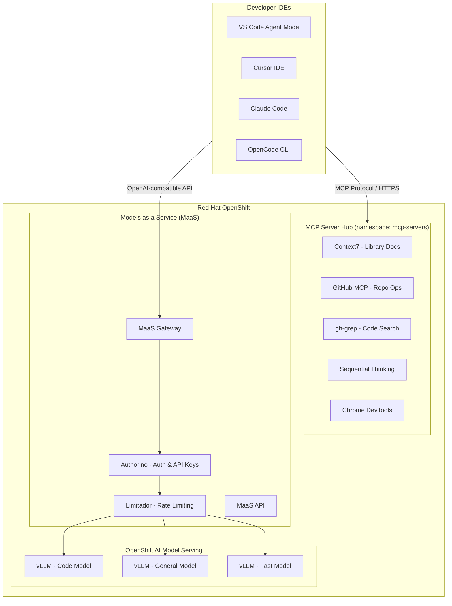
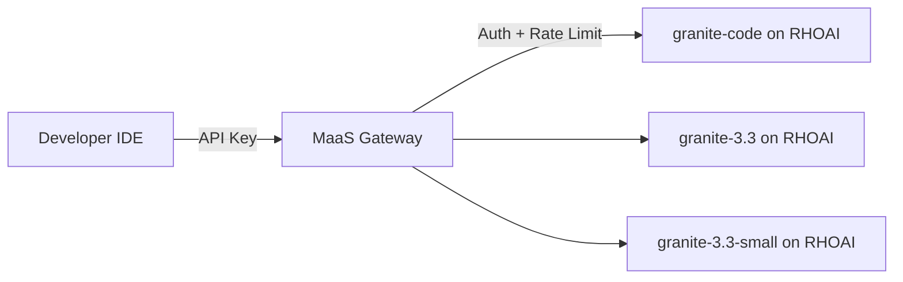
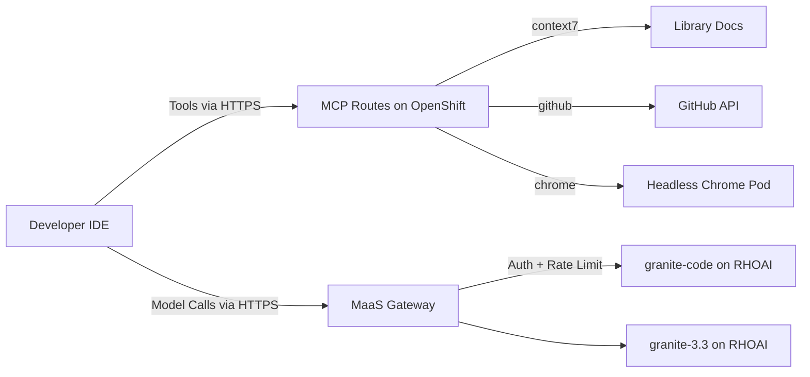

# RHOAI Code Assistant Lab

A hands-on workshop for building a **centralized coding assistant infrastructure** on **Red Hat OpenShift AI (RHOAI)**. This lab guides you through deploying shared MCP tool servers and enabling **Models as a Service (MaaS)** for managed model access with built-in authentication and rate limiting — no external LLM API keys required.

## Architecture



## How It Works

* **Phase 1 (MCP Servers):** Deploy MCP servers as OpenShift Services with Routes. IDEs connect via HTTPS to shared tool servers — enabling team-wide access to GitHub operations, documentation lookup, browser automation, and more.
* **Phase 2 (MaaS):** Enable Models as a Service on RHOAI to provide a managed AI gateway with built-in API key authentication, subscription-based rate limiting, and model discovery — all operator-managed with zero manual proxy deployment.

## Model Serving Strategy

This lab uses **models deployed on OpenShift AI** with **MaaS enabled** for managed access:



| RHOAI Model | Use Case |
|-------------|----------|
| IBM Granite 3.3 2B | Autocomplete, simple tasks |
| IBM Granite 3.3 8B | General coding, planning |
| IBM Granite Code 34B | Complex reasoning, architecture |

> **Note:** Model choices are configurable. Any model deployable on vLLM (Llama, Mistral, Qwen, etc.) works.

## What's Included

### 0. Setup

* **0_setup/0_prerequisites.md**: Required access, tools, and environment preparation.
* **0_setup/1_environment_setup.ipynb**: Verify cluster access, deploy models on RHOAI, and test InferenceService endpoints.

### 1. MCP Servers (Phase 1)

* **1_mcp_servers/1_mcp_overview.md**: Introduction to MCP protocol, server types, and deployment strategies on OpenShift.
* **1_mcp_servers/2_deploy_mcp_servers.ipynb**: Deploy 5 MCP servers to OpenShift (Context7, GitHub, gh-grep, Sequential Thinking, Chrome DevTools).
* **1_mcp_servers/3_connect_ide_clients.ipynb**: Configure IDEs to connect to MCP servers via OpenShift Routes.

### 2. Models as a Service (Phase 2)

* **2_ai_gateway/1_maas_overview.md**: MaaS architecture — how it provides managed auth, rate limiting, and API key management for RHOAI models.
* **2_ai_gateway/2_enable_maas.ipynb**: Enable MaaS on RHOAI, create API keys, and test model access.
* **2_ai_gateway/3_test_model_serving.ipynb**: Test inference, streaming, rate limiting, and concurrent access.
* **2_ai_gateway/4_ide_configuration.ipynb**: Configure IDEs to use MaaS endpoints for model calls.
* **2_ai_gateway/5_maas_advanced.ipynb**: Advanced MaaS features — subscription rate limits, API key management, and monitoring.

## Phase Comparison

| Aspect | Phase 1: MCP Servers | Phase 2: MaaS |
|--------|---------------------|---------------|
| **What it centralizes** | Tools & capabilities | Model access & governance |
| **Protocol** | MCP (JSON-RPC over HTTP SSE) | OpenAI-compatible HTTP API |
| **Developer setup** | Add MCP server Route URL to IDE | Set MaaS endpoint + API key in IDE |
| **Key benefit** | Shared tools without local install | Managed model access with auth & rate limiting |
| **Manages** | External services (GitHub, docs, search) | RHOAI model endpoints |
| **Scaling** | HPA per MCP server | Operator-managed gateway + model replicas |
| **Use together** | IDE connects to MCP servers for tools AND MaaS for model calls |

## Combined Architecture (Production)



In production, both phases work together:
- **MCP Servers** provide the "hands" (tools the AI can use)
- **MaaS + RHOAI** provides the "brain" (managed model inference with governance)

## Prerequisites

* Red Hat OpenShift cluster with OpenShift AI and MaaS support
* GPU nodes for model serving (NVIDIA GPU recommended for vLLM)
* `oc` CLI with cluster-admin or appropriate RBAC
* Python 3.11+ (for Jupyter notebooks)
* GitHub Personal Access Token (for GitHub MCP server)
* An IDE with MCP support (VS Code, Cursor, Claude Code, or OpenCode)

## Quick Start

1. Clone this repo into your OpenShift AI Workbench:
```bash
git clone https://github.com/hyogrin/rhoai-code-assistant-lab.git
cd rhoai-code-assistant-lab
```

2. Configure environment:
```bash
cp sample.env .env
# Edit .env with your tokens and cluster info
```

3. Deploy models on RHOAI with MaaS enabled (via Dashboard or CLI)

4. Deploy MCP servers:
```bash
oc apply -f 1_mcp_servers/manifests/
```

5. Get endpoints:
```bash
oc get routes -n mcp-servers       # MCP server URLs for IDE config

# MaaS endpoint
CLUSTER_DOMAIN=$(kubectl get ingresses.config.openshift.io cluster -o jsonpath='{.spec.domain}')
echo "https://maas.${CLUSTER_DOMAIN}"
```

6. Follow notebooks for detailed walkthroughs.

> **Note:** All components run within OpenShift. No external LLM API subscriptions required — models are self-hosted on RHOAI with vLLM, accessed through MaaS.

## About

This workshop demonstrates how to build a fully self-contained, enterprise-grade coding assistant infrastructure on Red Hat OpenShift AI — from model serving to tool integration to IDE connectivity — without dependency on external AI API providers.
